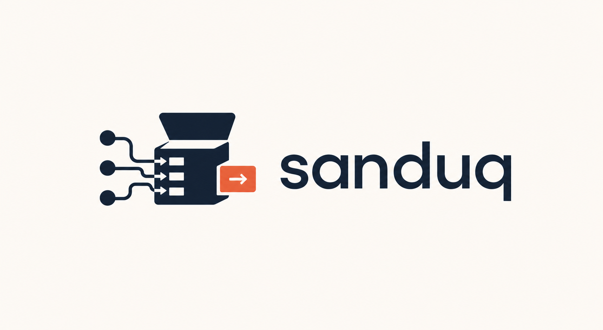
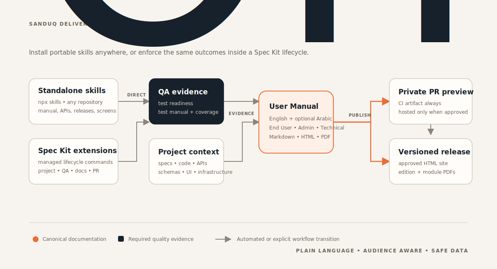

# sanduq

<p align="center">
  
</p>

[](#spec-kit-extensions)
[](#portable-skills)
[](https://squidfunk.github.io/mkdocs-material/)
[](#language-audience-and-security-rules)
[](https://skills.sh/samykabu/sanduq)
[](#license)

**sanduq** is a modular toolbox for AI-assisted software delivery. Use its portable skills in any
repository, or install its Spec Kit extensions to make project tracking, QA analysis, application
manuals, illustrations, and pull-request documentation part of a governed lifecycle.



## Choose your path

| Need | Recommended path | Why |
| --- | --- | --- |
| Create or update a manual without Spec Kit | Install the standalone `user-manual` skill | It is self-contained and works from repository evidence and Git changes. |
| Add only API, release, screenshot, or publishing expertise | Install the matching focused skill | Each module loads independently, keeping agent context small. |
| Enforce QA and documentation around implementation and PRs | Install `qa`, `user-manual`, and `pr` extensions | Lifecycle hooks check freshness at the correct gates. |
| Create a diagram in any workflow | Install the `illustrate` skill or extension | Both package the same visual vocabulary and exporters. |
| Keep a Spec Kit feature synchronized with GitHub Projects | Install the `project` extension | It maintains the parent issue, task sub-issues, and lifecycle status. |

## Quick start

List the portable skills exposed by this repository:

```bash
npx skills add samykabu/sanduq --list
```

Install the complete standalone User Manual skill for Codex in the current project:

```bash
npx skills add samykabu/sanduq --skill user-manual -a codex
```

Then ask your agent:

```text
$user-manual create a complete manual for this application. Start by interviewing me and proposing
the module map. Require English, offer Arabic, and do not use production data.
```

For a governed Spec Kit project, add the catalog and extensions:

```bash
specify extension catalog add --name sanduq --priority 10 --install-allowed \
  https://raw.githubusercontent.com/samykabu/sanduq/main/catalog.json

specify extension add illustrate
specify extension add qa
specify extension add user-manual
specify extension add pr
```

## Portable skills

Portable skills live under [`skills/`](skills/) and do not require Spec Kit. The core User Manual
skill includes its own scripts, MkDocs Material scaffold, RTL styles, CI workflows, and references.

| Skill | Purpose | Install only this skill |
| --- | --- | --- |
| [`illustrate`](skills/illustration-tools/skills/illustrate/) | Generate 27 diagram and chart types as HTML/SVG/PNG/PDF. | `npx skills add samykabu/sanduq --skill illustrate` |
| [`user-manual`](skills/dev-tools/skills/user-manual/) | Create, audit, incrementally update, and build complete audience editions. | `npx skills add samykabu/sanduq --skill user-manual` |
| [`user-manual-api-docs`](skills/dev-tools/skills/user-manual-api-docs/) | Produce filtered, safe API documentation from real contracts and code. | `npx skills add samykabu/sanduq --skill user-manual-api-docs` |
| [`user-manual-release-docs`](skills/dev-tools/skills/user-manual-release-docs/) | Create release notes and actionable migration guides. | `npx skills add samykabu/sanduq --skill user-manual-release-docs` |
| [`user-manual-ui-screenshots`](skills/dev-tools/skills/user-manual-ui-screenshots/) | Plan and capture deterministic, redacted web/mobile screenshots. | `npx skills add samykabu/sanduq --skill user-manual-ui-screenshots` |
| [`user-manual-preview-publishing`](skills/dev-tools/skills/user-manual-preview-publishing/) | Publish private PR artifacts and approved hosted previews/releases. | `npx skills add samykabu/sanduq --skill user-manual-preview-publishing` |

### Install with `npx skills`

The official CLI runs through `npx`, so no global CLI installation is required.

```bash
# Inspect before installing
npx skills add samykabu/sanduq --list

# Install one skill into the current project
npx skills add samykabu/sanduq --skill user-manual

# Install several modules in one operation
npx skills add samykabu/sanduq \
  --skill user-manual \
  --skill user-manual-api-docs \
  --skill user-manual-ui-screenshots

# Target Codex and skip interactive confirmation
npx skills add samykabu/sanduq --skill user-manual -a codex -y

# Install globally instead of in only the current project
npx skills add samykabu/sanduq --skill illustrate -g

# Run a skill without keeping an installation
npx skills use samykabu/sanduq@user-manual
```

Set `DISABLE_TELEMETRY=1` if you want to disable the CLI's anonymous telemetry.

### `illustrate`

Use this skill for architecture, process flow, ER, sequence, state, data-flow, timeline, Gantt,
quantitative charts, and other documentation visuals. It generates editable HTML/SVG first and can
export PNG or PDF when the required local renderer is available.

```text
$illustrate create a light architecture diagram showing a mobile app, API gateway, booking service,
payment service, PostgreSQL, and an external payment provider. Keep trust boundaries visible.
```

Real-life scenario: an architecture decision record is difficult to scan. Ask `illustrate` for a
seven-node architecture diagram, review the editable SVG, then embed it in the ADR and User Manual.

Illustrate initializes a project-level theme at `.github/illustration-theme.yml`. Cobalt Porcelain
Light is the default; Emerald Mist and the former Sanduq Classic palette remain selectable. Each
preset provides light/dark colors and sans, serif, and mono font stacks with Arabic fallbacks.

```text
$illustrate initialize the illustration theme and show the available presets
$illustrate switch this project to Emerald Mist Dark using local fonts
$illustrate create a custom light and dark theme from docs/design-system.md
```

Commit the YAML so diagrams generated locally and in CI use the same palette and typography.

### `user-manual`

Use the complete workflow when a manual does not exist or when a feature changes multiple
documentation surfaces. It will:

1. Interview stakeholders and inspect routes, navigation, code, tests, contracts, schemas, and
   approved infrastructure sources.
2. Propose modules and save the approved, later-extensible map in `User-Manual/manual.yml`.
3. Keep English required and Arabic optional while making HTML, diagrams, and PDFs RTL-ready.
4. Maintain separate End User, Administrator/Operator, and Technical Reference navigation.
5. Generate canonical Markdown, MkDocs Material HTML, edition PDFs, and module PDFs on demand.
6. Audit freshness, links, metadata, audience separation, assets, and accidental secret patterns.

```text
$user-manual analyze this repository, interview me about audiences and modules, then create the
manual from the ground up. Include web, mobile, API, infrastructure, architecture, system ER, and
module ER documentation. Use synthetic examples only.
```

Real-life scenario: a logistics platform has no documentation. The skill discovers Shipment,
Driver, Customer, Billing, and Operations modules, asks the owner to approve them, then builds
plain-English task guides for customers, operational procedures for dispatchers, and private API,
schema, deployment, and architecture references for technical readers.

For an incremental change:

```text
$user-manual update the existing manual for the new partial-refund feature. Use the Git diff as the
scope, preserve authored text, update affected screenshots and entities, and report untouched gaps.
```

### `user-manual-api-docs`

Use this focused module when the main work is an API inventory or contract change.

```text
$user-manual-api-docs document every public partner endpoint in openapi.yaml. Exclude internal,
admin, debug, webhook-receiver, and secret-bearing operations. Add safe request and response examples.
```

Real-life scenario: a marketplace exposes seller order APIs and also has internal reconciliation
routes. The skill builds a partner reference for seller operations, puts administrator operations
behind authenticated navigation, and prevents internal endpoints from leaking into public output.

### `user-manual-release-docs`

Use this module when users or operators need to understand a release or take migration action.

```text
$user-manual-release-docs create release notes and a migration guide from v2.4.0 to v3.0.0 using
the Git diff, schemas, deployment files, and tests. Separate user impact, operator steps, and API changes.
```

Real-life scenario: an authentication release retires legacy tokens. The result explains the visible
sign-in change to end users, gives administrators a rollout checklist, and provides technical readers
with compatibility, verification, and rollback steps grounded in the code.

### `user-manual-ui-screenshots`

Use this module when documentation needs repeatable UI evidence.

```text
$user-manual-ui-screenshots create and execute a Playwright capture matrix for account recovery in
English and Arabic, desktop and mobile, success and validation-error states. Use synthetic users and
mask email addresses, tokens, IDs, and timestamps.
```

Real-life scenario: every release made screenshots stale. The module ties each image to a stable
test scenario, fixed viewport, locale, fixture, role, and application state so CI can recapture only
the affected module.

### `user-manual-preview-publishing`

Use this only for preview and release delivery. A private CI artifact is always the baseline; an
ephemeral hosted preview is allowed only when the project has an approved provider configured.

```text
$user-manual-preview-publishing add a private GitHub Actions preview artifact to documentation PRs.
Use the approved provider from User-Manual/manual.yml for an optional hosted preview, keep Admin and
Technical editions authenticated, and publish versioned HTML/PDF only after merge or a release tag.
```

Real-life scenario: customer reviewers need a convenient preview, while operations documentation
must remain private. CI uploads all editions as a repository-reader artifact, deploys only approved
End User pages to the configured preview provider, and publishes release PDFs after merge.

### Claude Code plugin installation

The same skills are grouped into two optional Claude Code plugins:

```text
/plugin marketplace add samykabu/sanduq
/plugin install dev-tools@sanduq
/plugin install illustration-tools@sanduq
```

Invoke them through Claude Code's plugin namespace, for example:

```text
/dev-tools:user-manual
/illustration-tools:illustrate
```

## Spec Kit extensions

The root [`catalog.json`](catalog.json) is authoritative and is mirrored to
[`extensions/catalog.json`](extensions/catalog.json). Install an extension by id after adding the
catalog.

| Extension | Version | Commands | Primary outcome |
| --- | ---: | --- | --- |
| [`project`](extensions/project/) | 2.0.0 | `/speckit-project-init`, `/speckit-project-sync` | GitHub Project lifecycle and task synchronization. |
| [`qa`](extensions/qa/) | 1.0.0 | `/speckit-qa-init`, `/speckit-qa-analyze`, `/speckit-qa-document` | Pre-implementation QA analysis and maintained test documentation. |
| [`user-manual`](extensions/user-manual/) | 1.0.0 | `/speckit-user-manual-init`, `analyze`, `update`, `release` | Incremental application documentation inside the feature lifecycle. |
| [`pr`](extensions/pr/) | 4.0.0 | `/speckit-pr-generate`, `/speckit-pr-review-feedback` | Documentation-gated PR creation/update and review processing. |
| [`illustrate`](extensions/illustrate/) | 2.1.0 | `/speckit-illustrate-generate`, `/speckit-illustrate-export`, `/speckit-illustrate-theme` | Managed diagrams, project themes, fonts, and exports for specs, QA, manuals, and PRs. |

Codex users can replace the leading slash with `$`, such as `$speckit-qa-analyze`.

### `project` extension

Initialize once after authenticating GitHub CLI for Projects:

```bash
gh auth refresh -h github.com -s project,read:project
```

```text
/speckit-project-init
/speckit-project-sync
```

The initializer discovers the target board and asks whether lifecycle hooks are
`required` (automatic) or `optional` (manual approval). It creates one parent feature issue, one
native sub-issue per task, advances status without regression, and closes sub-issues when tasks are
completed.

Real-life scenario: a ten-task billing specification moves from analysis to implementation. The
extension keeps the GitHub Project parent and tasks aligned without developers manually copying
status between `tasks.md` and the board.

### `qa` extension

```text
/speckit-qa-init
/speckit-qa-analyze
/speckit-qa-document
```

`init` asks whether QA analysis and documentation are part of the project lifecycle. When enabled,
fresh `qa analyze` evidence is required before Spec Kit implementation. `qa document` is run before
PR creation if it has not run for the feature's current implementation state.

Real-life scenario: a payment specification describes retries but omits duplicate-charge and
timeout tests. `qa analyze` identifies the risk before implementation; after implementation,
`qa document` produces executable scenarios, test layers, environments, data rules, and coverage
evidence in plain language.

### `user-manual` extension

```text
/speckit-user-manual-init
/speckit-user-manual-analyze
/speckit-user-manual-update
/speckit-user-manual-release
```

- `init` interviews the team, proposes the application module map, and scaffolds `User-Manual/`.
- `analyze` compares the current specification with manual coverage before implementation.
- `update` changes canonical sources and affected assets on every feature PR.
- `release` builds approved, versioned HTML/PDF editions after merge or release tagging.

Real-life scenario: a specification adds partial refunds. Analysis identifies End User instructions,
operator permissions, API changes, Refund entities/enumerations, migration notes, and three UI states.
The update command changes only those pages and assets and the PR receives a private preview.

### `pr` extension

```text
/speckit-pr-generate
/speckit-pr-review-feedback owner/repository#123
```

Before creating or updating a PR, `pr generate` checks installed QA and User Manual policies. It
refreshes required documentation when stale, builds the PR body from real feature artifacts, and
updates an existing feature PR instead of creating a duplicate. Review feedback is inspected,
validated, fixed only when appropriate, replied to, and resolved through an approval-aware workflow.

Real-life scenario: implementation is complete but the manual has never recorded the new module.
The PR gate runs the required manual update, publishes the private preview artifact, and includes
the resulting evidence in the existing PR.

### `illustrate` extension

```text
/speckit-illustrate-generate architecture --theme light
/speckit-illustrate-export docs/architecture.html --svg-only
```

Use it for specification flows, QA matrices, system/module ER diagrams, infrastructure views, and
PR visuals. Keep diagrams small enough to explain one important relationship and store editable
sources beside the documentation that owns them.

Real-life scenario: a feature spans browser, API, queue, worker, and database. Generate a concise
data-flow diagram for the technical manual and export an SVG that remains readable in Markdown,
HTML, and PDF.

## Recommended integrated lifecycle

```text
specify/specification
  → user-manual analyze
  → qa analyze
  → speckit implement
  → qa document
  → user-manual update
  → pr generate + private documentation preview
  → merge/release tag
  → user-manual release (versioned HTML and PDFs)
```

`pr`, `qa`, and `user-manual` depend on a compatible `illustrate` extension. The default policy
prompts before install/update and caches catalog checks for 24 hours. Projects may configure:

```yaml
# .specify/extension-dependencies.yml
schema_version: "1.0"
update_policy: prompt # prompt | auto | manual
check_interval_hours: 24
```

## Language, audience, and security rules

- English is required; Arabic is optional per project and RTL support is present from day one.
- End User documentation may be published only after approval.
- Administrator/Operator documentation requires authenticated internal access.
- Technical Reference is a private CI artifact or secured internal site.
- PRs always receive a private preview artifact and a link in the PR.
- Hosted PR previews require an approved provider in `User-Manual/manual.yml`.
- Releases publish one PDF per audience edition; module PDFs are generated on demand.
- Examples and screenshots use synthetic data. Secrets and real production data are prohibited.
- Feature and scenario explanations use plain English or plain Arabic appropriate to the audience.

## Repository layout

```text
sanduq/
  .claude-plugin/marketplace.json
  catalog.json
  docs/assets/
  extensions/
    project/
    qa/
    user-manual/
    pr/
    illustrate/
  skills/
    dev-tools/                  # five standalone User Manual skills
    illustration-tools/        # standalone illustrate skill
```

## Development and release

For local extension development:

```bash
specify extension add --dev /absolute/path/to/sanduq/extensions/user-manual --force
```

When a target project resolves an old release, clear only its extension cache and retry:

```powershell
Remove-Item -Recurse -Force .specify\extensions\.cache
specify extension add user-manual --force
```

Changes to a publishable skill, plugin, or extension must update its manifest version and changelog.
The release workflow refreshes both catalogs, packages extension ZIPs, and publishes tags named
`<extension>-vX.Y.Z`.

## License

Current and future sanduq original contributions are **source-available** under the
[PolyForm Noncommercial License 1.0.0](LICENSE). Noncommercial use, modification, and redistribution
are permitted by that license. Commercial use requires a separate written license from the owner;
open a private licensing request with [Samy K. Abushanab](https://github.com/samykabu).

This is intentionally **not an OSI-approved open-source license**, because it restricts commercial
use. Copies already published under MIT remain available under the MIT terms that accompanied those
copies. Bundled upstream material keeps its original license; see
[`THIRD_PARTY_NOTICES.md`](THIRD_PARTY_NOTICES.md).
