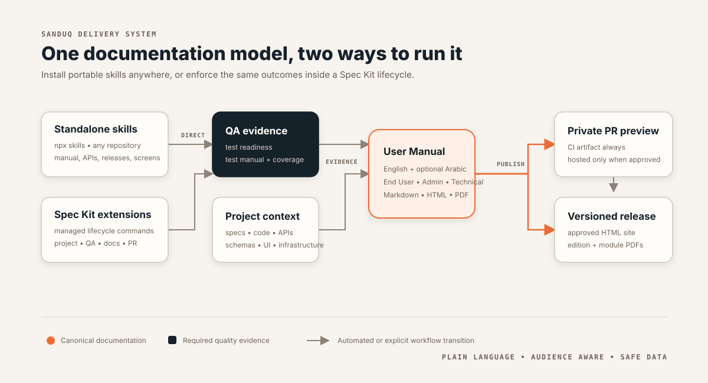
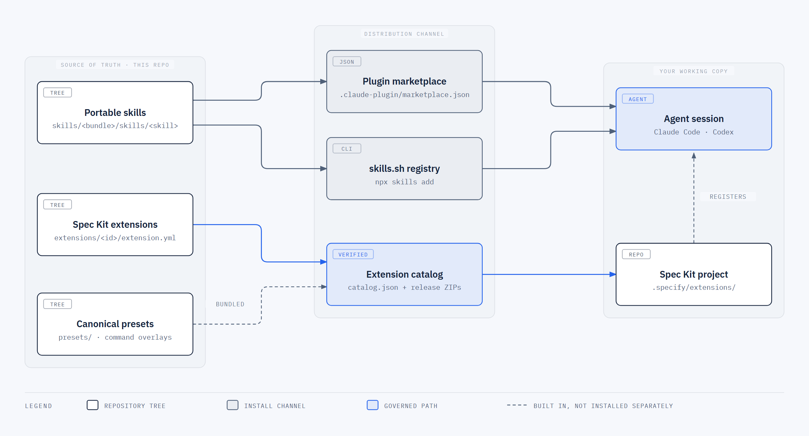
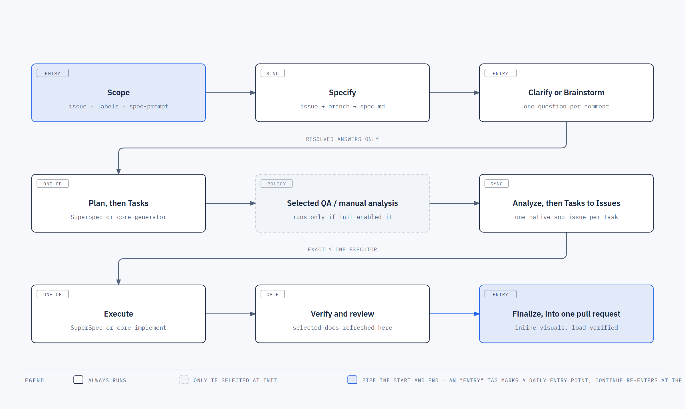
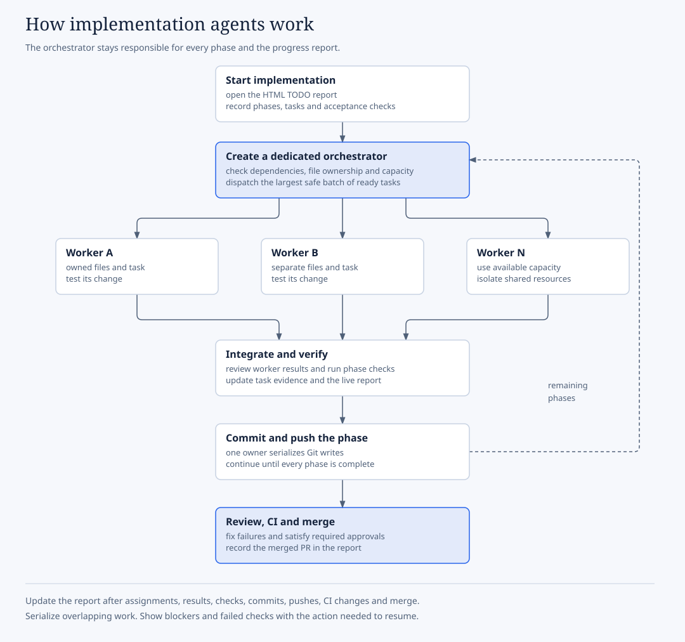
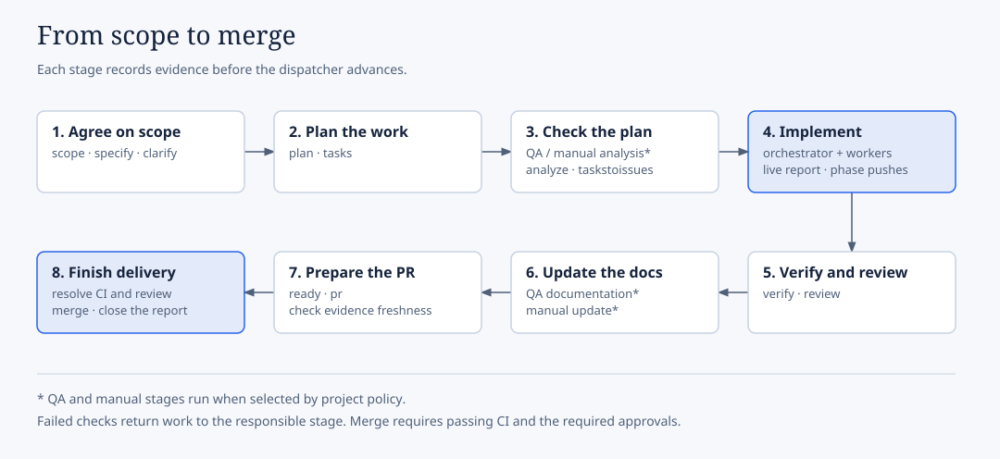
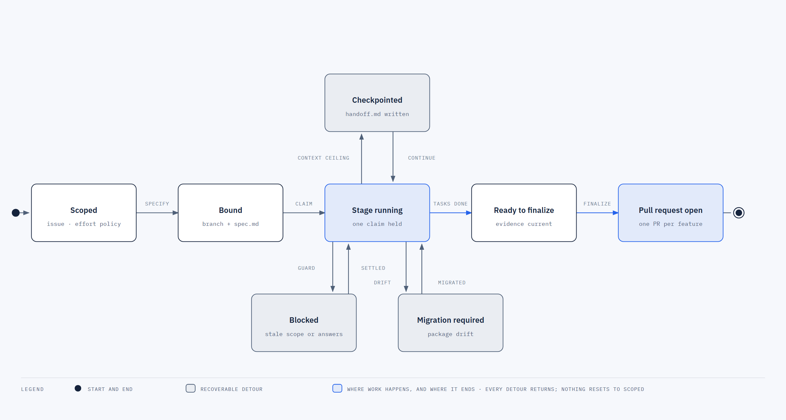

# sanduq

<p align="center">
  <picture>
    <source media="(prefers-color-scheme: dark)" srcset="docs/assets/sanduq-logo-dark.png">
    
  </picture>
</p>

[](#spec-kit-extensions)
[](#portable-skills)
[](https://squidfunk.github.io/mkdocs-material/)
[](#language-audience-and-security-rules)
[](https://skills.sh/samykabu/sanduq)
[](#license)

Sanduq supplies agent skills and Spec Kit extensions for software delivery. Use a portable skill
for a bounded task, or install the managed workflow to take a GitHub issue through specification,
implementation, verification, documentation, and a pull request. Implementation uses a dedicated
orchestrator and workers, with an HTML report that follows progress through an authorized PR merge.

The orchestration and live-report additions described here require workflow 1.2.0, currently staged
in this checkout. The published catalog still installs workflow 1.0.0. Use the
[local package procedure](#try-the-staged-workflow) to try 1.2.0 before its release.

Start with the [complete how-to and prompt guide](docs/skill-guide.md). It covers every portable
skill, extension command, Sanduq overlay, and stage in the managed lifecycle.



## Choose your path

| Need | Recommended path | Why |
| --- | --- | --- |
| Create or update a manual without Spec Kit | Install the standalone `user-manual` skill | It is self-contained and works from repository evidence and Git changes. |
| Add only API, release, screenshot, or publishing expertise | Install the matching focused skill | Each module loads independently, keeping agent context small. |
| Enforce QA and documentation around implementation and PRs | Install `assure`, `user-manual`, and `pr` extensions | Lifecycle hooks check freshness at the correct gates. |
| Create a diagram in any workflow | Install the `illustrate` skill or extension | Both package the same visual vocabulary and exporters. |
| Keep a Spec Kit feature synchronized with GitHub Projects | Install the `project` extension | It maintains the parent issue, task sub-issues, and lifecycle status. |
| Run a task on a different agent CLI, or get a second opinion | Install the `delegate-task` skill | It dispatches in the background and measures the outcome instead of relaying the harness's own claim. |
| Drive a whole feature from GitHub issue to pull request | Install the `workflow` extension | One resumable dispatcher sequences every stage, and resumes the earliest unfinished one after a break. |

## Skills, plugins, and extensions

Sanduq has three installation formats. Choose the one your agent and project use.



| | **Portable skill** | **Plugin bundle** | **Spec Kit extension** |
| --- | --- | --- | --- |
| What it is | Instructions the agent loads on its own when the task matches | One or more skills packaged for Claude Code's plugin system | A versioned package that adds `/speckit-*` commands and lifecycle hooks to a Spec Kit project |
| Needs Spec Kit | No | No | **Yes** |
| Install with | `npx skills add samykabu/sanduq --skill <name>` | `/plugin install <bundle>@sanduq` | `specify extension add <id>` |
| Invoke with | Ask in plain English, or `$<name>` | `/<bundle>:<skill>` | `/speckit-<id>-<command>` |
| Lands in | `.claude/skills/<name>/` | Claude Code's plugin directory | `.specify/extensions/<id>/` |
| Source | [`skills/`](skills/) | [`skills/<bundle>/`](skills/) | [`extensions/`](extensions/) |

A fourth directory, [`presets/`](presets/), holds canonical command overlays. They are bundled into
extension archives at build time and installed with their owning extension.

The same capability is sometimes published both ways. `illustrate` exists as a portable skill *and*
as a Spec Kit extension: identical visual vocabulary and exporters, different delivery. Use the skill
in any repository; use the extension when a Spec Kit project should resolve and update it through the
catalog like its other dependencies.

## Quick start

List the portable skills exposed by this repository:

```bash
npx skills add samykabu/sanduq --list
```

Install the complete standalone User Manual skill for Codex in the current project:

```bash
npx skills add samykabu/sanduq --skill user-manual -a codex
```

Then ask your agent:

```text
$user-manual create a complete manual for this application. Start by interviewing me and proposing
the module map. Require English, offer Arabic, and do not use production data.
```

For a governed Spec Kit project, add the catalog and extensions:

```bash
specify extension catalog add --name sanduq --priority 10 --install-allowed \
  https://raw.githubusercontent.com/samykabu/sanduq/main/catalog.json

specify extension add illustrate
specify extension add project
specify extension add assure
specify extension add user-manual
specify extension add pr
specify extension add scope
specify extension add workflow
```

For the managed lifecycle, run `/speckit-workflow-init` in your project's agent session.
It selects QA and User Manual, installs the selected dependencies, and initializes their project
state. Then run `/speckit-workflow-scope <issue-number>` to start from a GitHub issue.
Verify that the selected `scope` package comes from `samykabu/sanduq`, because other catalogs use
the same id. See [the managed Spec Kit workflow](#the-managed-spec-kit-workflow) for the full sequence.

Not sure which of the three package kinds you want? Start with
[Skills, plugins, and extensions](#skills-plugins-and-extensions).

## Portable skills

Portable skills live under [`skills/`](skills/) and do not require Spec Kit. The core User Manual
skill includes its own scripts, MkDocs Material scaffold, RTL styles, CI workflows, and references.

| Skill | Purpose | Install only this skill |
| --- | --- | --- |
| [`illustrate`](skills/illustration-tools/skills/illustrate/) | Generate 27 diagram and chart types as HTML/SVG/PNG/PDF. | `npx skills add samykabu/sanduq --skill illustrate` |
| [`user-manual`](skills/dev-tools/skills/user-manual/) | Create, audit, incrementally update, and build complete audience editions. | `npx skills add samykabu/sanduq --skill user-manual` |
| [`user-manual-api-docs`](skills/dev-tools/skills/user-manual-api-docs/) | Produce filtered, safe API documentation from real contracts and code. | `npx skills add samykabu/sanduq --skill user-manual-api-docs` |
| [`user-manual-release-docs`](skills/dev-tools/skills/user-manual-release-docs/) | Create release notes and actionable migration guides. | `npx skills add samykabu/sanduq --skill user-manual-release-docs` |
| [`user-manual-ui-screenshots`](skills/dev-tools/skills/user-manual-ui-screenshots/) | Plan and capture deterministic, redacted web/mobile screenshots. | `npx skills add samykabu/sanduq --skill user-manual-ui-screenshots` |
| [`user-manual-preview-publishing`](skills/dev-tools/skills/user-manual-preview-publishing/) | Publish private PR artifacts and approved hosted previews/releases. | `npx skills add samykabu/sanduq --skill user-manual-preview-publishing` |
| [`delegate-task`](skills/agent-tools/skills/delegate-task/) | Run one task on Claude Code, Codex, OpenCode, Copilot, or Pi and measure the result. | `npx skills add samykabu/sanduq --skill delegate-task` |

### Using a skill once it is installed

A skill contains instructions that the agent loads when your request matches its description.
Describe the task in plain English:

```text
create a light architecture diagram of the booking service and its payment provider
```

Name it explicitly when you want to be certain which one is used, or when two could apply:

```text
$illustrate create a light architecture diagram of the booking service
```

Codex uses `$name`. Claude Code accepts the same phrasing, and additionally exposes plugin-installed
skills under their bundle namespace:

```text
/illustration-tools:illustrate
/dev-tools:user-manual
/agent-tools:delegate-task
```

Installation affects context and executable paths:

- Every installed skill's description
  is read at session start, which costs context. Install the modules you use, not all of them,
  that is why the User Manual capability ships as five separately installable skills rather than one.
- `illustrate` ships Python exporters; `delegate-task` ships
  a Node driver. Those run from the skill's own directory, so where you installed it decides their
  path. Each skill's README says how to resolve it.

### Install with `npx skills`

The official CLI runs through `npx`, so no global CLI installation is required.

```bash
# Inspect before installing
npx skills add samykabu/sanduq --list

# Install one skill into the current project
npx skills add samykabu/sanduq --skill user-manual

# Install several modules in one operation
npx skills add samykabu/sanduq \
  --skill user-manual \
  --skill user-manual-api-docs \
  --skill user-manual-ui-screenshots

# Target Codex and skip interactive confirmation
npx skills add samykabu/sanduq --skill user-manual -a codex -y

# Install globally instead of in only the current project
npx skills add samykabu/sanduq --skill illustrate -g

# Run a skill without keeping an installation
npx skills use samykabu/sanduq@user-manual
```

Set `DISABLE_TELEMETRY=1` if you want to disable the CLI's anonymous telemetry.

### `illustrate`

Use this skill for architecture, process flow, ER, sequence, state, data-flow, timeline, Gantt,
quantitative charts, and other documentation visuals. It generates editable HTML/SVG first and can
export PNG or PDF when the required local renderer is available.

```text
$illustrate create a light architecture diagram showing a mobile app, API gateway, booking service,
payment service, PostgreSQL, and an external payment provider. Keep trust boundaries visible.
```

For example, an architecture decision record is difficult to scan. Ask `illustrate` for a
seven-node architecture diagram, review the editable SVG, then embed it in the ADR and User Manual.

Illustrate initializes a project-level theme at `.github/illustration-theme.yml`. Cobalt Porcelain
Light is the default; Emerald Mist and the former Sanduq Classic palette remain selectable. Each
preset provides light/dark colors and sans, serif, and mono font stacks with Arabic fallbacks.

```text
$illustrate initialize the illustration theme and show the available presets
$illustrate switch this project to Emerald Mist Dark using local fonts
$illustrate create a custom light and dark theme from docs/design-system.md
```

Commit the YAML so diagrams generated locally and in CI use the same palette and typography.

### `user-manual`

Use the complete workflow when a manual does not exist or when a feature changes multiple
documentation surfaces. It will:

1. Interview stakeholders and inspect routes, navigation, code, tests, contracts, schemas, and
   approved infrastructure sources.
2. Propose modules and save the approved, later-extensible map in `User-Manual/manual.yml`.
3. Keep English required and Arabic optional while making HTML, diagrams, and PDFs RTL-ready.
4. Maintain separate End User, Administrator/Operator, and Technical Reference navigation.
5. Generate canonical Markdown, MkDocs Material HTML, edition PDFs, and module PDFs on demand.
6. Audit freshness, links, metadata, audience separation, assets, and accidental secret patterns.

```text
$user-manual analyze this repository, interview me about audiences and modules, then create the
manual from the ground up. Include web, mobile, API, infrastructure, architecture, system ER, and
module ER documentation. Use synthetic examples only.
```

For example, a logistics platform has no documentation. The skill discovers Shipment,
Driver, Customer, Billing, and Operations modules, asks the owner to approve them, then builds
plain-English task guides for customers, operational procedures for dispatchers, and private API,
schema, deployment, and architecture references for technical readers.

For an incremental change:

```text
$user-manual update the existing manual for the new partial-refund feature. Use the Git diff as the
scope, preserve authored text, update affected screenshots and entities, and report untouched gaps.
```

### `user-manual-api-docs`

Use this focused module when the main work is an API inventory or contract change.

```text
$user-manual-api-docs document every public partner endpoint in openapi.yaml. Exclude internal,
admin, debug, webhook-receiver, and secret-bearing operations. Add safe request and response examples.
```

For example, a marketplace exposes seller order APIs and also has internal reconciliation
routes. The skill builds a partner reference for seller operations, puts administrator operations
behind authenticated navigation, and prevents internal endpoints from leaking into public output.

### `user-manual-release-docs`

Use this module when users or operators need to understand a release or take migration action.

```text
$user-manual-release-docs create release notes and a migration guide from v2.4.0 to v3.0.0 using
the Git diff, schemas, deployment files, and tests. Separate user impact, operator steps, and API changes.
```

For example, an authentication release retires legacy tokens. The result explains the visible
sign-in change to end users, gives administrators a rollout checklist, and provides technical readers
with compatibility, verification, and rollback steps grounded in the code.

### `user-manual-ui-screenshots`

Use this module when documentation needs repeatable UI evidence.

```text
$user-manual-ui-screenshots create and execute a Playwright capture matrix for account recovery in
English and Arabic, desktop and mobile, success and validation-error states. Use synthetic users and
mask email addresses, tokens, IDs, and timestamps.
```

For example, every release made screenshots stale. The module ties each image to a stable
test scenario, fixed viewport, locale, fixture, role, and application state so CI can recapture only
the affected module.

### `user-manual-preview-publishing`

Use this only for preview and release delivery. A private CI artifact is always the baseline; an
ephemeral hosted preview is allowed only when the project has an approved provider configured.

```text
$user-manual-preview-publishing add a private GitHub Actions preview artifact to documentation PRs.
Use the approved provider from User-Manual/manual.yml for an optional hosted preview, keep Admin and
Technical editions authenticated, and publish versioned HTML/PDF only after merge or a release tag.
```

For example, customer reviewers need a convenient preview, while operations documentation
must remain private. CI uploads all editions as a repository-reader artifact, deploys only approved
End User pages to the configured preview provider, and publishes release PDFs after merge.

### `delegate-task`

Use this skill to hand a single bounded task to another agent CLI; Claude Code, OpenAI Codex,
OpenCode, GitHub Copilot, or Pi; run it in the background, and read back a result that was
*measured* rather than relayed. Every result carries the status **and the rule that produced it**,
what git saw change on disk next to what the delegate claimed it changed, and token counts
normalised across harnesses that each count differently.

```text
$delegate-task use codex to add input validation to parse_config() in src/config.py, plus a test
for the bad-input path. Run pytest -q and make it green. Don't touch anything else.
```

```text
$delegate-task ask codex to review src/middleware/auth.py for session-handling flaws, read-only
```

For example, a security review must not be graded by the agent that wrote the code. Dispatch
it read-only to a second harness with `--sandbox`, then compare its findings against your own pass,
the tripwire tells you afterwards whether anything moved despite the sandbox.

The driver is a dependency-free Node script (Node ≥ 18) inside the skill, so its path depends on how
you installed it. Resolve it once, and send run artifacts to the project rather than beside the
driver:

```bash
DELEGATE="$CLAUDE_PLUGIN_ROOT/skills/delegate-task/delegate.mjs"   # plugin install
DELEGATE=".claude/skills/delegate-task/delegate.mjs"               # npx skills install

export DELEGATE_RUNS_DIR="$PWD/.delegate/runs"
node "$DELEGATE" doctor
```

Run artifacts hold your task text, the full prompt, and the harness's raw output. Set
`DELEGATE_RUNS_DIR`, add `.delegate/` to the project's `.gitignore`, and clear old runs with
`node "$DELEGATE" prune --keep 20 --yes`.

### Claude Code plugin installation

The same skills are grouped into three optional Claude Code plugins:

```text
/plugin marketplace add samykabu/sanduq
/plugin install dev-tools@sanduq
/plugin install illustration-tools@sanduq
/plugin install agent-tools@sanduq
```

Invoke them through Claude Code's plugin namespace, for example:

```text
/dev-tools:user-manual
/illustration-tools:illustrate
/agent-tools:delegate-task
```

## Spec Kit extensions

An extension adds `/speckit-*` commands and lifecycle hooks to a Spec Kit project. Hooks run at
named points such as `after_specify`, `before_implement`, and `after_implement`, so configured
checks run when the feature reaches that stage.

| Extension | Commands | Main use |
| --- | ---: | --- |
| [`illustrate`](extensions/illustrate/) | 3 | Diagrams, tracked project themes, and image exports. |
| [`project`](extensions/project/) | 2 | GitHub Project lifecycle and native task synchronization. |
| [`assure`](extensions/assure/) | 3 | QA task analysis and tester documentation. |
| [`pr`](extensions/pr/) | 2 | Feature documentation, PR creation/update, and review feedback. |
| [`user-manual`](extensions/user-manual/) | 4 | Audience-specific application documentation and release editions. |
| [`scope`](extensions/scope/) | 7 | Issue scope, decomposition, and GitHub clarification. |
| [`workflow`](extensions/workflow/) | 8 | Resumable dispatch from an issue through verification and a PR. |

The [catalog](catalog.json) records published versions and immutable download URLs. Source manifests
record the version in this checkout; [pending releases](extensions/pending-releases.json) identify
changes waiting for publication. A merged source change is available through the catalog only after
its release assets are published, downloaded, verified, and promoted. Build unreleased changes
locally using [the development procedure](#development-and-release).

### Using an extension

Add the catalog once per machine:

```bash
specify extension catalog add --name sanduq --priority 10 --install-allowed \
  https://raw.githubusercontent.com/samykabu/sanduq/main/catalog.json
```

#### Install the packages you need

Install by id, then initialize the ones that keep project state:

```bash
specify extension add illustrate
specify extension add project
specify extension add assure
specify extension add user-manual
specify extension add pr
specify extension add scope
specify extension add workflow
```

For a managed project, initialize through Workflow so it coordinates the selected packages:

```text
/speckit-workflow-init
/speckit-workflow-scope <issue-number>
```

For standalone use without Workflow, initialize only the packages you installed:

```text
/speckit-project-init
/speckit-assure-init
/speckit-user-manual-init
```

#### Install the managed workflow

After adding Sanduq's catalog, install its workflow package:

```bash
specify extension add workflow
```

Scope's id also exists in other catalogs. Verify the selected package's repository is
`samykabu/sanduq`; the managed installer uses Sanduq's immutable dependency URLs. For unreleased
source, build and extract the packages outside the consumer's `.specify/extensions/` directory,
then use the documented local installation procedure below.

`workflow` then has its own initializer, which is what selects QA and User Manual and installs the
dependencies you chose:

```bash
python .specify/extensions/workflow/scripts/workflow.py init --qa on --manual off
python .specify/extensions/workflow/scripts/install.py --apply
python .specify/extensions/workflow/scripts/workflow.py doctor --project
```

Its commands are `/speckit-workflow-scope`, `-clarify`, `-continue`, `-finalize`, plus
`-status`, `-doctor`, `-init` and `-reconcile`. Scope's are `/speckit-scope-run`, `-guard`, `-bind`,
`-plan`, `-plan-guard`, `-after-specify` and `-reconcile`. Full detail:
[the managed Spec Kit workflow](#the-managed-spec-kit-workflow).

#### Command naming

Command names follow the manifest: `speckit.assure.analyze` in `extension.yml` renders as
`/speckit-assure-analyze`. Codex users invoke the generated skill as `$speckit-assure-analyze`.

Check these settings during installation:

- Run `init` for stateful extensions. It asks whether the extension's
  process is part of your lifecycle, and whether its hooks are `required` (automatic) or `optional`
  (manual approval). An installed extension whose `init` never ran enforces nothing.
- Enable `assure` and `user-manual` only when the project selects their processes.
- Commands register only for agents whose directory already exists. If a command never appears,
  create `.claude/skills/` and reinstall; see [Development and release](#development-and-release).
- `pr`, `assure`, and `user-manual` depend on `illustrate` and check the registry for a compatible
  version when invoked. The default policy asks before installing or updating it; set a project-wide
  choice in `.specify/extension-dependencies.yml`.
- `scope` is an ambiguous id in the public catalog. Install it from a Sanduq archive or a
  verified staged package, never by bare name.

### `project` extension

Initialize once after authenticating GitHub CLI for Projects:

```bash
gh auth refresh -h github.com -s project,read:project
```

```text
/speckit-project-init
/speckit-project-sync
```

The initializer discovers the target board and asks whether lifecycle hooks are
`required` (automatic) or `optional` (manual approval). It creates one parent feature issue, one
native sub-issue per task, advances status without regression, and closes sub-issues when tasks are
completed.

For example, a ten-task billing specification moves from analysis to implementation. The
extension keeps the GitHub Project parent and tasks aligned without developers manually copying
status between `tasks.md` and the board.

### `assure` extension

```text
/speckit-assure-init
/speckit-assure-analyze
/speckit-assure-document
```

`init` asks whether QA analysis and documentation are part of the project lifecycle. When enabled,
fresh `assure analyze` evidence is required before Spec Kit implementation. `assure document` is run before
PR creation if it has not run for the feature's current implementation state.

For example, a payment specification describes retries but omits duplicate-charge and
timeout tests. `assure analyze` identifies the risk before implementation; after implementation,
`assure document` produces executable scenarios, test layers, environments, data rules, and coverage
evidence in plain language.

### `user-manual` extension

```text
/speckit-user-manual-init
/speckit-user-manual-analyze
/speckit-user-manual-update
/speckit-user-manual-release
```

- `init` interviews the team, proposes the application module map, and scaffolds `User-Manual/`.
- `analyze` compares the current specification with manual coverage before implementation.
- `update` changes canonical sources and affected assets on every feature PR.
- `release` builds approved, versioned HTML/PDF editions after merge or release tagging.

For example, a specification adds partial refunds. Analysis identifies End User instructions,
operator permissions, API changes, Refund entities/enumerations, migration notes, and three UI states.
The update command changes only those pages and assets and the PR receives a private preview.

### `pr` extension

```text
/speckit-pr-generate
/speckit-pr-review-feedback owner/repository#123
```

Before creating or updating a PR, `pr generate` checks installed QA and User Manual policies. It
refreshes required documentation when stale, builds the PR body from real feature artifacts, and
updates an existing feature PR instead of creating a duplicate. Review feedback is inspected,
validated, fixed only when appropriate, replied to, and resolved through an approval-aware workflow.

For example, implementation is complete but the manual has never recorded the new module.
The PR gate runs the required manual update, publishes the private preview artifact, and includes
the resulting evidence in the existing PR.

### `illustrate` extension

```text
/speckit-illustrate-generate architecture --theme light
/speckit-illustrate-export docs/architecture.html --svg-only
```

Use it for specification flows, QA matrices, system/module ER diagrams, infrastructure views, and
PR visuals. Keep diagrams small enough to explain one important relationship and store editable
sources beside the documentation that owns them.

For example, a feature spans browser, API, queue, worker, and database. Generate a concise
data-flow diagram for the technical manual and export an SVG that remains readable in Markdown,
HTML, and PDF.

### `scope` extension

```text
/speckit-scope-run 412
/speckit-scope-plan
```

`scope` is the stage *before* a specification exists. It reads a GitHub issue, judges whether it is
one feature or several, asks for the preferred decomposition, and publishes labels, sub-issues, and
the spec-prompt only after the proposal is approved. Mutations require `--apply`; nothing is written
on a dry run.

It also owns **GitHub clarification**: one question per comment, each mentioning the issue creator,
each with a stable ID and an unchecked recommendation. You answer by replying `C1Q1: A` or ticking
the box. Re-running Clarify rereads the thread; including edited comments; without anyone moving
the card.

A project can settle decomposition once instead of being asked per issue. After running
`/speckit-workflow-init`, edit **`.specify/workflow.yml` in the project using Sanduq**.
For Bunyan, that is `D:\Projects\abushanab-net\Bunyan\.specify\workflow.yml`.
Merge the following `keep_together` block into the existing top-level `scope` section.
If there is no `scope` section, add the whole snippet at the top level. Keep other settings,
such as `scope.statuses`, `scope.artifact_directory`, and `scope.plan_file`; do not create a
second `scope` key or replace the entire file.

```yaml
scope:
  keep_together:
    target: 20
    tolerance: 3
    unit: points
    inclusive: true
```

This is consumer project policy. Do not put it in Sanduq's `extension.yml`, `preset.yml`, a
`SKILL.md`, or a file under `.specify/extensions/`. Save it, then validate from the project root:

```bash
python .specify/extensions/workflow/scripts/workflow.py doctor --project
```

Scope reads the saved policy on the next invocation. No package rebuild or reinstall is needed.

Estimates of 17, 20, and 23 keep the feature whole; 16 and 24 get ordinary assessment. The unit must
match the project's real estimation system. This never suppresses implementation task sub-issues, and
the approval is recorded as *project policy*, not as a human decision that nobody made.

For example, an issue reads "add refunds". Scope finds three separable features inside it,
proposes the split with effort estimates, and; once approved; creates the sub-issues, labels, and
spec-prompt that Specify then binds to a branch.

## The managed Spec Kit workflow

The [`workflow`](extensions/workflow/README.md) extension is the one that sequences the others. You
choose QA and User Manual **once**, at init; after that a single resumable dispatcher runs each
stage, calls whichever provider your project actually has installed, and records what it did.

```bash
python .specify/extensions/workflow/scripts/workflow.py init --qa on --manual off
python .specify/extensions/workflow/scripts/install.py            # preview
python .specify/extensions/workflow/scripts/install.py --apply    # backup, install, reconcile hooks
python .specify/extensions/workflow/scripts/workflow.py doctor --project
```

`doctor --project` is stricter than the plain doctor: it requires real board IDs, every Scope column,
and every phase mapping. Claims enforce that check before any stage does semantic work.



### The four daily entry points

These entry points resume one pipeline. An issue with resolved requirements can continue from
Scope through implementation without another routine approval at each stage.

| Entry | Command | What happens automatically |
| --- | --- | --- |
| **Scope** | `/speckit-workflow-scope 412` | Check prerequisites and project preferences, publish the managed issue, labels, and spec-prompt, run Specify, then Clarify or Brainstorm |
| **Clarify** | `/speckit-workflow-clarify` | Reread paginated comments and edits, apply resolved answers, Plan, generate tasks, run selected QA/manual analysis, final Analyze, create native task sub-issues, then implement |
| **Continue** | `/speckit-workflow-continue` | Validate checkpoint identity, current inputs, and package versions, then resume the earliest unfinished or stale stage |
| **Finalize** | `/speckit-workflow-finalize` | Finish required verification and documentation, then create or update exactly one PR with inline visuals |

`/speckit-workflow-status` shows the current stage, the active claim, and evidence freshness without
changing anything. The default implementation boundary is *ready to finalize*. An instruction to
continue through PR creation includes Finalize; an instruction to merge when green lets the
coordinator follow CI and verify the merge. Preserve that authorization across phase boundaries.
Deployment needs separate authorization.

The pipeline picks **exactly one** task generator and **exactly one** executor. It prefers a
compatible, enabled SuperSpec provider where that command exists, and falls back to the core command
otherwise. An explicitly required provider that is unavailable blocks execution rather than silently
substituting another.

### Orchestrated implementation and live progress

Both `/speckit-implement` and `/speckit-superspec-execute` create a dedicated orchestration agent.
It delegates every implementation task to workers, fills available slots with ready work, and
keeps conflicting file writes or shared resources out of the same batch. Tasks with dependencies
run when their prerequisites pass. The coordinator alone integrates results and commits and pushes
each verified phase before continuing.



At implementation start, the workflow creates and opens
`specs/<feature>/workflow/progress/index.html`. The report records the task queue, worker ownership,
checks, phase commits and pushes, and PR status. Keep it updated after material events and through
CI repairs and the verified merge when that work is authorized. Pending checks and failed checks
remain visible; they never count as completion.

```text
/speckit-implement Keep implementing all approved phases. Delegate implementation to workers and
run the maximum conflict-free ready tasks in parallel. Open and maintain the HTML progress report.
Verify, commit, and push each completed phase. Continue through Finalize, fix CI and review findings,
and merge this feature's PR when required checks and approvals pass.
```

Use `/speckit-superspec-execute` with the same prompt when SuperSpec is the selected provider. For
an interrupted run, use `/speckit-workflow-continue`; inspect recorded worker handles and remote
state before starting replacements. The [stage-by-stage guide](docs/skill-guide.md#every-stage-of-the-managed-lifecycle)
includes prompts for setup, specification, analysis, review, and publication.



### The lifetime of one feature

A feature does not march through the stages once and stop. It holds a claim while a stage runs, and
it has three ways to leave that state and come back; none of which resets it to the beginning.



| State | Reached when | Leaves when |
| --- | --- | --- |
| **Scoped** | The issue is analysed and its effort settled | Specify claims it |
| **Bound** | Specify verified `scope-source.json` and bound a branch | The first stage takes a claim |
| **Stage running** | A stage holds the claim | The stage finishes, or one of the three detours below |
| **Checkpointed** | A fresh, reliable measurement crosses the checkpoint fraction; `checkpoint.json`, `handoff.md`, and `resume-prompt.md` are written | `continue` validates identity, inputs, and package versions |
| **Blocked** | Stale scope, unresolved answers, a wrong binding, or a closed issue | The real state is settled; never by marking it done to get past the guard |
| **Migration required** | An upgrade changed the packages under an in-flight feature | `workflow.py migrate --feature ... --reason ...`, after review |
| **Ready to finalize** | Required tasks are complete and evidence is current | Finalize |
| **Pull request open** | One PR per feature, visuals verified as loading | Required CI/review passes and an authorized merge is verified |

A claim gives one stage ownership of a feature at a time, so a second agent
cannot start a competing executor. If a claim is interrupted, `recover` takes the recorded token,
but inspect possible remote writes first. A missing HTTP response is not proof that an issue or PR
was never created.

Migration preserves still-current evidence with its original package
digest and invalidates only the stages whose command selection actually changed. Use
`--invalidate-from <stage>` when an upgrade changed a stage's contract. Historical receipts are never
edited to claim that a new package executed old work.

### Where the state lives

| Path | Holds |
| --- | --- |
| `.specify/workflow.yml` | Project policy; which processes are on, provider preferences, context budget |
| `.specify/scope/github/` | Managed Scope artifacts |
| `specs/<feature>/workflow/` | Per-feature checkpoint, handoff, resume prompt, receipts, evidence |
| `specs/<feature>/workflow/progress/index.html` | Live implementation report through authorized PR merge |
| `.specify/workflow/backups/installs/` | Backup ZIP and operation log for every install and upgrade |
| `docs/workflow/implementation-plan.html` | The Archify dependency plan, regenerated after every decomposition |

Reusable source lives in this repository. Policy, issue bindings, feature progress, manual content,
and evidence stay in **your** project. Never edit an installed upstream command; an upgrade replaces it.

### What the CI gate actually checks

The policy-aware workflow validates every changed feature: current inputs and outputs, completed
required tasks, parent issue mapping, and selected-documentation freshness. It compares the PR head
against its common ancestor with the target branch, so unrelated target-branch features are not
dragged in, and it fetches full history; a shallow checkout fails with `BASE_HISTORY_UNAVAILABLE`
rather than guessing.

For a source-only change, name the feature explicitly: commit a `.specify/workflow/pr-features.json`
containing `{"features": ["specs/001-example"]}`, or pass `--feature` to the gate CLI.

The evidence checks have separate responsibilities:

- QA Assure supplies tester readiness and
  walkthrough evidence; User Manual supplies audience-facing documentation. Neither is a test result.
- Verification inventories source additions and
  deletions, so leaving a changed code file out of an agent receipt is caught, not tolerated.
- Finalize inventories every relevant diagram and
  screenshot, embeds each inline, and then verifies that it actually loads in an authenticated
  private-repository view. Never publish private assets to a public host, and never put credentials
  in an image URL.

The two processes stay independent. Neither QA nor User Manual is enabled merely because its
extension is installed. Where this gate runs is a separate, project-level decision; see
[Where your CI actually runs](#where-your-ci-actually-runs).

### Where your CI actually runs

Sanduq ships the workflow files a project needs, but it does not decide where they run. The
runner is a project decision, captured once during `init` and kept in `.specify/workflow.yml`:

```yaml
ci:
  provider: github-actions        # or `none`, to manage no workflow files at all
  policy: hosted-allowed          # or `self-hosted-required`
  runners:
    linux: [ubuntu-latest]
    windows: [windows-latest]
  capabilities:
    system_packages: sudo-apt     # or `preinstalled`
    python: setup-action          # or `preinstalled`
    python_version: "3.13"
  exceptions: []
```

Record it once, without editing any YAML by hand:

```bash
python .specify/extensions/workflow/scripts/workflow.py ci --show
python .specify/extensions/workflow/scripts/workflow.py ci   --policy self-hosted-required   --linux self-hosted,homek8-general --windows self-hosted,windows   --system-packages preinstalled --python preinstalled
```

Every shipped workflow file is then **rendered** from that selection rather than copied, so
changing a runner stays a supported upgrade instead of a fork. The files rendered this way are
`sanduq-workflow-gates.yml`, `documentation-gates.yml`, `user-manual-preview.yml` and
`user-manual-release.yml`.

`capabilities` matters as much as the labels. A runner without `sudo` cannot `apt-get install`
the `age` and Pango packages the User Manual jobs use, and a container image that already carries
Python does not want `actions/setup-python`. Setting either to `preinstalled` removes those steps
and makes the runner image responsible for providing them — so a self-hosted selection produces
jobs that actually run, not jobs that merely carry the right label.

#### Requiring self-hosted runners

`policy: self-hosted-required` refuses to let a GitHub-hosted runner pass unnoticed. Every
workflow still on a hosted runner needs its own dated entry:

```yaml
  exceptions:
    - workflow: user-manual-release.yml
      platform: linux
      reason: "The self-hosted image has no WeasyPrint system libraries and the job cannot install them."
      removed_by: "Add libpango/libharfbuzz to the runner image."
      decided: 2026-09-22
```

`doctor` reports `CI_HOSTED_RUNNER_UNDOCUMENTED` until each one is recorded, and
`CI_WORKFLOW_STALE` when a selection was changed but never re-installed. Under the default
`hosted-allowed` nothing is required and nothing changes.

### Continuing in a fresh session

Context policy lives in `.specify/workflow.yml` under `context.mode` and defaults to
**`measured-only`**; checkpoint at 50% occupancy, a 60% ceiling, 10% reserved for the handoff. A
pause also fires early if the projected next call plus that reserve would cross the ceiling.

Only a **fresh, reliable measurement** can pause a run: the host's own reading, no more than 120
seconds old. Telemetry that is missing, estimated, stale, or malformed is **non-blocking**; the
stage continues, the gate records `unavailable`, and nothing claims a guarantee it did not have.
An estimate never forces a pause or a new session, and the legacy `measured-with-estimated-fallback`
mode now behaves the same way. Only explicit `strict` mode refuses to proceed without a host that
enforces per-call bounds.

Use the saved resume prompt after an actual interruption or a measured limit. Missing context
telemetry does not require a new session.

The handoff names the issue, feature,
branch, completed stages, pending task IDs, evidence, and the active claim. Add your real test
results, background process handles, and unresolved approvals, then start the next session with the
saved prompt.

Full operating detail: the [managed workflow guide](docs/workflow-guide.md) and the
[compatibility contract](docs/workflow-compatibility.md).

## Language, audience, and security rules

- English is required; Arabic is optional per project and RTL support is present from day one.
- End User documentation may be published only after approval.
- Administrator/Operator documentation requires authenticated internal access.
- Technical Reference is a private CI artifact or secured internal site.
- PRs always receive a private preview artifact and a link in the PR.
- Hosted PR previews require an approved provider in `User-Manual/manual.yml`.
- Releases publish one PDF per audience edition; module PDFs are generated on demand.
- Examples and screenshots use synthetic data. Secrets and real production data are prohibited.
- Feature and scenario explanations use plain English or plain Arabic appropriate to the audience.

## Repository layout

```text
sanduq/
  .claude-plugin/marketplace.json   # plugin bundles, for /plugin install
  catalog.json                      # extension catalog, authoritative
  extensions/
    catalog.json                    # mirror of the root catalog; CI checks they match
    pending-releases.json           # versions staged but not yet published
    illustrate/  project/  assure/  pr/  user-manual/  scope/  workflow/
    scripts/                        # package, release, and smoke-install tooling
  presets/                          # canonical command overlays, bundled at build time
  skills/
    illustration-tools/             # bundle: illustrate
    dev-tools/                      # bundle: five User Manual skills
    agent-tools/                    # bundle: delegate-task
  docs/
    assets/                         # README diagrams, editable HTML beside every export
    workflow-guide.md               # operating guide for the managed workflow
    workflow-compatibility.md       # tested hosts and versions
```

README diagrams keep editable HTML beside their exports in `docs/assets/` or `docs/diagrams/`.
Use Illustrate to edit the source, export it again, and inspect the rendered image before committing.

## Continuous integration

$${\color{red}\text{Runner-policy exception: every Sanduq CI job runs on GitHub-hosted runners, because the home-office self-hosted runners cannot serve this personal-account repository. Details below.}}$$

This repository uses GitHub-hosted runners. The home-office ARC runner sets belong to a different
GitHub account and cannot serve this personal repository under their current registration.

This is Sanduq's own pipeline, not a rendered one. A project that *adopts* Sanduq records the same
kind of decision as data instead of prose, under `ci.policy` and `ci.exceptions` in
`.specify/workflow.yml`; see [Where your CI actually runs](#where-your-ci-actually-runs).

| | |
| --- | --- |
| **Workflows** | [`.github/workflows/ci.yml`](.github/workflows/ci.yml) and [`.github/workflows/release-extensions.yml`](.github/workflows/release-extensions.yml) |
| **Jobs** | All 14: `lint`, `regression` (4 matrix legs), `installation` (4), `upgrade`, `project-init` (2), `dryrun`, and `release` |
| **Runners used** | `ubuntu-latest`, plus `windows-latest` for the two Windows `regression` legs |
| **Why the self-hosted runners cannot run them** | `homek8-general` and `homek8-mobile` are ARC runner scale sets registered at **organisation** scope on `abushanab-net`. This repository is owned by the personal account `samykabu` and has zero repo-level runners. GitHub shares self-hosted runners only downward inside one account boundary; an enterprise to its orgs, an org to its repos; so an organisation runner cannot accept a job from a repository outside that organisation. Runner groups do not bridge it either: the `Default` group's `visibility=all` means all repositories *in that organisation*. Pointing a job at `homek8-general` today would leave it queued indefinitely, with no error. |
| **What would remove the exception** | Transfer this repository into the `abushanab-net` organisation. The `homegate-arc` GitHub App is already installed there org-wide (`repository_selection=all`), so `homek8-general` would serve it with no cluster change, and every `runs-on` could switch to it. Deploying an `AutoscalingRunnerSet` scoped to `github.com/samykabu/sanduq` would also work, at the cost of a second scale set for one repository. Either way the two Windows `regression` legs still need a self-hosted Windows label, and the runner image needs `pwsh`, `jq`, `shellcheck`, Python 3.13, and outbound network access for `pip` and PSGallery. |
| **Decided** | 2026-09-18 |

### Release eligibility

`Release extensions` runs after a successful push CI on `main`, and **skips without failing** while
[`extensions/pending-releases.json`](extensions/pending-releases.json) has any status other than
`ready` or `released`. Reviewed work staged for release is the normal state, not a broken pipeline;
the run summary records the status it saw. Marking that status `ready` is the only thing that
authorizes publication, and release assets and tags are immutable once published.

## Development and release

### Try the staged workflow

Build from the Sanduq checkout, then extract into a directory outside the consumer repository:

```bash
python extensions/scripts/package.py workflow
python -m zipfile -e dist/workflow.zip /absolute/path/to/sanduq-packages
```

For a project that already has workflow installed, run its upgrade adapter from the consumer root.
The first command previews the operation; the second applies the same version with backup and
rollback protection:

```bash
python .specify/extensions/workflow/scripts/upgrade.py --version 1.2.0 --packages /absolute/path/to/sanduq-packages
python .specify/extensions/workflow/scripts/upgrade.py --version 1.2.0 --packages /absolute/path/to/sanduq-packages --apply
python .specify/extensions/workflow/scripts/workflow.py doctor --project
```

This example assumes the selected dependencies already match
[`dependencies.json`](extensions/workflow/dependencies.json). If a dependency needs installation or
an update, build it with `python extensions/scripts/package.py <id>` and extract its ZIP into the
same `sanduq-packages` directory before applying; `--packages` resolves required changes locally.

Resolve active claims before upgrading. Review any checkpoint migration required by the new package
identity. For a new consumer, install the extracted package with
`specify extension add --dev /absolute/path/to/sanduq-packages/workflow`, then use Workflow Init.

If your project intentionally customizes `.github/workflows/sanduq-workflow-gates.yml`, add
`--preserve-ci` to the upgrade command. This keeps that file while updating the package, presets,
and generated skills. The upgrade receipt records the choice. Without this option, substantive
local CI edits still stop the upgrade; LF/CRLF checkout conversion alone is accepted.
Keep the extracted package available while testing the development installation. These commands
test staged source; they do not publish or promote it.

### Package development

For local extension development:

```bash
specify extension add --dev /absolute/path/to/sanduq/extensions/user-manual --force
```

When a target project resolves an old release, clear only its extension cache and retry:

```powershell
Remove-Item -Recurse -Force .specify\extensions\.cache
specify extension add user-manual --force
```

If an extension installs without errors but its commands never appear in an agent (for example
Claude Code's `/` skill list), the installer probably skipped that agent silently: commands are
registered only for agents whose directory exists at install time. For Claude Code, ensure
`.claude/skills/` exists and reinstall:

```powershell
New-Item -ItemType Directory -Force .claude\skills
specify extension add project --force
```

Versions awaiting publication in `pending-releases.json` require a local package until their
release assets and catalog entry exist. Build and install the version under review:

```bash
python extensions/scripts/package.py workflow          # produces a ZIP
# extract it OUTSIDE the consumer's .specify/extensions/ directory, then:
specify extension add --dev <extracted>/workflow
```

Point `--dev` at an external clone path, never at a path inside the target project's
`.specify/extensions/`. Install the raw source folder and you bypass the bundled presets and shared
helpers, which is not the package that gets tested.

Changes to a publishable skill, plugin, or extension must update its manifest version and changelog.
The release workflow waits for successful main-branch CI, packages reviewed versions in
`extensions/pending-releases.json`, publishes immutable assets, verifies their downloaded bytes,
and only then updates both catalogs. Tags use `<extension>-vX.Y.Z`; existing assets are never
clobbered. See the [upgrade and release guide](docs/workflow-guide.md#updates-and-releases).

## License

Current and future sanduq original contributions are **source-available** under the
[PolyForm Noncommercial License 1.0.0](LICENSE). Noncommercial use, modification, and redistribution
are permitted by that license. Commercial use requires a separate written license from the owner;
open a private licensing request with [Samy K. Abushanab](https://github.com/samykabu).

This is intentionally **not an OSI-approved open-source license**, because it restricts commercial
use. Copies already published under MIT remain available under the MIT terms that accompanied those
copies. Bundled upstream material keeps its original license; see
[`THIRD_PARTY_NOTICES.md`](THIRD_PARTY_NOTICES.md).
