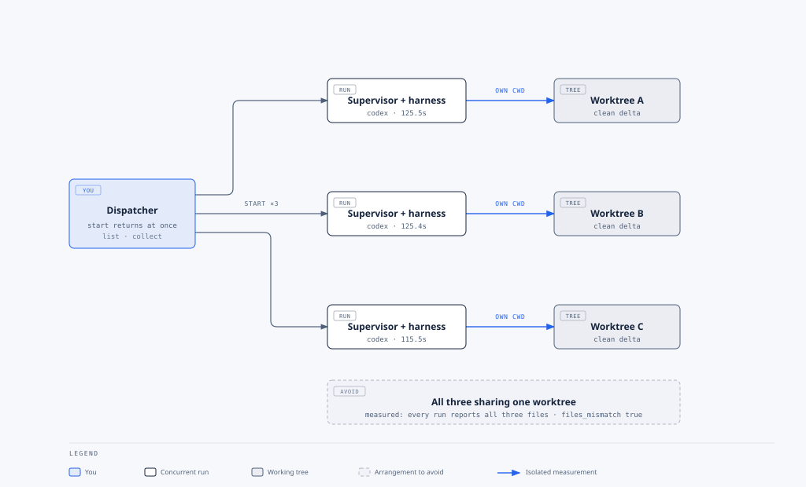

# Delegate Task: debate, parallel work, and automation

Delegate Task starts another agent CLI in a separate process and returns measured results. A
coordinator decides what to dispatch next. The debate below is a bounded review policy built from
`start` and `collect`; it is not a native consensus flag.

## Table of contents

- [Claude and Codex debate](#claude-and-codex-debate)
- [Independent parallel work](#independent-parallel-work)
- [Automate a separate process](#automate-a-separate-process)

## Claude and Codex debate

Use this when a decision benefits from competing views. For issue 412, ask both reviewers to
agree on refund idempotency, permissions, rejection, and settlement recovery before implementation.
Limit the debate to **three pairs, at most six delegated runs**. Stop earlier on agreement or failure.


Claude proposes a candidate; Codex reviews that exact candidate. The coordinator carries objections
into the next pair. Agreement requires both reviewers to endorse identical text. Failure, malformed
data, or exhausted iterations returns **unresolved**, with the last candidate and remaining objections.
[Editable diagram](diagrams/delegate-consensus.html).

These Windows examples require **PowerShell 7.3 or later**, which preserves quoted proposal text
when passing native arguments. Resolve the installed driver, run `doctor`, and keep artifacts outside
the target checkout:

```powershell
$delegate = 'C:\Users\you\.agents\skills\delegate-task\delegate.mjs'
$target = 'D:\Projects\booking-app'
$env:DELEGATE_RUNS_DIR = 'D:\AgentRuns\booking-refund-review'
node $delegate doctor
```

The coordinator follows this playbook; each `start` gets an explicit `--cwd`, `--timeout 600`,
and `--sandbox`. Select a Codex model available in your CLI; Claude's model below is Opus 5.5.

| Pair | Claude task | Codex task | Coordinator decision |
| --- | --- | --- | --- |
| 1 | Propose the refund design from issue 412 and current code. | Critique Claude's exact candidate against the same requirements. | Stop if both agree; otherwise preserve concrete objections. |
| 2 | Revise the candidate to address Codex's recorded objections. | Review the revised candidate, including each prior objection. | Stop on identical endorsed text or failure. |
| 3 | Make the final bounded revision. | Review the final candidate. | Agreement or unresolved; no fourth pair. |

```powershell
$claudeTask = @'
Read issue 412's provided requirements and the current refund implementation. Propose one design
covering permission checks, idempotency, rejection, and settlement recovery. Do not edit or commit.
In the delegation summary, return only a JSON object with proposal (string), agree (boolean),
and objections (array of strings). Set agree true only if you endorse this exact proposal.
'@
$claudeRun = node $delegate start --harness claude --model claude-opus-5-5 --cwd $target --timeout 600 --sandbox --task $claudeTask | ConvertFrom-Json
node $delegate collect $claudeRun.run_id --wait 30 --json
```

Exit 3 from Collect means still running: collect the **same run**, without starting another.
Once it finishes, check `status`, `status_provenance`, changes, and truncation. Parse `summary` as
JSON data and validate its three fields. Reject unstructured text rather than guessing agreement.

```powershell
# $candidate is validated JSON from Claude's successful result.summary.
$codexTask = "Review this exact refund design against issue 412 and current code: $($candidate.proposal). Do not edit or commit. Return only JSON in the delegation summary: proposal (copy unchanged if agreed, revised if objecting), agree (boolean), objections (array of strings)."
$codexRun = node $delegate start --harness codex --cwd $target --timeout 600 --sandbox --task $codexTask | ConvertFrom-Json
node $delegate collect $codexRun.run_id --wait 30 --json
```

The loop guard is `pair <= 3`; consensus is `claude.agree && codex.agree` with an **ordinal exact
match** of `proposal` and empty objections on both sides. Record each run ID and the validated
objects. Resume each harness's own previous run for a revision using `--resume <its-run-id>`,
repeating the read-only constraints. This is a coordinator playbook, not an executable end-to-end
script; enforce the cap in your coordinator before dispatching.

Consensus settles a proposed design. Run implementation checks separately before accepting code.
Codex requests CLI-enforced read-only; Claude requests plan mode. The tripwire cannot prove that
no writes occurred, and a `null` read-only result means unknown. Keep the target unchanged during
reviews so concurrent edits do not contaminate measured deltas.

## Independent parallel work

For the same refund feature, let Claude inspect permission and recovery risks while Codex inspects
coverage and accessibility. Dispatch both before collecting either:

```powershell
$security = node $delegate start --harness claude --model claude-opus-5-5 --cwd $target --timeout 600 --sandbox --task 'Read the refund feature. Report permission and recovery risks with file references. Do not edit or commit.' | ConvertFrom-Json
$coverage = node $delegate start --harness codex --cwd $target --timeout 600 --sandbox --task 'Read the refund feature. Report missing tests and accessibility checks with file references. Do not edit or commit.' | ConvertFrom-Json
node $delegate collect $security.run_id --wait 30 --json
node $delegate collect $coverage.run_id --wait 30 --json
```

Both agent processes run in the background even though the two `start` calls are issued sequentially.
Independent read-only reviews can share a stable checkout. Parallel writers each need a separate
worktree and owned paths; review and integrate their changes afterward. Reuse the skill's
[parallel fan-out example](../skills/agent-tools/skills/delegate-task/README.md#running-several-at-once)
and [queue guidance](../skills/agent-tools/skills/delegate-task/references/task-queues.md).



## Automate a separate process

For a scheduled report, start one Codex review, persist its returned run ID in the scheduler's
state, then collect it on subsequent ticks. The driver launches a detached supervisor; an interactive
chat session does not need to remain open. Keep the run directory and environment consistent.

```powershell
$run = node $delegate start --harness codex --cwd $target --timeout 600 --sandbox --task 'Inspect refund contract drift and return a findings list with file references. Do not edit, commit, or send messages.' | ConvertFrom-Json
# Persist $run.run_id, then use it on each scheduler tick:
$resultText = node $delegate collect $run.run_id --json
$collectExit = $LASTEXITCODE
if ($collectExit -eq 3) { Write-Output 'Still running; collect this run on the next tick.' }
elseif ($collectExit -ne 0) { throw "Collection needs review: exit $collectExit" }
else {
    $result = $resultText | ConvertFrom-Json
    if ($result.status -ne 'successful') { throw "Delegate failed: $($result.status_provenance.primary)" }
    $result.summary
}
```

Inspect provenance, measured changes, dropped records, and model reporting before consuming a
successful summary. Exit 6 can mean an adrift child; inspect `status` rather than redispatching.
Treat model output as data. Automation here reports findings; publishing or applying them is a
separate authorized action. [Driver contract](../skills/agent-tools/skills/delegate-task/SKILL.md).
