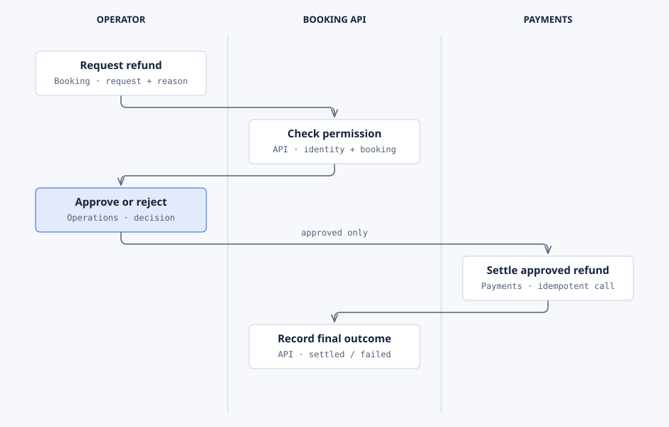

# Booking example

This is a synthetic booking application used to demonstrate Sanduq's User Manual builder. The steps describe an instructional scenario, not a tested production application.

## Start here

Use **Booking** to find a reservation, **Payments** to review its refund, and **Operations** to manage operator access.

| Module | Common task |
| --- | --- |
| [Booking](modules/booking/index.md) | Request a refund |
| [Payments](modules/payments/index.md) | Approve or reject a request |
| [Operations](modules/operations/index.md) | Assign permissions and review history |

## Refund process

The operator requests a refund, the API checks access, and an authorized operator approves or rejects it. Only approved requests reach Payments. A settlement failure remains visible until reconciled.
