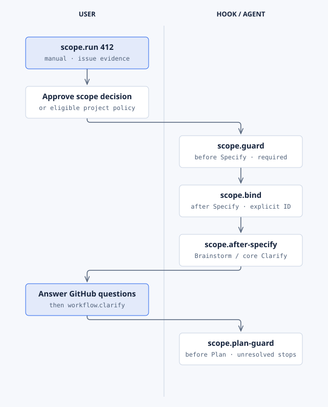
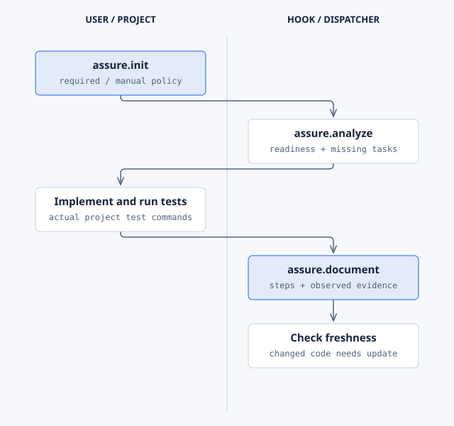
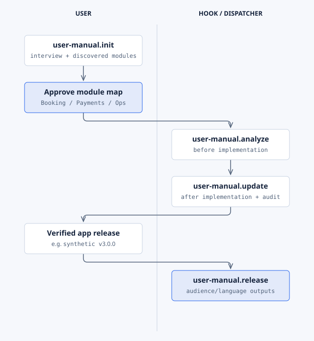
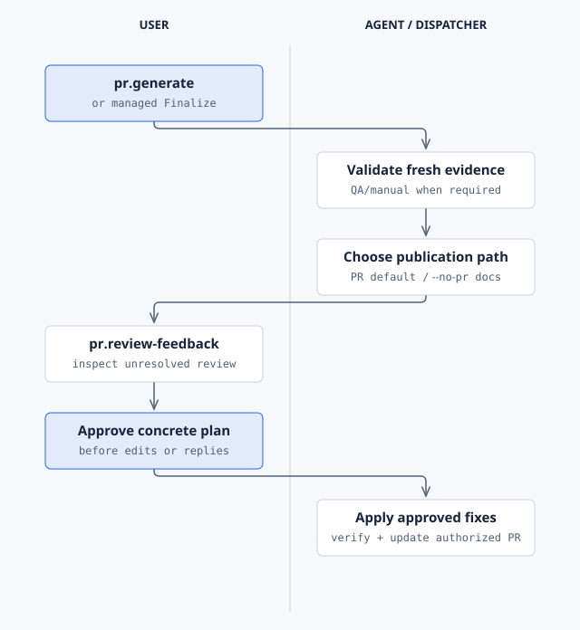

# Extension workflows, commands, and states

Read each lane diagram from top to bottom. **User** lanes show explicit commands or decisions.
**Hook** lanes run when their configured Spec Kit phase fires. **Dispatcher** lanes belong to
managed Workflow, which controls stage order and the selected executor. These are distinct triggers.

Command labels omit the `$speckit-` prefix for space: `scope.run` means `$speckit-scope-run` in
Codex. See [host command syntax](getting-started.md#command-names) and the
[complete command reference](extensions.md). All feature examples use synthetic issue 412.

## Table of contents

- [Managed Workflow](#managed-workflow)
- [Optional delivery paths](#optional-delivery-paths)
- [Scope](#scope)
- [Project](#project)
- [Assure](#assure)
- [User Manual](#user-manual)
- [PR](#pr)
- [Illustrate](#illustrate)
- [Memory](#memory)
- [State and recovery](#state-and-recovery)

## Managed Workflow

The user starts `workflow.scope 412`, answers clarification questions when asked, and explicitly
invokes `workflow.finalize` for the authorized PR handoff. The dispatcher owns Scope, specification,
clarification, planning, task generation, analysis, implementation, verification, review, current
documentation, and Ready. Ready checks required evidence before the PR handoff.
`workflow.continue` resumes an interrupted checkpoint; it does not skip a blocking gate.
Workflow declares no independent hooks. [Editable overview](diagrams/extension-workflow.html).

The [sequence diagram](diagrams/dispatcher-sequence.html) shows the claim, host work, and
receipt validation. The [implementation diagram](diagrams/implementation-orchestration.html)
shows delegated workers; the [state diagram](diagrams/feature-state.html) shows checkpoints.

## Optional delivery paths

QA and manual selection are independent. Enabled QA adds readiness analysis and a post-check
walkthrough; enabled manual adds gap analysis and affected-page updates. Selecting neither keeps
the core delivery stages. [Editable decision flow](diagrams/delivery-choices.html).

| Choice | Selected path |
| --- | --- |
| Core executor | Core task generation and implementation route |
| Installed SuperSpec | Selected SuperSpec task generator and executor; no second core executor |
| Bridge overlay | Continuation routes to the existing owner; it does not add another executor |
| Questions unresolved | Pause for human answers, then explicit Clarify |
| Required check stale or failed | Block Finalize; repair and verify affected evidence |
| PR Generate `--no-pr` | Write documents only; no remote PR operation |

## Scope

Standalone `scope.run` checks issue evidence and prerequisites. Publish decomposition only after
approval or an eligible configured project-policy decision. Required hooks guard Specify, bind its
explicit issue, select installed Brainstorm or core Clarify, and guard Plan. Split work also needs
`scope.plan` through installed Archify. Managed Workflow sequences these operations through its
dispatcher. [Editable source](diagrams/extension-scope.html).

## Project

`project.init` discovers the board and records approved column mappings. Required integrated sync
runs automatically; optional hooks prompt, and manual operation requires `project.sync`. Managed
Workflow owns task sub-issue creation/completion and calls its Project adapter. A graceful skip
remains a skip. [Editable source](diagrams/extension-project.html).

## Assure

Select integrated or manual policy at `assure.init`. Configured hooks or the managed dispatcher
invoke Analyze and Document; a standalone manual setup uses explicit commands. Assure identifies
missing coverage and writes tester instructions. Project checks supply actual execution evidence.
Changed implementation can stale the walkthrough. [Editable source](diagrams/extension-assure.html).

## User Manual

Init interviews the owner and requires module-map approval. Analysis precedes implementation;
Update authors affected pages, audits, and builds a preview afterward. Release uses verified
application release evidence to build selected audience/language editions. Unselected manual
maintenance is skipped by Workflow; audience publication still follows its approved visibility.
[Editable source](diagrams/extension-user-manual.html) · [real theme screenshots](user-manual-examples.md).

## PR

Standalone Generate is explicit; managed Finalize owns the handoff. Generation defaults to PR
publication when prerequisites exist, while `--no-pr` writes documents only. Review Feedback
presents a concrete plan and requires approval before edits, replies, commits, pushes, or thread
resolution. Missing remote prerequisites produce an accurate skipped-PR report.
[Editable source](diagrams/extension-pr.html).

## Illustrate

Illustrate has no hooks. The user selects the preset or custom theme, asks for the diagram, and
explicitly requests exports. The agent resolves tokens, applies the diagram-type rules, inspects
the HTML, and embeds the reviewed output. [Editable source](diagrams/extension-illustrate.html)
· [process and theme gallery](illustrate-examples.md).

## Memory

Impact consults current knowledge before Analyze through its required hook, and during explicit
specification/impact work. Prepare queues completed implementation. After merge into the configured branch, the next local
session checks approved automatic policy and actual verification. Knowledge reconciliation,
fixture migration, independent review, and recoverable checkpoint/final commits precede removal.
Automatic mode needs a one-time review of the concrete policy and implementation; changes invalidate
approval. It is a local session path, not a daemon or a remote merge trigger.
[Editable source](diagrams/extension-memory.html).

Explicit `memory.run` can select an archive without automatic mode. Failed guards, an active writer,
or interrupted work require the recorded recovery recipe. Resume, abandon, rollback, explicit
retirement, and verification overrides follow the package's own contracts; deleting the journal
does not repair the transaction. [Memory reference](../extensions/memory/README.md).

## State and recovery

A ready feature advances through implementation and verified documentation to PR. Questions or
stale evidence block progression until corrected. Merge alone does not make an archive eligible.
[Editable state diagram](diagrams/feature-state.html) · [status and recovery commands](workflow-operations.md).

Outside managed Workflow, hooks with `optional: false` run automatically; `optional: true` asks
before invocation. Init can rewrite Project and Assure hooks according to policy. Managed
`workflow.reconcile` owns its integration wiring: avoid installing a second competing hook chain.
