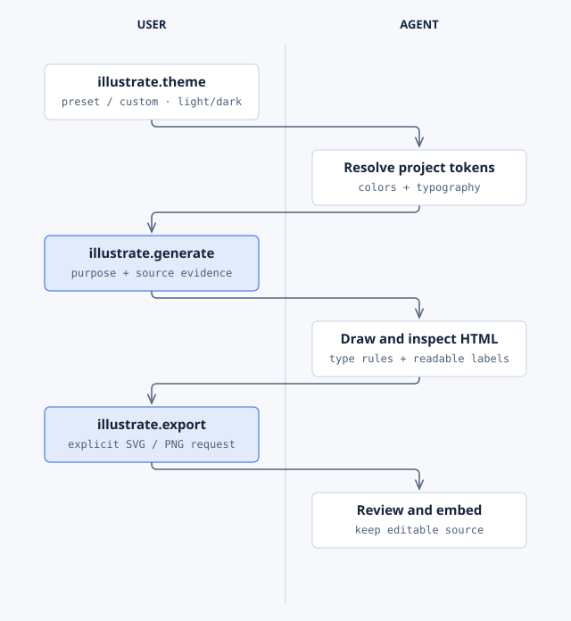

# Illustrate

**Purpose:** draw diagrams and charts as editable HTML with inline SVG, in your project's tracked
color and font theme. It supports 44 diagram types and exports SVG and PNG on request, and an animated SVG of a motion figure for README images.

| | |
| --- | --- |
| Lifecycle phase | Any; runs only when you ask |
| Hooks | None |
| Commands | `generate`, `export`, `theme`, `import` ([reference](../reference/commands.md#illustrate)) |
| Requires | Nothing |
| Required by | Assure, PR, User Manual (Illustrate 2.x) |
| Standalone | Yes |
| License | PolyForm Noncommercial 1.0.0 |

The extension carries its own version-matched copy of the Illustrate skill under
`.specify/extensions/illustrate/skill/`. It does not need a separately installed skill. The copy is
[vendored](../../vendor.lock.json) from [sanduq-skills](https://github.com/samykabu/sanduq-skills).

## Setup

```bash
specify extension add illustrate
```

```text
$speckit-illustrate-theme set cobalt light
```

The theme is stored in `.github/illustration-theme.yml`. Commit it so local runs and CI draw the same
colors and fonts. Cobalt Porcelain, Emerald Mist and Sanduq Classic are built in, each with light and
dark modes.

## Example

```text
$speckit-illustrate-generate Create a state diagram of refund request, approval, rejection and settlement from the real implementation.
$speckit-illustrate-export docs/refund-approval.html --svg-only
$speckit-illustrate-export docs/refund-approval-animated.html --animated
$speckit-illustrate-import docs/legacy/order-flow.mmd --size doc-wide --detail balanced
```

The [process and theme gallery](../illustrate-examples.md) shows the presets and a custom theme.

## How it runs



You choose the theme, ask for the diagram, and ask for exports. The agent resolves the theme tokens,
applies the diagram type's rules, checks the HTML, and embeds the reviewed output.
[Editable source](../diagrams/extension-illustrate.html).

## Limits

- PNG export needs Playwright and Chromium. SVG and animated SVG export need Python.
- An animated SVG fades each step in once (opacity only), has no script or remote fonts, and
  shows the complete figure to readers who prefer reduced motion.
- The hand-drawn generator needs Node.js and an `npm install` in the skill directory.
- Keep the editable HTML beside every export. Review the rendering before you embed it.
- Old Diagram Design installs must migrate: `specify extension remove diagram-design`, then add `illustrate`.

Package details: [Illustrate README](../../extensions/illustrate/README.md).
