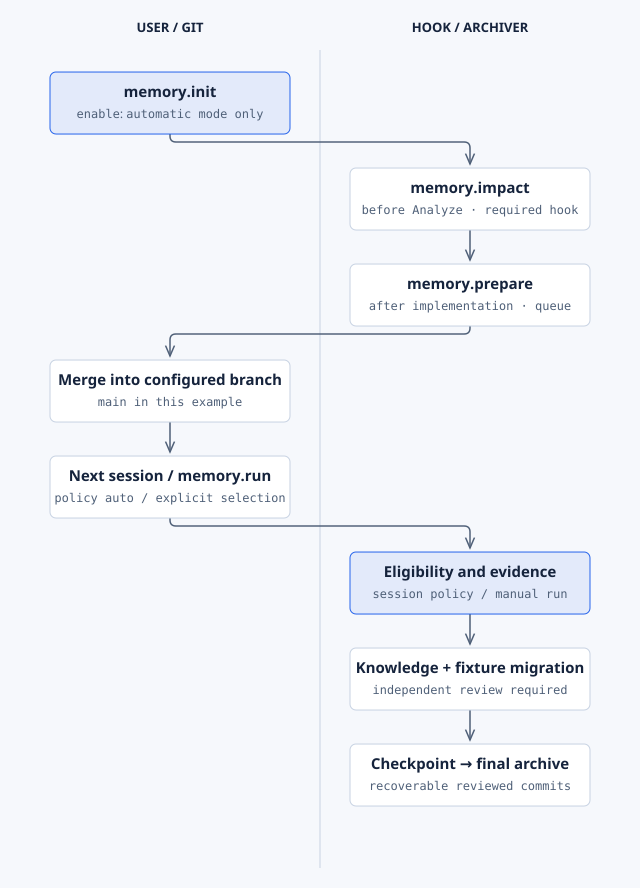

# Memory

**Purpose:** keep current product knowledge in `specs/memory/`. After a feature merges, Memory
reconciles what it learned into memory entries and archives the feature folder through reviewed,
recoverable Git commits.

| | |
| --- | --- |
| Lifecycle phase | Before `specify`, before `analyze`, after `implement`; next local session after merge |
| Hooks | Three mandatory hooks ([hooks](../reference/hooks.md)) |
| Commands | `init`, `prepare`, `run`, `session`, `enable`, `impact`, `status` ([reference](../reference/commands.md#memory)) |
| Requires | Nothing; Python 3.11 or later, Git, Spec Kit 1.x |
| Standalone | Yes |
| License | PolyForm Noncommercial 1.0.0 |

## Setup

```bash
specify extension add memory
python .specify/extensions/memory/scripts/install.py --target-branch main
```

```text
$speckit-memory-init Configure main as the merge branch and register our real test commands and covered paths.
```

Use your real merge branch and checks that verify your code. Init does not enable automatic
archiving. `$speckit-memory-enable` shows the policy for your review first.

## Example

```text
$speckit-memory-impact Consult current refund constraints and settlement decisions relevant to this change.
$speckit-memory-run specs/412-refund-approval Archive this verified, fully completed feature.
```

```bash
python .specify/extensions/memory/scripts/archive.py memory query --text refund
python .specify/extensions/memory/scripts/archive.py memory check
```

## How it runs



Impact reads current knowledge before Analyze. Prepare queues finished work. After the merge, the
next local session checks the approved policy and the real checks, then reconciles knowledge,
reviews it, and commits before it removes the feature folder.
[Editable source](../diagrams/extension-memory.html).

## Limits

- Automatic mode runs in a local session. There is no daemon and no remote merge trigger.
- Changing the policy or the scripts withdraws the approval. Review and enable again.
- Checked tasks and a merge do not prove a feature is complete. Memory runs your checks.
- Never delete a journal or reset Git to get past a blocked archive. Use the printed recovery steps.

Package details: [Memory README](../../extensions/memory/README.md).
