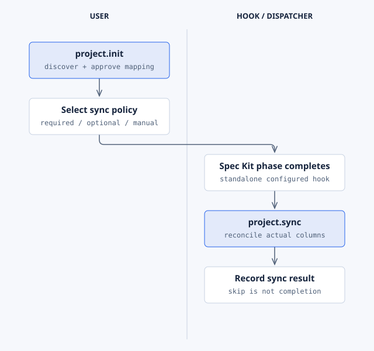

# Project

**Purpose:** mirror each Spec Kit feature on a GitHub Project (v2). Project creates a parent issue,
moves its Status column through the lifecycle, and creates one sub-issue per task.

| | |
| --- | --- |
| Lifecycle phase | After `specify`, `plan`, `analyze` and `tasks`; before and after `implement` |
| Hooks | Six optional hooks; Project Init can make them mandatory ([hooks](../reference/hooks.md)) |
| Commands | `init`, `sync` ([reference](../reference/commands.md#project)) |
| Requires | Nothing; uses `gh` when available |
| Standalone | Yes |
| License | PolyForm Noncommercial 1.0.0 |

## Setup

```bash
specify extension add project
gh auth refresh -h github.com -s project,read:project
```

```text
$speckit-project-init Discover the booking application's Project, map lifecycle columns, and select required sync.
```

Init asks whether sync hooks are **required** (automatic) or **optional** (ask first). It maps each
phase to a real board column and writes `config.json`. Commit it with `.specify/extensions.yml`.

## Example

```text
$speckit-project-sync Synchronize the refund parent and completed task IDs without duplicate sub-issues.
```

For a dry run, use the package's sync helper: `project-sync.ps1 -Phase auto -DryRun` or
`project-sync.sh --phase auto --dry-run`.

## How it runs



Required sync runs automatically at each phase. Optional hooks ask first. In the managed Workflow,
Workflow requires automatic sync and its own adapter creates and closes task sub-issues.
[Editable source](../diagrams/extension-project.html).

## Limits

- If `gh`, its scopes, a GitHub remote or `config.json` is missing, sync logs a skip and exits 0.
  A skip is not a completed sync.
- Project only touches the configured board and issues in the `origin` repository.

Package details: [Project README](../../extensions/project/README.md).
