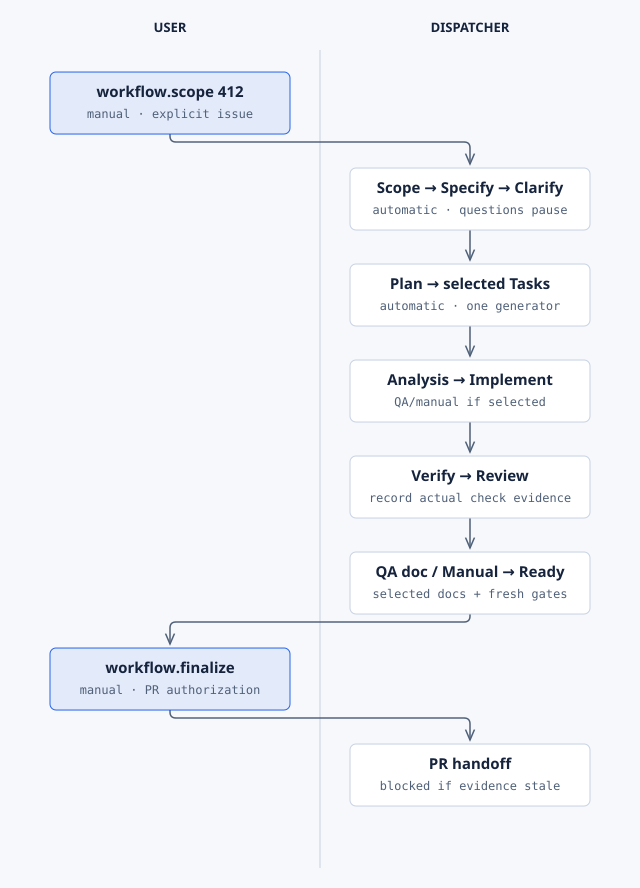

# Workflow

**Purpose:** run one GitHub issue from scope to a verified pull request through a resumable
[dispatcher](../reference/glossary.md#dispatcher). Workflow coordinates the other extensions and
can resume in a new session.

| | |
| --- | --- |
| Lifecycle phase | All of them, as sixteen [stages](../workflow/stages.md) |
| Hooks | None of its own; it disables the hooks it owns and runs them as stages ([hooks](../reference/hooks.md#managed-workflow)) |
| Commands | 13, including `init`, `scope`, `clarify`, `continue`, `finalize`, `status`, `doctor` ([reference](../reference/commands.md#workflow)) |
| Requires | Python 3.10 or later, Git, `gh`; installs Scope, Project, PR, Illustrate and selected Assure and User Manual |
| Standalone | Yes; it is the managed level |
| License | PolyForm Noncommercial 1.0.0 |

## Setup

Follow the [managed-workflow scenario](../scenarios/managed-workflow.md).

## Example

```text
$speckit-workflow-scope 412 Assess refund approval and continue through implementation under project policy.
$speckit-workflow-clarify Reread issue 412's answers and resume the bound feature.
$speckit-workflow-continue Resume specs/412-refund-approval from its checkpoint.
$speckit-workflow-finalize Finish current checks and documentation; create or update the refund feature's PR.
```

## How it runs



You use four entry points: Scope, Clarify, Continue and Finalize. The dispatcher owns every stage
between them. [Editable diagram](../diagrams/extension-workflow.html).

## Limits

- Merge and deployment need separate authorization.
- Utilities such as `verify-affected` do not claim or complete a stage. Their local results do not
  count as remote CI evidence.
- A schema pass is not acceptance. Runtime checks also enforce identity, freshness and stage order.

Guide: [Workflow README](../../extensions/workflow/README.md). Reference: [stages](../workflow/stages.md),
[state files](../workflow/state-files.md), [schemas](../workflow/schemas.md),
[runner policy](../workflow/runner-policy.md), [utilities](../workflow/utilities.md),
[delegation](../workflow/delegation.md), [development](../workflow/development.md).
