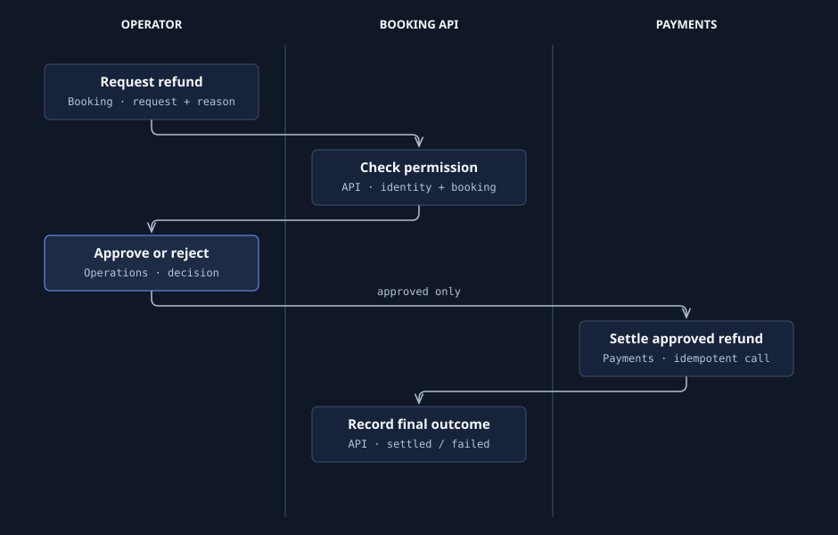
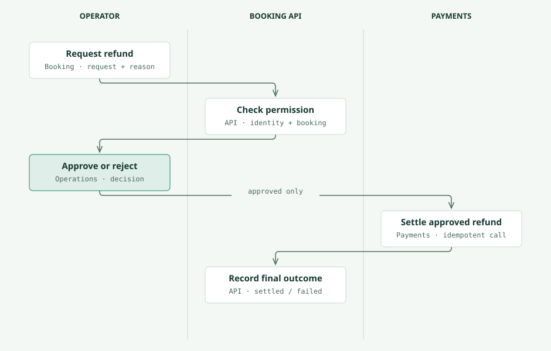
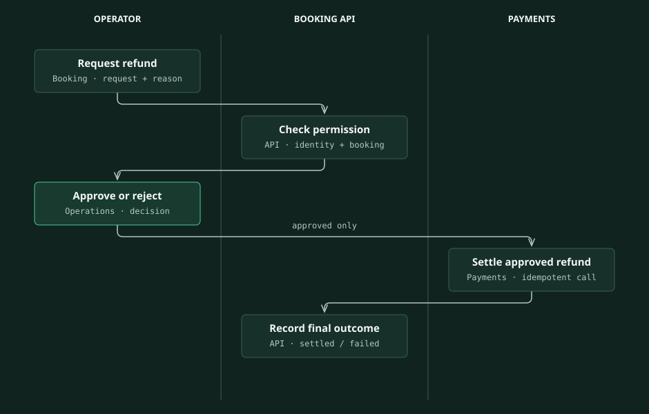
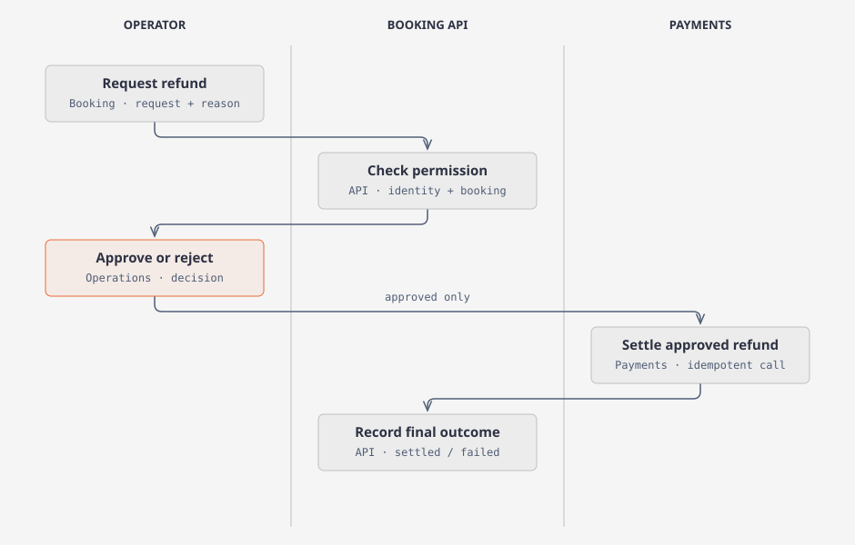
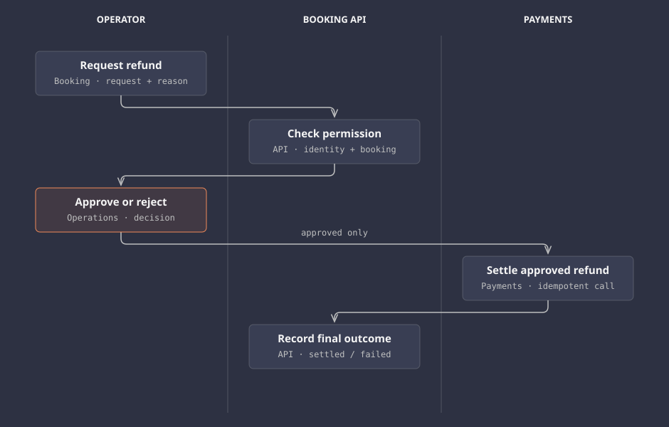
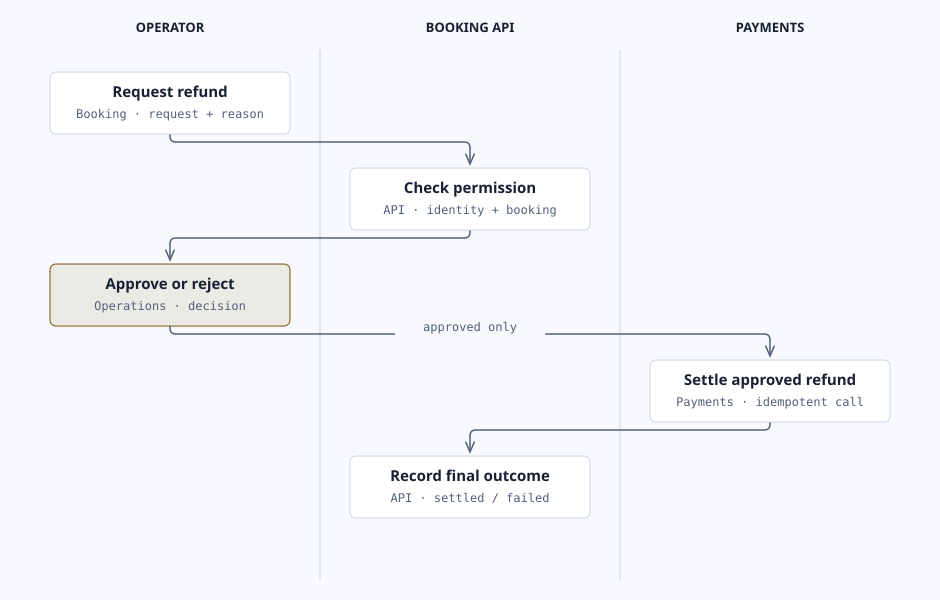

# Illustrate: processes and color themes

A process diagram makes responsibility visible. Use a swimlane when you need to show who acts,
and a flowchart when the decision branches matter. The examples below use the same synthetic
booking refund scenario as the [skill guide](scenarios/skills-only.md#illustrate).

## Table of contents

- [Draw the process](#draw-the-process)
- [Choose a preset](#choose-a-preset)
- [Supply your own colors](#supply-your-own-colors)
- [Export and check](#export-and-check)

## Draw the process

```text
$illustrate Draw an editorial swimlane for refund approval. Use Operator, Booking API, and
Payments lanes. Show the request, permission check, approve/reject decision, settlement of
approvals only, and recorded outcome. Label it as a synthetic example. Use our project theme.
Keep an editable HTML source and export an SVG for the documentation.
```


The operator supplies the request and decision; the API checks permission and records the outcome;
Payments settles approvals. Rejection ends before settlement. A payment failure stays failed until
reconciled. [Open the editable example](diagrams/refund-process-cobalt-light.html).

For a payload and tool map, ask for the **process** type and name each step's input, output, tool,
and owner. For branching logic, ask for a **flowchart** with labeled permission, rejection, and
settlement-failure paths. Use observed application states when documenting a real project.

## Choose a preset

Run from your consumer project. `$ILLUSTRATE` is the installed skill directory; for the Spec Kit
extension it is `.specify/extensions/illustrate/skill`.

```bash
python "$ILLUSTRATE/scripts/illustration_theme.py" --project-root . list
python "$ILLUSTRATE/scripts/illustration_theme.py" --project-root . set --theme emerald --mode light
python "$ILLUSTRATE/scripts/illustration_theme.py" --project-root . set --theme cobalt --mode dark
python "$ILLUSTRATE/scripts/illustration_theme.py" --project-root . set --theme cobalt --font-loading system
python "$ILLUSTRATE/scripts/illustration_theme.py" --project-root . resolve --format yaml
```

Initialize a project without a theme using `init --non-interactive`. Selection is saved in
`.github/illustration-theme.yml`; regeneration applies the resolved palette and font stacks.
Changing the file does not recolor an existing export.

| Preset | Fonts | Light example | Dark example |
| --- | --- | --- | --- |
| Cobalt Porcelain | IBM Plex Sans, Serif, Mono | [Editable HTML](diagrams/refund-process-cobalt-light.html) | [Editable HTML](diagrams/refund-process-cobalt-dark.html) |
| Emerald Mist | Source Sans, Serif, Code | [Editable HTML](diagrams/refund-process-emerald-light.html) | [Editable HTML](diagrams/refund-process-emerald-dark.html) |
| Sanduq Classic | Geist, Instrument Serif, Geist Mono | [Editable HTML](diagrams/refund-process-classic-light.html) | [Editable HTML](diagrams/refund-process-classic-dark.html) |

### Cobalt Porcelain




### Emerald Mist




### Sanduq Classic




These editorial previews resolve each preset with `font_loading: system`, which uses locally
available fonts and the declared fallbacks. Use `remote` to load the preset's web fonts, or `local`
when your installed fonts provide them. SVG viewers may substitute fonts; inspect your target viewer.
Technical-color process templates also encode step categories through semantic colors; describe
that grammar explicitly rather than treating every colored step as the project accent.

## Supply your own colors

Copy the complete [Booking Brand YAML](examples/booking-illustration-theme.yml) to
`docs/examples/booking-illustration-theme.yml` in your project, change its name,
and edit the semantic roles in both `light` and `dark`. It supplies navy text and a gold accent,
with system font stacks. This example is a synthetic identity.

```bash
python "$ILLUSTRATE/scripts/illustration_theme.py" --project-root . create --from-file docs/examples/booking-illustration-theme.yml
python "$ILLUSTRATE/scripts/illustration_theme.py" --project-root . validate
python "$ILLUSTRATE/scripts/illustration_theme.py" --project-root . resolve --format css
```

Import selects the custom theme. Keep `paper`/`paper-2` for backgrounds, `ink` for primary text,
`muted` for secondary text, `rule`/`rule-solid` for boundaries, and `accent`/`accent-tint` for the
one or two focal elements. The validator checks the complete palette, typography, and text contrast.
Change typography's `remote_css_url` only when you want remote font loading.

```text
$illustrate Regenerate the refund process using booking-brand in light mode. Apply the resolved
tokens to SVG text, backgrounds, borders, and arrow markers. Keep approval as the single focal step.
```



[Editable custom example](diagrams/refund-process-booking-brand.html).

## Export and check

```bash
python "$ILLUSTRATE/scripts/export_diagram.py" docs/refund-process.html --svg-only
python "$ILLUSTRATE/scripts/export_diagram.py" docs/refund-process.html --png-only --scale 2
```

PNG needs Playwright and Chromium. Keep HTML beside its exports, inspect narrow and desktop views,
and provide a text explanation beside an embedded image. The [extension pages](README.md#extensions)
show how the same approach explains commands, automation, and blocked states.
