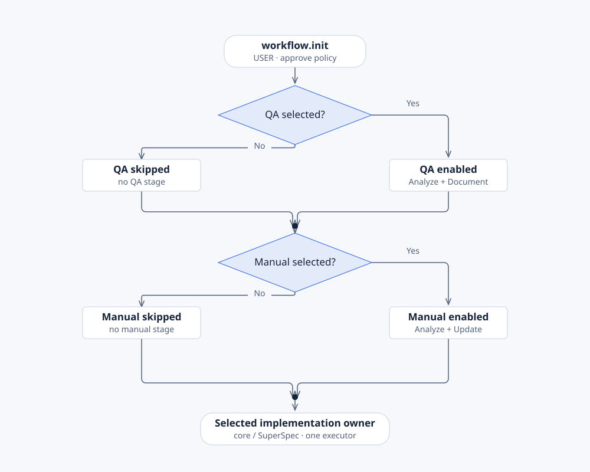

# Managed Workflow

**Goal:** take one GitHub issue from scope to a verified pull request with one command, and resume it
in a new session if you are interrupted.

The [managed Workflow](../reference/glossary.md#managed-workflow) adds a
[dispatcher](../reference/glossary.md#dispatcher). It decides which [stage](../reference/glossary.md#stage)
runs next, takes a [claim](../reference/glossary.md#claim) on it, and checks the
[receipt](../reference/glossary.md#receipt) before it moves on.

## Prerequisites

- A Spec Kit project with the Sanduq catalog registered. See [set up Spec Kit](../start/install-speckit.md).
- Python 3.10 or later, Git, and `gh` signed in with Project scopes. See [prerequisites](../start/prerequisites.md).
- A GitHub Project (v2) for the repository.

## Install

```bash
specify extension add workflow
```

Then initialize. Init records your choices and runs Workflow's installer, which adds the
extensions it needs.

<details>
<summary>Codex</summary>

```text
$speckit-workflow-init Enable QA and User Manual for the booking application. Use our existing GitHub Project and an advisory managed-only evidence gate.
$speckit-workflow-doctor Verify project readiness and installed host commands.
```

</details>

<details>
<summary>Claude Code</summary>

```text
/speckit-workflow-init Enable QA and User Manual for the booking application. Use our existing GitHub Project and an advisory managed-only evidence gate.
/speckit-workflow-doctor Verify project readiness and installed host commands.
```

</details>

The script equivalent is:

```bash
python .specify/extensions/workflow/scripts/workflow.py init --qa on --manual on --gate-mode advisory --gate-scope managed-only
python .specify/extensions/workflow/scripts/install.py
python .specify/extensions/workflow/scripts/install.py --apply
python .specify/extensions/workflow/scripts/workflow.py doctor --project
```

The first `install.py` call previews. The second backs up, applies, and rolls back on failure. If
your board is not configured yet, run `$speckit-project-init`. You are ready when
`doctor --project` passes.

## First prompt

<details>
<summary>Codex</summary>

```text
$speckit-workflow-scope 412 Assess refund approval using our project policy and continue through implementation. Stop before PR creation.
```

</details>

<details>
<summary>Claude Code</summary>

```text
/speckit-workflow-scope 412 Assess refund approval using our project policy and continue through implementation. Stop before PR creation.
```

</details>

## What you will see


You start `workflow.scope 412`. Scope posts any open questions on the issue. You answer them on
GitHub, then run `workflow.clarify`. The dispatcher runs specification, planning, task generation,
analysis, implementation, verification, review and documentation. When evidence is current, the
feature is ready. `workflow.finalize` opens or updates one pull request.

At implementation start, a live progress report opens at
`specs/412-refund-approval/workflow/progress/index.html`. `workflow.continue` resumes an interrupted
run from its [checkpoint](../reference/glossary.md#checkpoint). It never skips a blocking check.

The [sequence diagram](../diagrams/dispatcher-sequence.html) shows the claim, the host's work and
the receipt check. The [worked lifecycle](../workflow/lifecycle.md) walks through every stage.


## Optional delivery paths



QA and manual selection are independent. Selected QA adds readiness analysis and a walkthrough after
checks. A selected manual adds gap analysis and affected-page updates. Selecting neither keeps the
core stages. [Editable decision flow](../diagrams/delivery-choices.html).

| Choice | Path |
| --- | --- |
| Core executor | Core task generation and implementation |
| SuperSpec installed | SuperSpec generates tasks and executes; no second core executor runs |
| Superpowers Bridge installed | Continuation goes to the current owner; no extra executor runs |
| Questions unresolved | Pause for answers on GitHub, then run Clarify |
| Required check stale or failed | Finalize is blocked until the evidence is repaired |
| PR Generate `--no-pr` | Documents only; no remote PR work |

## State and recovery


A ready feature moves through implementation and verified documentation to a pull request. Open
questions or stale evidence block it until you fix them.
[Editable state diagram](../diagrams/feature-state.html) ·
[status and recovery commands](../workflow/operations.md).

## Next step

- Daily operation, upgrades and recovery: [operating guide](../workflow/operating-guide.md).
- CI gate modes and adding QA or the manual later: [delivery policy](../workflow/delivery-policy.md).
- Every stage and its command: [stages](../workflow/stages.md) and the [hooks reference](../reference/hooks.md#managed-workflow).

## Who enforces dependencies

Workflow's installer adds Scope, Project, PR and Illustrate, plus Assure and User Manual when you
select them. It pins each version in `dependencies.json` and keeps a newer compatible version if you
already have one. Spec Kit itself does not enforce `requires.extensions`.

## Limits

- Merge and deployment need your explicit authorization. Finalize stops at the pull request.
- Workflow disables the extension hooks it owns and runs those commands as stages instead. Do not
  re-enable them by hand. Run `$speckit-workflow-reconcile` to repair the wiring.
- Installing a package does not [enable](../reference/glossary.md#enabled) its process. Init does.
- Context protection relies on the host's measurements. When none are available, the run continues
  and records that the measurement was unavailable.
