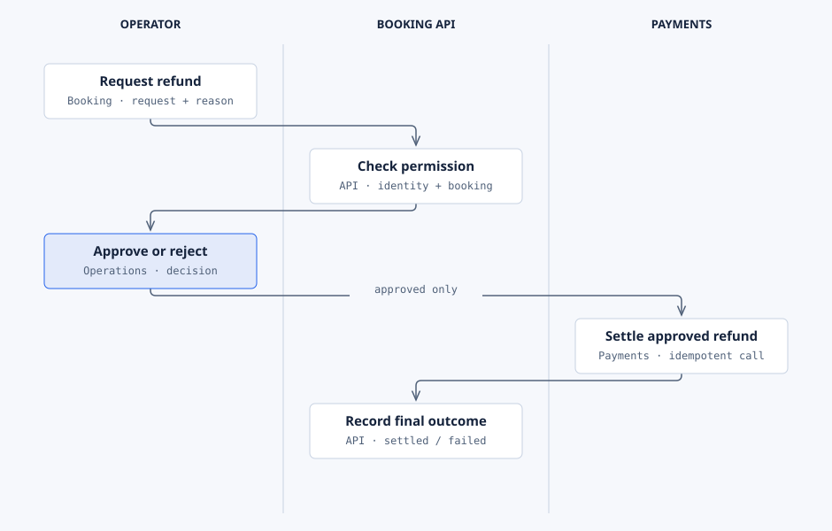
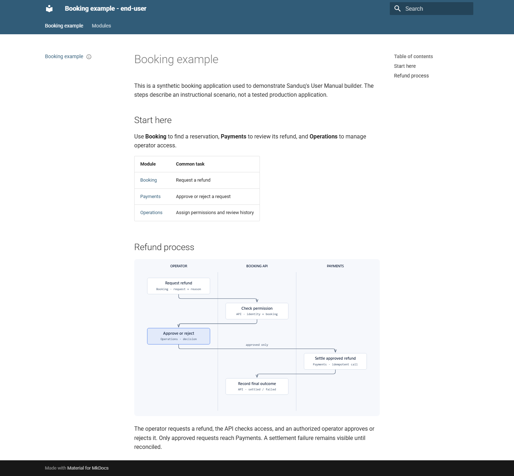
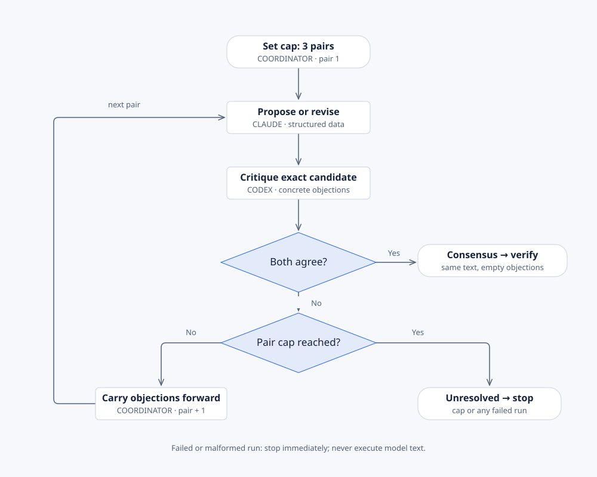

# Portable skills

A portable skill gives your agent instructions and tooling for a bounded task. These seven skills
work without Spec Kit. Install the modules you use; focused skills keep unrelated guidance out of
the task. For installation and plugin namespaces, see [Getting started](getting-started.md).

## Table of contents

- [Illustrate](#illustrate)
- [User Manual](#user-manual)
- [API documentation](#user-manual-api-docs)
- [Release documentation](#user-manual-release-docs)
- [UI screenshots](#user-manual-ui-screenshots)
- [Preview publishing](#user-manual-preview-publishing)
- [Delegate Task](#delegate-task)

All examples use the [booking application and refund feature](README.md#example-conventions).
Each section names the source contract so you can check its prerequisites and detailed behavior.

## Illustrate



See the [process and theme gallery](illustrate-examples.md) for all three light/dark presets,
editable process diagrams, and a complete custom color file. The operator decides; the API checks
access and records the outcome; Payments settles approvals only.

Use `illustrate` when a relationship is clearer as a diagram: components, time-ordered messages,
workflow states, data, ownership, or measured quantities. It supports 44 diagram types. Use a table
when the content is simply a list. [Source](https://github.com/samykabu/sanduq-skills/blob/main/skills/illustration-tools/skills/illustrate/SKILL.md).

```text
$illustrate Create a sequence diagram for refund approval from specs/412-refund-approval/plan.md
and the implemented API. Show the operator, booking API, and payment provider, including repeated
approval and settlement failure. Use the tracked project theme and keep the HTML editable.
```

Expected result: a self-contained HTML file with inline SVG, grounded labels, and a diagram small
enough to read. The project's `.github/illustration-theme.yml` controls palette, mode, and fonts.
Cobalt Porcelain, Emerald Mist, and Sanduq Classic provide light/dark presets; custom themes and
remote, local, or system font loading are supported.

```text
$illustrate Export docs/refund-approval.html as SVG for the manual and PNG for the PR.
```

Keep the editable source beside its exports. Inspect the rendered diagram before embedding it.
SVG export uses Python; PNG needs Playwright and Chromium. Technical-color templates also have
browser export controls. [Workflow interaction example](diagrams/dispatcher-sequence.html).

## User Manual



The [manual theme guide](user-manual-examples.md) compares actual Material light/dark,
ReadTheDocs, MkDocs, and custom CSS builds, and shows how to install an authored theme.

Use `user-manual` for a new manual, a cross-module update, or a coverage audit. It discovers modules,
asks for approval, and maintains one Markdown source with End User, Administrator/Operator, and
Technical Reference editions. English is required; Arabic is optional with RTL support.
[Source](https://github.com/samykabu/sanduq-skills/blob/main/skills/dev-tools/skills/user-manual/SKILL.md).

```text
$user-manual Inspect our booking application and interview me about its audiences. Propose
Booking, Payments, and Operations modules from routes, tests, contracts, and schemas. After map
approval, create the manual, including refund request and approval tutorials. Use synthetic data.
```

Expected result: `User-Manual/manual.yml`, approved modules, audience-specific Markdown, asset
coverage, and an audit. Build HTML/PDF through the skill's scripts after the audit passes. Newly
discovered modules remain proposed until approved. Document evidenced entities, columns,
relationships, constraints, and enumerations in the technical edition.

For a feature update:

```text
$user-manual Update the existing manual for issue 412 from the Git diff. Change only affected
refund instructions, entities, API examples, and screenshots. Preserve hand-authored text and
report unresolved coverage gaps.
```

The core scripts are `init_manual.py`, `audit_manual.py`, and `build_manual.py` in the installed
skill's `scripts/` directory. Install its pinned build requirements before rendering.

## user-manual-api-docs

Use this module when a contract or API reference is the main task. It inventories callers and
audiences before rendering; an `/api/` route does not establish public access.
[Source](https://github.com/samykabu/sanduq-skills/blob/main/skills/dev-tools/skills/user-manual-api-docs/SKILL.md).

```text
$user-manual-api-docs Document refund requests and approval from our checked-in contracts and
tests. Put customer operations in the appropriate edition and operator approval in the secured
administrator reference. Include synthetic payloads, permission failures, and duplicate approval.
```

Expected result: linted/bundled contracts where supported, filtered references, authentication
concepts, parameters, responses, and evidenced errors. Internal/debug operations stay out of
public output. If contracts are unreliable, label the reference a draft and record the gap.
Supported surfaces include OpenAPI, AsyncAPI, GraphQL, RPC, webhooks, and code APIs.

## user-manual-release-docs

Use this module for release-visible changes or an upgrade requiring action.
[Source](https://github.com/samykabu/sanduq-skills/blob/main/skills/dev-tools/skills/user-manual-release-docs/SKILL.md).

```text
$user-manual-release-docs Compare the booking application's actual v2.4.0 and v3.0.0 tags.
Document delivered refund approval changes for customers, operators, and technical readers.
Create migration instructions only where contracts, schemas, or configuration require action.
Include verification and evidenced rollback steps.
```

Expected result: audience-specific release notes and, when needed, a migration guide explaining
who must act, rollout order, and success checks. Stop and report missing tags or evidence rather
than inventing release dates, compatibility promises, or migration steps.

## user-manual-ui-screenshots

Use this module when a manual needs repeatable UI evidence.
[Source](https://github.com/samykabu/sanduq-skills/blob/main/skills/dev-tools/skills/user-manual-ui-screenshots/SKILL.md).

```text
$user-manual-ui-screenshots Use our existing UI runner to capture refund requested, approved,
rejected, and permission-denied states. Use deterministic synthetic bookings. Fix viewport,
locale, timezone, fonts, theme, and reduced motion; capture English and Arabic only when enabled.
Mask personal data and add task-focused captions and alt text.
```

Expected result: a role/state capture matrix, images under their owning module/language, and
coverage metadata tied to source tests. Prefer the existing Playwright runner for web; use the
existing mobile runner for native apps. A missing runnable application is an evidence gap.

## user-manual-preview-publishing

Use this module to configure or repair preview and release delivery.
[Source](https://github.com/samykabu/sanduq-skills/blob/main/skills/dev-tools/skills/user-manual-preview-publishing/SKILL.md).

```text
$user-manual-preview-publishing Prepare private CI preview artifacts for the refund manual PR.
Read User-Manual/manual.yml before considering hosted previews. Use only an approved provider;
keep Administrator and Technical editions authenticated and update the existing PR comment.
```

Expected result: a private artifact link and, only when configured and authorized, an ephemeral
hosted preview. Public hosting contains only approved End User content. Untrusted fork PRs use
the artifact fallback when credentials are unavailable. Inspect the provider's current official
documentation before changing an adapter; pin dependencies under the project's supply-chain policy.

## Delegate Task



The [delegation examples](delegate-examples.md) show a capped Claude/Codex debate, independent
parallel work, and a separate-process report. Agreement refers to the same candidate; unresolved
objections or the cap stop the debate.

Use `delegate-task` for one bounded task on another agent CLI or an independent second opinion.
Node 18+ runs its dependency-free driver. Claude Code, Codex, and OpenCode are verified harnesses;
Copilot and Pi are experimental. [Source](https://github.com/samykabu/sanduq-skills/blob/main/skills/agent-tools/skills/delegate-task/SKILL.md).

```text
$delegate-task Ask Claude to review refund approval for duplicate settlement and permission
flaws. Limit it to the feature's API, service, and tests. Use read-only mode. Return findings
with file evidence and do not commit, post comments, or change files.
```

Resolve the driver from its installed path. This PowerShell example assumes a Codex project install:

```powershell
$delegateDriver = '.agents/skills/delegate-task/delegate.mjs'
$env:DELEGATE_RUNS_DIR = Join-Path (Get-Location) '.delegate/runs'
node $delegateDriver doctor
node $delegateDriver start --harness claude --cwd . --sandbox --timeout 600 --task 'Review refund approval for duplicate settlement and permission flaws. Read only.'
node $delegateDriver collect <run-id> --json
```

For a plugin, the driver is under `$CLAUDE_PLUGIN_ROOT/skills/delegate-task/`. Use the same
`DELEGATE_RUNS_DIR` for start/status/collect and ignore `.delegate/` in Git. Artifacts hold prompts
and raw output. Default execution uses full bypass; explicitly request `--sandbox` for a review.

Expected result: `successful`, `failed`, or `abandoned` with `status_provenance`, Git-measured
changes, claimed files, and available token usage. Inspect all of those before accepting work.
Read-only detection covers final-state changes that Git can measure; it cannot prove no writes
occurred. A concurrent edit can also appear in the measured delta. Missing usage is unknown,
and token totals from different harnesses are not an efficiency ranking.

Use `status` while running, `collect` for the result, `start --resume <run-id>` for a follow-up,
and `prune --keep 20 --yes` to remove older terminal run artifacts. `contract` prints flags and
guarantees. Do not redispatch an `adrift` run until its surviving process is settled.
