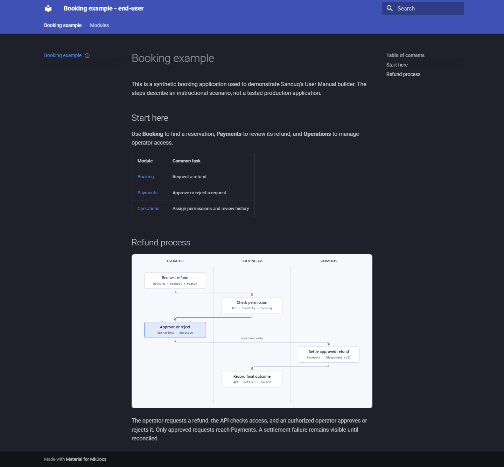
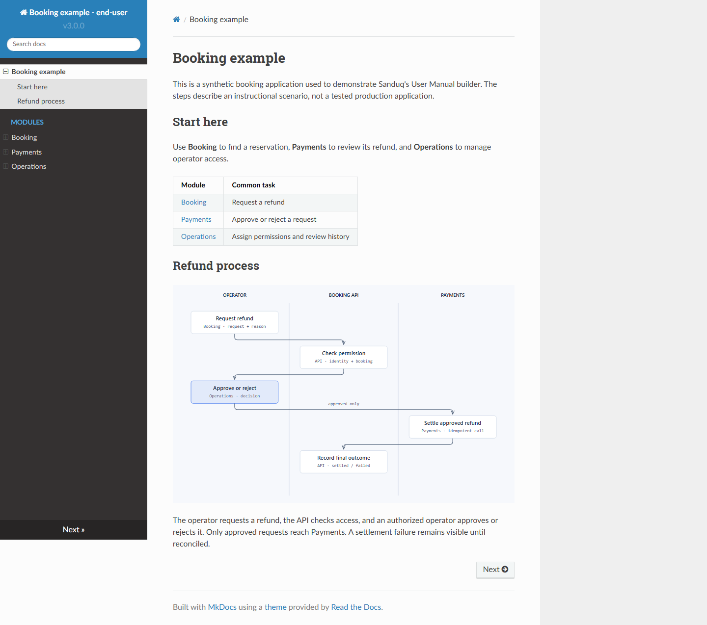
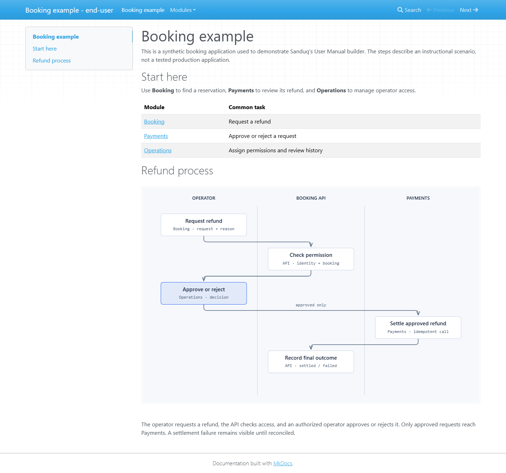
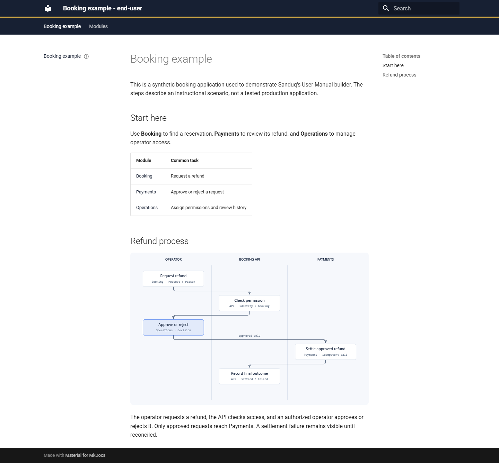

# User Manual: themes and a rendered example

The same manual content can have different navigation, typography, and colors. Choose a renderer
that supports your theme, then audit and build the audience edition. These screenshots come from
the actual extension builder, using the checked-in synthetic Booking, Payments, and Operations manual.

## Table of contents

- [Supported themes](#supported-themes)
- [Screenshot gallery](#screenshot-gallery)
- [Customize the theme](#customize-the-theme)
- [Install your own theme](#install-your-own-theme)
- [Rebuild the sample](#rebuild-the-sample)

## Supported themes

| Builder | Theme support | Customization |
| --- | --- | --- |
| Portable User Manual skill | Material; Zensical as an HTML compatibility renderer | Project `theme/extra.css`, `rtl.css`, `print.css`; theme name/palette fixed in the builder |
| Spec Kit User Manual extension | Material by default; built-in ReadTheDocs and MkDocs; other installed MkDocs themes | `renderer.theme`, `renderer.theme_options`, project CSS, and template overrides |

The extension's `--renderer material` selects the MkDocs build path even when its configured theme
is `readthedocs`, `mkdocs`, or another installed theme. `--renderer zensical` requires Material.
PDF generation has its own native dependency checks; this gallery verifies HTML only.

## Screenshot gallery

Every screenshot uses the same four authored pages and embedded Illustrate process diagram.
The sample is instructional; its approval metadata refers to the demo's module map, not a real
application owner's signoff. See [sample source and regeneration](examples/booking-manual/README.md).

### Material light


### Material dark



### ReadTheDocs



### MkDocs



### Booking Brand customization



This last variant customizes Material through project CSS; it is not an additional installed theme.
The manual theme and the diagram theme are independent. Regenerate the diagram to change its palette.

## Customize the theme

For the **extension builder**, edit `User-Manual/manual.yml`:

```yaml
renderer:
  theme: material
  theme_options:
    palette:
      scheme: slate       # default = light; slate = dark
      primary: indigo
      accent: amber
    features:
      - navigation.sections
```

To use built-in alternatives, set `theme: readthedocs` or `theme: mkdocs` and remove Material-only
options. To reproduce the custom screenshot, add this to `User-Manual/theme/extra.css`:

```css
:root {
  --manual-primary: #172033;
  --manual-accent: #875d09;
}
.md-header { border-bottom: 4px solid #caa344; }
```

Both builders copy project CSS. Material selectors apply to Material; another theme needs its own
selectors. For template changes, put an override such as `main.html` in `User-Manual/theme/overrides/`
and set extension `theme_options.custom_dir` to that directory's **resolved absolute path**. The
builder stages its config in a temporary directory, so an ordinary project-relative path resolves
there. Use [Material's documented override blocks](https://squidfunk.github.io/mkdocs-material/customization/).

## Install your own theme

Install a theme package into the **same Python environment** that runs the extension builder,
then set `renderer.theme` to its registered MkDocs theme name. Pin that package in your project's
requirements. An uninstalled name is rejected with the available themes.

For an authored theme, a minimal local package can extend Material:

```text
booking-theme/
  pyproject.toml
  booking_manual_theme/
    __init__.py
    mkdocs_theme.yml
    main.html
```

```toml
# booking-theme/pyproject.toml
[build-system]
requires = ["setuptools>=68"]
build-backend = "setuptools.build_meta"
[project]
name = "booking-manual-theme"
version = "0.1.0"
dependencies = ["mkdocs>=1.6,<2", "mkdocs-material==9.7.6"]
[project.entry-points."mkdocs.themes"]
booking_manual = "booking_manual_theme"
[tool.setuptools.package-data]
booking_manual_theme = ["*.html", "*.yml"]
```

Keep `__init__.py` empty. Put `extends: material` in `mkdocs_theme.yml`, and use this template:

```jinja


  {{ super() }}
  <style>.md-header { border-bottom: 4px solid #caa344; }</style>

```

```bash
python -m pip install ./booking-theme
# Then set renderer.theme: booking_manual in User-Manual/manual.yml.
python .specify/extensions/user-manual/scripts/audit_manual.py --root User-Manual
python .specify/extensions/user-manual/scripts/build_manual.py --root User-Manual --audience end-user --language en --version preview
```

This uses MkDocs' [theme package and inheritance contract](https://www.mkdocs.org/dev-guide/themes/).
Keep theme code and assets in version control. Test audience filtering, keyboard navigation, RTL
when offered, and your actual PDF renderer before adopting a new theme.

## Rebuild the sample

```text
$user-manual Generate the booking application's English manual after I approve the Booking,
Payments, and Operations module map. Explain refund requests, decisions, and recovery. Use
$illustrate for the process diagram, then audit and build the end-user preview with Material.
```

The checked-in sample was scaffolded through Init and then authored for this synthetic scenario.
Its [gallery script](examples/booking-manual/build_gallery.py) runs the real audit and extension
builder for all five variants, serves the outputs locally, checks the embedded diagram loaded,
and captures Chromium screenshots. [Exact setup and commands](examples/booking-manual/README.md).
