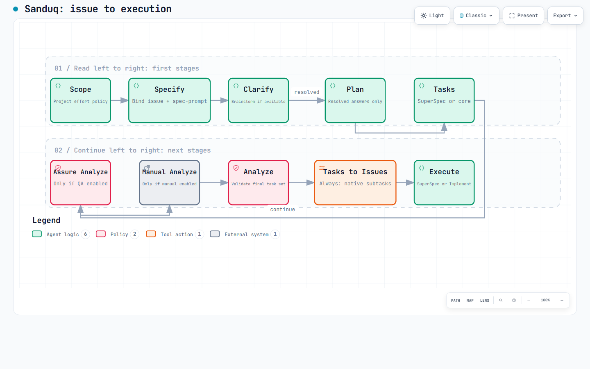
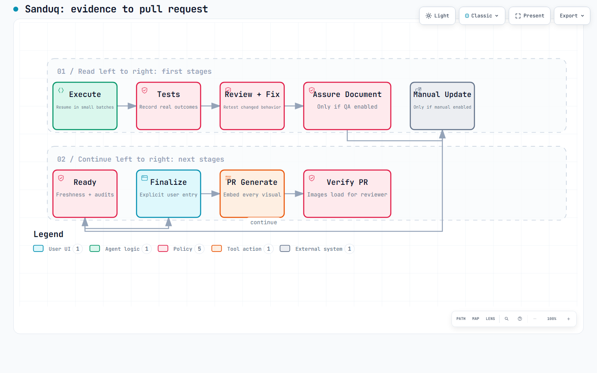

# Reusable Spec Kit workflow extension implementation plan

> Policy amendment, 2026-09-19: the owner superseded estimate-based context pauses.
> Default execution continues without reliable telemetry. Only fresh reliable measurements
> may trigger context pauses; historical estimated-fallback references below are superseded.

Date: 2026-09-18
Status: Implementation in progress on `feat/reusable-workflow`. Canonical sources, orchestration, installers, rollback and release tooling are implemented locally. Actual native installation and upgrade tests pass within the scope recorded in [implementation progress](workflow-implementation-progress.md). Remote CI, semantic live acceptance, release and consumer adoption remain pending. See the [operating guide](workflow-guide.md) and [compatibility decisions](workflow-compatibility.md).
Canonical repository: `samykabu/sanduq`.
Extension ID: `workflow`; no matching entry in the official community catalog checked on 2026-09-18. The existing `scope` ID collides with an unrelated community extension, so Sanduq Scope must be installed from an explicit Sanduq package and provenance must be checked.

## 1. Intended outcome

Provide one reusable orchestration extension installed from Sanduq. A project chooses whether QA Assure and application documentation participate, independently. Daily work uses four entry points: Scope, Clarify, Continue, and Finalize. The orchestrator delegates to installed Spec Kit/Sanduq/SuperSpec capabilities, saves verifiable progress, and resumes across fresh sessions.

All custom reusable extension, preset, skill, agent, adapter, and helper source belongs in Sanduq. Consumer repositories retain configuration, installed distributions, generated agent registrations, specifications, documentation, evidence, and workflow state. They must not become authoritative forks of the tooling.

This plan covers implementation and validation first, then a separately verified release and consumer migration. Creating this plan does not publish packages, open PRs, change project policy, or initiate feature execution.

## 2. Corrections to the proposed four-step flow

1. **Scope**: inspect the explicit issue, apply existing project scope preferences, update its managed description/labels and `spec-prompt`, then automatically invoke Specify when no unresolved decision remains. A configured keep-together band such as 20 +/- 3 means inclusive 17-23 in that project's declared effort unit, not an assumed universal scale. For decomposition outside settled policy, preserve explicit selection and dependency rules.
2. **Specify -> Clarify -> Plan -> Tasks -> Analyze -> Tasks-to-Issues -> Execute**: automatically chain these stages. Prefer compatible, enabled SuperSpec Brainstorm, Tasks and Execute independently where installed; otherwise use their core equivalents. Insert selected QA/manual analyses before final cross-artifact analysis and issue creation. Clarification advances only once required answers have actually been consumed, not merely because all questions were posted.
3. **Continue**: resume the earliest unfinished or invalidated stage from saved state. Context protection applies to every command and phase, including scoping, planning, documentation, and finalization; it is not a separate one-time phase.
4. **Finalize**: verify completion, tests and review, refresh selected documentation, then create or update the feature PR. No automatic merge or deployment.

One-time **Init** chooses project policy. It is not a recurring feature step. First Scope may offer Init if policy is absent; non-interactive runs must supply explicit choices rather than guessing.

Specify must start the clarification stage automatically after successful specification and issue binding. It chooses SuperSpec Brainstorm when compatible/enabled, otherwise core Clarify, with the same Sanduq GitHub transport preset. It stops for unanswered questions. Clarify is the entry point for consuming answers and continuing. If there are genuinely no ambiguities, the same state machine continues without requiring an empty Clarify invocation. The four commands are entry points, not four mandatory pauses.

## 2a. Workflow illustrations

All illustrations for this plan are generated with the installed Archify skill. They show the proposed process, not a workflow already implemented or verified in production.

- [Issue to execution: interactive diagram](assets/workflow-plan/issue-to-execution.html) ([Archify source](assets/workflow-plan/issue-to-execution.json)).
- [Evidence to PR: interactive diagram](assets/workflow-plan/evidence-to-pr.html) ([Archify source](assets/workflow-plan/evidence-to-pr.json)).

Read each diagram's first row left to right, then follow `continue` into its next row. The long continuation connector is page layout, not a repeat of completed stages. All stages are core except those visibly labelled `Only if QA enabled` or `Only if manual enabled`; those are independent opt-ins and are bypassed when disabled. Tasks-to-Issues is always required. SuperSpec/core selection is a provider choice within the same required stage. Finalize is the explicit user entry. Unlabelled arrows mean ordinary progression already implied by their endpoints; the labelled `resolved` transition requires actual answers or a documented decision that the question no longer applies.





Diagram evidence: both final artifacts pass 9/9 Archify showcase checks with zero errors/warnings and automated browser checks at 1440x900, 1600x1000, 1920x1080 and 2048x1320. Final light/small and dark/large screenshots were visually inspected. Source/artifact hashes and separate browser/visual-review results are in [delivery-summary.json](assets/workflow-plan/delivery-summary.json). This does not establish live PR image rendering or end-to-end workflow execution.

## 3. Historical starting point before implementation

- Sanduq currently contains `assure` 2.0.1, `user-manual` 1.0.1, `pr` 4.0.2, `project`, and `illustrate`; catalogs are at `catalog.json` and `extensions/catalog.json`.
- Bunyan's custom Scope source and two presets remain under `tools/speckit-scope/`. Installed Scope is 1.3.0. Move their canonical source to Sanduq with provenance and tests.
- Bunyan has both SuperSpec 1.0.2 and a separate `speckit-superpowers-bridge` 1.2.0. They are different execution integrations, not aliases. Only one executor may own a feature at a time.
- Bunyan has approved manual modules in `User-Manual/manual.yml`, but no Assure integrated-policy file. QA/manual lifecycle hooks are optional and competing operations have identical priorities.
- Direct SuperSpec Execute does not explicitly run QA/manual preflights. The separate Bridge Execute does dispatch implementation hooks; indiscriminate wrapping could execute stages twice or recurse.
- Assure Init parses a particular YAML indentation using regular expressions. Its dry run against Bunyan returned `hooks_changed=0` despite the optional QA gate. Fix upstream and verify parsed postconditions.
- PR currently enforces User Manual based on installation. That conflicts with choosing documentation off while keeping its commands installed for occasional use.
- Status helpers emit JSON with `current: false` without necessarily exiting nonzero. CI must parse this contract or use a new explicit check operation.
- Sanduq's existing release workflow runs automatically for extension changes on `main`, bumps versions, and updates catalogs. Coordinated release sequencing needs explicit tests and gating.
- Local Spec Kit is `1.0.6.dev0`. Do not turn that development build into an unqualified stable compatibility claim.
- Existing uncommitted changes in `extensions/pr/CHANGELOG.md` and `extensions/pr/commands/speckit.pr.generate.md` concern PR images. Preserve and integrate deliberately; do not overwrite or accidentally publish them as part of unrelated work.

## 4. Project setup and policy

Proposed command: `speckit.workflow.init`.

Offer all four choices equally explicitly: neither, QA only, User Manual only, or both. Also select executor (`auto`, `speckit`, `superspec`, or supported legacy Bridge), tracker configuration, continuation/checkpoint behavior, and context monitor mode. Recommend both QA and User Manual, but do not infer selection from package installation.

Store policy outside replaceable package directories, proposed `.specify/workflow.yml`:

```yaml
schema_version: 1
processes:
  qa: true
  user_manual: true
execution:
  engine: auto
  checkpoints: required-only
providers:
  clarification: prefer-superspec
  tasks: prefer-superspec
issue_sync:
  taskstoissues: required
  parent_link: native-subissue
clarification:
  transport: github-comments
  resume_on_reinvoke: reread-answers
context:
  mode: measured-with-estimated-fallback
  max_fraction: 0.60
  checkpoint_fraction: 0.50
  missing_telemetry: labelled-estimate-small-batches
finalize:
  create_pr: true
  merge: false
updates:
  policy: reviewed
```

These are proposed fields, not settings already recognized by installed extensions. Validate with a versioned schema. Save project preferences once; do not ask again on each feature. Policy edits receive a diff and invalidate affected readiness receipts. Disabling a process preserves existing manuals and evidence. Re-enabling it schedules the necessary analysis and refresh.

Scope preferences are also project configuration. Discover them from existing authorized project instructions and Scope configuration before asking setup questions. Normalize a clear existing preference into a versioned policy with its source path and exact wording. Proposed representation: `scope.keep_together: {target: 20, tolerance: 3, unit: <declared-project-unit>, inclusive: true}`. Do not invent the effort unit, convert hours into the existing Scope dimension score, or silently resolve contradictory preferences. Once adopted, estimates inside the band remain one feature issue and proceed without a decomposition confirmation. Estimates below/above it follow the rest of the project policy; being outside the band does not itself require splitting. Preserve prerequisite/security constraints and explicit issue-specific instructions.

This keep-together rule controls **feature decomposition during Scope**. It does not disable the mandatory creation of implementation task sub-issues from the final `tasks.md` later. Explain that distinction in Init so the two settings cannot contradict each other unnoticed.

If User Manual is selected, reuse an approved module map or run its discovery/approval once. Selecting documentation does not authorize public publication. English/Arabic and audience choices remain independent of enabling the process.

Selected integrations must be installed, enabled and compatible. Missing selected dependencies block with an actionable setup result; absent unselected dependencies do not block. Resolve dependencies through the public CLI and catalog, following the selected install/update policy. Do not assume the CLI recursively installs optional dependencies. Illustrate and PR dependencies remain whatever their tested contracts require.

Precedence: explicit workflow policy in managed projects; existing extension policy in unmanaged projects. Do not weaken existing consumers by changing global default behavior. Offer adoption of stronger legacy requirements during Init and make any intentional opt-out visible in the policy diff.

## 5. Command contract and stage ordering

Public daily command IDs:

| Command | Input | Automatic work | Stops for |
| --- | --- | --- | --- |
| `speckit.workflow.scope` | Explicit issue/feature request | Scope, prerequisite checks, Specify, initial clarification | Missing issue, scope choices, unresolved questions, context handoff |
| `speckit.workflow.clarify` | Feature or bound issue | Reread GitHub answers, Clarify/Brainstorm, Plan, Tasks, readiness, task sub-issues, selected executor | Unresolved ambiguity, invalid artifacts, required approvals, context handoff |
| `speckit.workflow.continue` | Feature or checkpoint path | Validate checkpoint and resume earliest unfinished stage | Changed contract, blocked evidence, context handoff |
| `speckit.workflow.finalize` | Feature | Final verification, selected docs, PR create/update | Incomplete work, stale evidence, required publication approval, context handoff |

Maintenance commands can include `init`, `status`, `doctor`, and `reconcile`; users should not need them for each feature. Use agent-neutral command references and generated host registrations, not literal Codex-only invocation strings in shared source.

Preparation order:

```text
Scope with project preferences -> update issue/labels/spec-prompt
  -> Specify -> SuperSpec Brainstorm OR core Clarify until resolved
  -> Plan -> SuperSpec Tasks OR core Tasks (one generator)
  -> Assure Analyze (if selected)
  -> User Manual Analyze (if selected)
  -> normalize execution markers only if needed (do not regenerate all tasks)
  -> cross-artifact Analyze and resolve blocking findings
  -> validate final task contract and readiness receipts
  -> core Tasks-to-Issues with Sanduq parent/dedup preset (always)
  -> verify native sub-issue links and mapping
  -> create execution handoff -> SuperSpec Execute OR core Implement
```

All task-producing steps finish before handoff. If a later step changes semantic task content, refresh affected analysis; do not accept stale readiness simply because the command ran earlier. Bound preparation retries and surface oscillation instead of looping forever.

Tasks-to-Issues is mandatory even when QA and User Manual are both off. Invoke the actual core command through the installed Sanduq preset after the task list is final; do not replace it with an unrelated Project-sync invocation. The preset must upsert task issues within `(repository, parent issue, feature identity, task ID)`, attach native GitHub sub-issue relationships, and preserve dependency order. Task IDs may repeat across features and may exceed T999. A bare repository-wide T001 match must never suppress another feature's task.

Project sync remains responsible for board/status updates, but shares the same task mapping and cannot independently create a second set of issues. Disable/reconcile the overlapping automatic issue-creation path only for managed projects. On re-invocation, repair missing links and reuse existing open/closed issues; after task changes rerun task mapping before execution. If GitHub authorization or parent linkage fails, checkpoint and stop before implementation rather than reporting task publication as complete.

Execution completion order:

```text
Implementation -> applicable tests -> review -> fixes and necessary retests
  -> Assure Document (if selected)
  -> User Manual Update (if selected)
  -> documentation audits and freshness verification -> ready_to_finalize
```

Finalize reuses valid evidence and refreshes invalid evidence before PR generation. It must not open a PR from an automatic `after_implement` hook before the user invokes Finalize. Separate branch-finishing skills from merge/deploy operations.

Distinguish code completion from documentation completion: documentation tasks cannot be an impossible prerequisite for the command that generates them. Mark an artifact generation task complete when the artifact is verified; preserve a separate pending human QA task when actual human testing is required.

Executor `auto` selects compatible, enabled SuperSpec when available, otherwise core Spec Kit. An explicitly selected but unavailable executor blocks rather than silently changing behavior. Persist the selection for the feature and migrate existing Bridge ownership deliberately. No nested core Implement and SuperSpec Execute invocation.

Provider selection is per capability, not only per executor: Brainstorm, Tasks, Execute, and Review are resolved separately from the installed registry and validated command availability. Do not run core Tasks then SuperSpec Tasks as duplicate generators. Retain the same lifecycle events and downstream stages for either choice.

## 5a. Reusable Bunyan preset contract

Migrate the existing `scope-gate`, `scope-brainstorm`, `scope-analyst`, and shared `github-clarification` behavior into versioned Sanduq distributions, with tests and preserved provenance. Do not merely copy the generated consumer SKILL.md files.

| Existing behavior | Reusable contract |
| --- | --- |
| Issue-bound scoping | Require explicit issue identity; bind generated specifications back to that issue. |
| Issue enrichment | Update only managed issue sections, effort/scope labels, dependencies, status and enriched `spec-prompt`; preserve unrelated user content and labels. |
| Project-specific board | Resolve field IDs/status names from project configuration; never hard-code Bunyan, its organization or Project #2. |
| GitHub questions | Post one useful question per issue comment with stable question ID, mention the issue creator, explain alternatives and the recommendation; leave all choices unchecked. |
| Answer collection | On re-invocation read current issue and all paginated comments, including edited question checkboxes, free-text replies, IDs and quoted/linked answers; reconcile conflicts and update the specification with cited answer evidence. |
| No chat interrogation | Keep feature clarification discussion on GitHub; conversation reports links and progress. |
| Retry and rounds | Retain stable markers, journals, creator controls and configurable round limit; do not duplicate questions or treat quota exhaustion as resolution. |
| Automatic handoff | Resolved clarification advances to Plan, Tasks, analysis, task publication and execution; it does not stop after Plan. |

Explicitly replace conflicting legacy behaviors in the managed preset: Scope currently says not to call Specify, and shared clarification currently says not to call Tasks/Implement after Plan. The new chain supersedes those stops. Preserve those defaults for unmanaged legacy consumers unless they adopt the new policy.

The current Bunyan clarification gate also requires manually moving a waiting issue back to Feature Specification. To reduce intervention, managed `resume_on_reinvoke: reread-answers` reads the waiting thread when Clarify is invoked, processes valid new answers and updates its own status. If unanswered, leave it waiting without duplicate posts. Keep a `manual-status` compatibility mode for teams that explicitly want the old gate. Closed/cancelled features and execution-owned contracts still need explicit handling; reinvocation is not permission to reopen arbitrary issues.

No extra `spec ready?` prompt is needed when the complete scan has no unresolved decision. Silence, recommendations, round limits and merely asking every question are not answers. A user decision that genuinely removes an ambiguity must be recorded; an unresolved waiver does not silently become an executable requirement.

For managed automatic execution, a Sanduq preset makes routine SuperSpec phase checkpoints evidence checkpoints rather than recurring approval questions, as requested by the user. Preserve explicit task `[REVIEW]` human gates, product decisions and consequential publication/deployment approvals. Advertise this as an explicit project policy override of the upstream phase-pause prompt, not a capability upstream already implements.

Use Archify for diagrams authored for this plan and for the migrated workflow's clarification/process diagrams. Ship a tested Archify adapter/dependency contract with provenance and immutable version information; do not copy a locally installed third-party skill into Sanduq without checking its redistribution/update contract. Existing Assure/User Manual Illustrate requirements remain intact unless separately migrated and versioned; this request does not silently change their renderer dependencies.

## 6. Orchestration design and hook ownership

Use a small Python state/validation layer plus agent command/skill instructions. Python determines the next stage and validates receipts; an agent dispatcher performs semantic analysis and invokes skills. A shell script cannot execute a slash command by printing its name.

The orchestrator owns automatic chaining for managed projects. Delegates own their domain behavior. Registered core hooks provide guards and consistent entry-point behavior, not a second competing orchestration chain.

- Install supported presets from Sanduq for command composition where necessary; extension templates are not a substitute for preset wrapping.
- Reconcile only managed hook IDs. Preserve unrelated hooks and persist previous values for reversible removal.
- Put the ordered substage list in one orchestrator rather than trusting every host to interpret equal-priority hooks identically.
- Track a run/stage dispatch token and reject reentrant stage execution. Confirm completion through receipts, not emitted text.
- Cover direct Core Implement, direct SuperSpec Execute, legacy Bridge Execute, and direct PR generation. For unsupported direct-entry interception, report the limitation and require the workflow entry point; do not claim universal enforcement.
- Policy must not globally disable an extension to turn one automatic process off.
- Missing/corrupt policy or state stops managed automation with a specific repair path.
- Keep upstream SuperSpec unmodified. Prefer tested presets/adapters or an upstream contribution. If its host cannot honor a composable adapter, mark that combination unsupported.
- Apply the explicit managed automation preset for routine phase continuation. Preserve human gates still required by project policy or explicit task markers; do not allow an unadapted upstream pause instruction to silently defeat the configured chain, and do not silently remove approval requirements unrelated to routine phase progress.

## 7. Context budget and fresh-session handoff

The requested ceiling is 60% of the active host/model context window, including initial instructions, messages, tool outputs and generated work. It is not 60% of a task token budget or cumulative account usage.

**User-selected policy: measured enforcement where supported, explicitly labelled estimation with smaller work batches otherwise.** Retain a strict-only option for projects that require it. Capability discovery must establish whether an authoritative used-context measurement, effective window size, freshness/session identity, and a way to bound the next operation exist. Never present an estimate or post-call telemetry as proof of a hard pre-call bound.

- Begin checkpoint preparation at 50%, reserving remaining space below 60% for the summary and continuation prompt. This is a starting reserve to validate, not a universal guarantee.
- Before every agent/model/tool stage, check current usage plus a defensible bound for the next input/output and checkpoint overhead. Stop early if it could cross 60%.
- Bound tool results and task batches. A monolithic Execute prompt with no interruptible checkpoints cannot satisfy strict mode.
- If a host lacks reliable telemetry or pre-call enforcement, report `context_limit_unenforceable` and pause strict execution. Building a host adapter/runner is a prerequisite to advertising strict support there.
- The user explicitly approved estimated fallback during this planning session. On hosts without reliable telemetry, visibly report `estimated`, use smaller task/tool batches, checkpoint at a conservative estimated 50% target, and stop earlier when confidence is low. If even a defensible estimate is unavailable, hand off rather than pretend usage is known. Estimated mode cannot be labelled as enforcing a hard 60% ceiling.
- If the current session already exceeds the threshold, emit the smallest recovery checkpoint and request a fresh session; do not claim the cap was maintained retroactively.
- Host compaction is not a user-visible fresh session. Do not silently treat compaction as fulfilling the requirement.
- A fresh session may need the user to start it. Automate launching only where a supported host API permits it; otherwise supply a copy-ready prompt.
- For any selected subagent execution, monitor each agent and parent separately and bound the returned result. Aggregated token totals are not an individual context measurement.

Checkpoint content: repo and worktree identity, branch/head and dirty-state summary, feature/issue, policy and dependency versions, completed/pending tasks, tests with actual outcomes and evidence paths, decisions, unresolved questions, blockers, active processes, next safe action, and exact resume command. Exclude secret values and full transcripts.

Proposed layout: `specs/<feature>/workflow/checkpoint.json`, `handoff.md`, and `resume-prompt.md`. Keep transient locks/session IDs in a gitignored runtime directory. Write checkpoints atomically and increment their generation. Do not commit dirty work merely to produce a checkpoint.

Example continuation prompt:

```text
Continue this feature in a fresh session using the installed Sanduq workflow.
Repository: <repo path>
Feature: <feature path>
Read <feature>/workflow/checkpoint.json and handoff.md, validate repository and
input fingerprints, then invoke the host-rendered workflow.continue command.
Preserve the saved policy and unresolved approvals. Resume the earliest pending
stage and stop before the configured context ceiling.
```

Host-specific capability validation is a release gate. Exact 60% support for Codex IDE or Claude Code is not yet established by this plan. Estimated fallback is authorized; record the measurement method and uncertainty in each checkpoint and carry the selected policy into the next session. Availability of this fallback does not block delivery on hosts without strict telemetry.

## 8. State, evidence, and CI

Version state schemas separately from package versions. State transitions include scoped, specified, awaiting_clarification, planning, preparing, executing, reviewing, documenting, ready_to_finalize, and pr_open. Paused/blocked/failed are explicit conditions, not successful completion.

Use per-feature locks, atomic state writes, and recoverable operation journals. Fingerprint semantic inputs for each stage, including policy and relevant implementation; do not make checkbox bookkeeping or generated receipt files create circular invalidation. Detect changed and deleted files. Never manipulate fingerprints merely to make stale evidence pass.

On resume, validate repository, worktree, feature binding, inputs and policy. Invalidate the earliest affected downstream stage. Reuse existing PR/issue identifiers and recover partially completed mutations to prevent duplicate issues, comments, or PRs.

CI should run an always-present workflow check on PRs, then determine applicable features and processes. Do not use only manual/spec path filters, nor blindly trust a shared `.specify/feature.json` for multi-feature changes. Resolve bindings against the PR diff and fail clearly when scope is ambiguous.

The gate checks selected process evidence, output existence/integrity, QA documentation validity, manual audit/build, review/verification receipts and explicit applicability exemptions. Treat unselected processes as not selected, not passed. An enabled process with no relevant user-facing changes can record a reasoned no-change assessment rather than forcing invented screenshots or pages.

Normalize Git-base resolution across local runs and CI; test branch checkout, merge checkout, shallow clone, renames/deletions, unrelated dirty files and line endings. Missing history must not yield a false-current result. Snapshot freshness is not proof that tests ran; maintain separate verifiable execution evidence.

CI enforcement requires the check to be required in repository rules. Provide setup instructions or an opt-in provider adapter; a workflow YAML alone cannot prevent merging. CI does not run semantic generation unless a separately authorized agent runner is configured.

## 9. Sanduq source and packaging

Proposed source layout:

```text
extensions/workflow/         Manifest, commands, runtime, schemas, tests, skills
extensions/scope/            Generalized Scope runtime and contracts
presets/workflow/            Supported command adapters
presets/scope-gate/          Migrated scope preset
presets/scope-brainstorm/    Migrated brainstorm preset
presets/workflow/commands/  Includes the actual core Tasks-to-Issues adapter overlay
skills/...                  Portable exports only where independently useful
docs/workflow/              Setup, lifecycle, context, upgrade, migration guides
extensions/scripts/         Packaging, compatibility, release tooling
```

Package required resources with versioned releases. Do not resolve runtime code from a developer's local Sanduq checkout or a floating `main` URL. Where presets/agents require a separate supported installer, bundle/version their assets and have Init install them via that interface. Prove clean-install registration on each supported host; do not assume extension installation registers arbitrary agent files.

Create an ownership inventory of Bunyan's custom reusable extensions, skills, agents and presets. Migrate project-authored source to Sanduq, including Scope. Keep third-party packages upstream with source/license provenance; do not copy all installed skills into Sanduq or redistribute them as original work. Classify project-specific instructions as consumer policy. Publish the inventory with remaining migrations explicitly listed.

Preserve existing MIT notices on migrated Scope code; new Sanduq-original work follows the repository license policy. Make any distribution-license decision explicit in notices and release documentation.

## 9a. Mandatory inline PR visuals

Update the canonical `extensions/pr/commands/speckit.pr.generate.md` and all generated PR skills through the packaging/registration pipeline. There is no separate standalone PR skill source in the inspected Sanduq tree; identify generated exports instead of creating a second divergent source.

Every feature diagram and screenshot included in the reviewer-facing feature explanation must appear inline in the PR description, with alt text. HTML/JSON sources may be linked in addition to the image. A link to the explanation document or an image file does not satisfy embedding. Apply this to Archify, Illustrate and captured screenshots equally; no fabricated visual is required when none is relevant.

Embedding and accessibility are separate checks. For private repositories, prefer supported GitHub attachment uploads with the returned asset URL where available, or an authenticated repository image URL verified for authorized reviewers. Never assume a `blob/<sha>/...?raw=true` URL works solely because it was constructed correctly. Never expose authentication tokens in URLs, publish private assets to a public host, or insert base64/data URLs GitHub may sanitize.

Build an asset inventory, ensure committed images exist remotely before referencing them, insert Markdown image elements for every expected asset, then inspect the rendered PR body and actual image loads in an authenticated browser. GitHub may proxy/rewrite image URLs; verify correspondence and successful loading rather than requiring one literal `` string. A rendered `` tag alone is not image-load evidence. If unavailable or failing, report publication as incomplete/unverified and retain a retry journal; do not silently downgrade to file links.

This corrects the pending local PR patch's unverified URL guarantee and brittle exact-HTML assertion while preserving its intended inline-embedding requirement. Test create and update, multiple formats, path escaping, existing manual images, private authenticated visibility, branch removal/asset retention, missing assets and body-size limits. Do not silently drop visuals to fit a limit; produce an actionable blocking result. Do not claim a commit SHA guarantees permanent retention after unreachable history is removed.

References: [GitHub image syntax](https://docs.github.com/en/get-started/writing-on-github/getting-started-with-writing-and-formatting-on-github/basic-writing-and-formatting-syntax) and [GitHub attachment access](https://docs.github.com/en/get-started/writing-on-github/working-with-advanced-formatting/attaching-files). Private image access still requires repository permission; inline Markdown is necessary for the requested presentation but is not itself an authentication mechanism.

## 10. Upgrade and version strategy

Proposed release targets, subject to rechecking versions immediately before implementation:

| Package | Observed baseline | Proposed target | Reason |
| --- | --- | --- | --- |
| workflow | New | 1.0.0 after acceptance | Reusable orchestration, policy and continuation |
| scope | Bunyan 1.3.0 | 1.4.0 if compatible | Sanduq distribution, configurable integration; use 2.0.0 if public behavior breaks |
| assure | 2.0.1 | 2.1.0 | Parser fix, managed policy and machine-checkable integration contracts |
| user-manual | 1.0.1 | 1.1.0 | Managed opt-in policy and resumable stage integration |
| pr | 4.0.2 | 4.1.0 | Respect explicit managed policy while retaining legacy behavior elsewhere |
| project | 2.0.1 | 2.1.0 if shared task mapping changes | Coordinate issue ownership with mandatory Tasks-to-Issues; otherwise retain installed version |
| illustrate | Existing | Unchanged unless modified | Preserve existing renderer dependency contracts |
| superspec | Third-party 1.0.2 installed | No Sanduq fork/version bump | Version a tested adapter and compatibility range |

Use patch releases for isolated bug fixes if shipped separately. Do not reserve or publish these versions during planning. Bump portable skill/plugin manifests only when their shipped content changes; generated copies must remain in sync with one canonical source.

Record a project installation lock outside replaceable packages: extension/preset versions, source release URLs, checksums, schemas and tested host/CLI compatibility. This is a proposed Sanduq lock contract, not a claim that Spec Kit already has that lockfile feature.

Update sequence: snapshot configuration/state -> install candidate immutable packages -> regenerate host registrations -> reconcile managed hooks -> migrate schemas -> run doctor and compatibility tests -> review diff -> adopt. Rollback restores both package versions and matching state/configuration backups. Unsupported schema downgrades stop safely.

Extend release tooling so dependency packages are published and downloadable before workflow catalog promotion. Do not commit a live catalog pointing at nonexistent assets. Test release reruns, partial failures, version monotonicity, and content checksums. The current automatic patch behavior must not double-bump a coordinated set. Require validation of the exact release revision rather than assuming a separate CI workflow already passed.

## 11. Implementation phases and acceptance

### Phase 1: Contracts and feasibility

- Inventory custom source and installed capabilities; map Scope/Bridge/SuperSpec ownership.
- Validate extension ID, supported Spec Kit releases, preset registration and host command syntax.
- Prototype context telemetry and bounded execution for target hosts before promising strict support.
- Finalize config/state/checkpoint schemas and four command contracts.
- Deliver capability matrix and architecture decision notes.

Acceptance: strict versus estimated capabilities are demonstrated; no unsupported guarantee; all four process selections have defined behavior.

### Phase 2: Move reusable source and repair foundations

- Import/generalize Scope and presets with tests/provenance, removing hard-coded Bunyan repository/board assumptions.
- Fix Assure YAML handling and add parsed postcondition validation.
- Add compatible managed-policy handling to Assure, User Manual and PR.
- Define deterministic freshness/check exit behavior without breaking legacy status consumers.
- Complete the mandatory inline PR-image contract in canonical source and generated skills, preserving the existing patch intent and validating private-repository loading.
- Migrate scope preferences, labels/spec-prompt and GitHub clarification presets; explicitly replace the old stop-after-Scope/Plan and manual-status behavior in managed mode.

Acceptance: clean consumer installs; legacy behavior regression tests; neither/QA/manual/both selections honored even when all packages are installed.

### Phase 3: Implement orchestration and recovery

- Build Init, Scope, Clarify, Continue, Finalize, Status, Doctor and reconciliation.
- Implement ordered dispatch, conditional integrations, executor ownership and direct-entry guards.
- Invoke exactly one task generator, then both selected analyzers, final Analyze, mandatory Tasks-to-Issues and native parent-link verification before automatic execution.
- Add bounded stages, checkpoint writing, stale-input invalidation, locks and idempotent remote operation recovery.
- Separate execution completion from explicit Finalize/PR creation.

Acceptance: complete simulated lifecycle and interrupted/resumed lifecycle produce identical required outcomes; no duplicate stages or PRs.

### Phase 4: CI and upgrade assurance

- Add required-check template and local validator, feature resolution and consistent Git-base handling.
- Add install/update/reconcile/rollback tests and host registration tests.
- Test runtime context adapters and fail-closed behavior for unsupported hosts.
- Run independent test suites in parallel with isolated fixtures and bounded workers; keep ordered integration scenarios sequential.

Acceptance: stale/incomplete evidence fails; disabled processes do not block; updating packages preserves project policy and unrelated hooks.

### Phase 5: Documentation, versions and release tooling

- Update root README, extension count, quick start and lifecycle visual; fix lingering `qa` naming.
- Update `extensions/README.md`, per-extension README/CHANGELOG and root CHANGELOG.
- Add guides for the four commands, setup combinations, engine selection, fresh-session continuation, context limitations, direct entry points, upgrade/rollback and Bunyan migration.
- Include the Archify workflow diagrams, scope policy boundary examples, GitHub answer/re-invocation walkthrough and mandatory task-subissue mapping.
- Document manual/QA distinction, privacy, state storage, CI requirements and meaningful evidence levels.
- Synchronize both catalogs and release metadata via validated tooling. Add preset/agent packaging where required.
- Prepare coordinated release assets and verify a clean download/install before catalog promotion.

Acceptance: versions, assets, manifests, docs, catalogs and license/provenance agree; tutorials are exercised rather than merely syntax checked.

### Phase 6: Pilot and consumer rollout

- Validate one clean fixture for each process combination and both core/SuperSpec execution.
- Back up Bunyan policy/hooks/state and install released Sanduq packages with the public CLI.
- Adopt existing manual modules, scoped issues and feature progress without recreating them.
- Remove duplicate local canonical tooling only after installed parity and rollback have been verified; preserve consumer configuration.
- Demonstrate a fresh-session resume and Finalize using a suitable authorized feature. Keep local, CI, remote PR and release evidence separate.

Acceptance: Bunyan uses Sanduq distributions; a second clean project follows the same commands without source edits; no unresolved custom-source migration is silently marked complete.

## 12. Required test scenarios

1. Four QA/manual selections x core/SuperSpec executor, including extensions installed but unselected.
2. Missing, disabled, incompatible and newly upgraded dependencies; no silent skips.
3. Clarification pending, resolved, conflicting or reopened; Plan/Execute never bypass unresolved blockers.
4. Task enrichment precedes handoff; task edits invalidate readiness; no recursive hooks.
5. Core, SuperSpec and legacy Bridge entry points; only one executor owns the feature.
6. Context boundaries, huge tool output, stale/missing telemetry, already-over-limit sessions and independent agent budgets.
7. Interruption during each phase and during remote mutation; fresh resume without duplicate work.
8. Selected documentation with no relevant change, absent screenshots, failed tests or pending human review; no invented success.
9. Source-only PRs, multi-feature PRs, missing binding, shallow/merge checkouts, deletions and normalization.
10. Repeated Init/reconcile, upgrade after custom policy, unrelated hooks, malformed YAML and rollback.
11. Finalize updates an existing PR; ordinary implementation completion creates none.
12. Release dependency ordering, catalog parity, missing assets, retry behavior, immutable checksums and documentation version consistency.
13. Inclusive scope-band boundaries (17, 20, 23), adjacent values (16, 24), missing unit and conflicting policy; settled choices never trigger redundant decomposition prompts.
14. SuperSpec/core selection per stage, automatic Specify-to-Clarify and Plan-to-Tasks, no second task generator, and analysis completed before task publication/execution.
15. Re-read waiting GitHub threads on explicit re-invocation; edited checkboxes, paginated replies, conflicting answers, creator controls, unchanged waiting state and no duplicate comments.
16. Mandatory Tasks-to-Issues across all process choices; repeated T001 across different features, T1000, missing native parent links and collision with Project sync.
17. Inline diagrams/screenshots in created and updated PRs; authenticated private-repo image loading, proxied URLs, missing remote assets and generated skill/source parity.

## 13. Reference contracts

- [Spec Kit extension development guide](https://github.com/github/spec-kit/blob/main/extensions/EXTENSION-DEVELOPMENT-GUIDE.md): manifests, hooks, preset-only composition, agent-neutral command references. Validate against the supported released CLI, not only current main.
- [Spec Kit extension user guide](https://github.com/github/spec-kit/blob/main/extensions/EXTENSION-USER-GUIDE.md): installation, catalogs and updates.
- Sanduq local evidence: `extensions/scripts/release.py`, `.github/workflows/ci.yml`, `.github/workflows/release-extensions.yml`, `extensions/{assure,user-manual,pr}/`.
- Bunyan local evidence: `tools/speckit-scope/`, `.specify/extensions.yml`, `.specify/extensions/{superspec,speckit-superpowers-bridge}/`, `User-Manual/manual.yml`.

## 14. Decisions to carry into implementation

- Adopt four daily entry points with Init once; Continue implements the requested session-resume behavior.
- Keep QA and User Manual independent opt-ins; configured selection, not installation, controls automation.
- Use measured context protection where possible and the user-approved, explicitly labelled estimated fallback with smaller work batches otherwise. A supported telemetry/enforcement adapter is a prerequisite for claiming a hard cap; strict-only mode remains available.
- Default automatic chaining to safe stage transitions; preserve required approvals and explicit Finalize.
- Apply project scope preferences without redundant questions; always publish the final implementation tasks as native sub-issues before execution.
- Reuse Bunyan's issue/label/spec-prompt and GitHub clarification presets from Sanduq, including re-reading answers on invocation; all required answers must be resolved before Plan.
- Prefer installed compatible SuperSpec Brainstorm, Tasks and Execute per capability, with core alternatives; make routine phase continuation automatic through the managed preset.
- Embed all reviewer-facing diagrams/screenshots in the PR description and verify private-repository visibility separately from Markdown structure.
- Keep shared custom source in Sanduq and upgrade consumers through versioned packages, with audited migration of existing custom assets.
