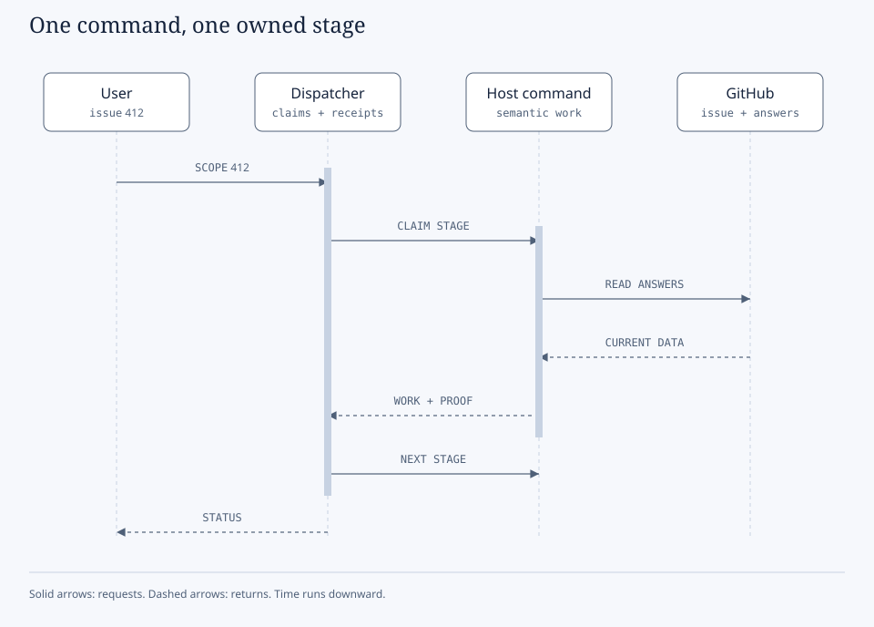

# Worked managed lifecycle

Follow this guide after [setup](../start/install-by-host.md). Examples use the [synthetic booking application](../README.md#example-conventions), issue 412, and `specs/412-refund-approval/`. Prompts use Codex syntax; see [host naming](../reference/commands.md#command-names). An editor tab does not select a feature.

## Table of contents

- [Start a managed project](#start-a-managed-project)
- [Every stage of the managed lifecycle](#every-stage-of-the-managed-lifecycle)
- [Implementation with workers](#implementation-with-workers)
- [Public extension commands](#public-extension-commands)
- [Core, SuperSpec, and bridge overlays](#core-superspec-and-bridge-overlays)
- [Portable skills](#portable-skills)
- [Keep customizations through upgrades](#keep-customizations-through-upgrades)

## Start a managed project

Install the Sanduq catalog and `workflow`, then ask:

```text
$speckit-workflow-init Enable QA and User Manual for this project. Use the existing GitHub Project
and approved module map. Discover the actual board columns and verify project readiness.
```

The installer selects required dependencies, composes Sanduq presets through the public Spec Kit
CLI, and preserves project settings. QA and User Manual are independent choices. A command being
installed does not enable its process. Run `$speckit-workflow-doctor` after setup or upgrades.

For a feature whose scope is already clear:

```text
$speckit-workflow-scope 412 Keep implementing all approved phases. Create a dedicated orchestration
agent and delegate implementation tasks to workers. Run as many ready tasks in parallel as the host
allows without conflicting file ownership or shared resources. Open the live HTML progress report,
verify each phase, and commit and push each completed phase. Continue through Finalize, fix CI and
review findings, and merge this feature's PR when required checks and reviews pass.
```

The last sentence explicitly authorizes PR creation and merge for this feature. Without that
authorization, the ordinary workflow stops at its configured boundary. Deployment requires its own
authorization. Scope changes and decisions that cannot be inferred still need an answer.

## Every stage of the managed lifecycle



Editable [sequence source](../diagrams/dispatcher-sequence.html). The dispatcher owns claims and
receipt validation; installed host commands perform the work and collect real evidence.

Use the daily workflow commands for normal work. The prompts below show what to ask at a particular
stage when diagnosing a problem or resuming work. They do not bypass stage order, claims, or evidence
checks. QA and manual stages run only when selected during initialization.

| Stage | How to use it | Example prompt |
| --- | --- | --- |
| Scope | Start with an explicit GitHub issue; settle decomposition and prerequisites. | `$speckit-workflow-scope 412 Assess this issue using our approved effort policy and continue once scope is resolved.` |
| Specify | Bind the specification to the scoped issue and exact feature directory. | `$speckit-specify Implement the approved spec prompt for issue 412 in its reserved feature directory.` |
| Clarify | Read GitHub answers, including edited comments; resolve ambiguous requirements. | `$speckit-workflow-clarify Recheck issue 412's clarification thread and continue from the resolved answers.` |
| Plan | Turn the approved specification into the implementation design. | `$speckit-plan Plan the bound feature using our constitution and existing architecture. Record technical uncertainties in research.md.` |
| Tasks | Generate the dependency order, task IDs, phase boundaries, and safe parallel groups. | `$speckit-tasks Generate tasks for this plan. Identify shared files and dependencies before marking work parallel.` |
| QA analysis | Add missing test, accessibility, screenshot, and QA documentation work. | `$speckit-assure-analyze Check this feature's task list for missing API and E2E coverage.` |
| Manual analysis | Add documentation work for affected audiences and modules. | `$speckit-user-manual-analyze Identify the pages, API examples, and screenshots this feature changes.` |
| Analyze | Check specification, plan, and tasks together before implementation. | `$speckit-analyze Report contradictions and uncovered requirements. Resolve blocking findings before execution.` |
| Task issues | Create native task sub-issues for the bound feature. | `$speckit-taskstoissues Synchronize these task IDs with the existing parent issue without duplicates.` |
| Execute | Create the orchestrator, open the report, delegate tasks, and finish all approved phases. | `$speckit-implement Implement all phases using conflict-free worker batches. Verify, commit, and push each completed phase.` |
| Verify | Run required checks against the integrated source and record actual results. | `$speckit-workflow-continue Complete verification for this feature and record commands, results, and source identity.` |
| Review | Review integrated changes and resolve blocking findings. | `$speckit-workflow-continue Review the integrated feature, delegate independent review, and fix confirmed findings.` |
| QA documentation | Refresh the tester walkthrough and feature evidence. | `$speckit-assure-document Update the QA test manual from the completed feature and recorded test results.` |
| Manual update | Update affected canonical content and build private previews. | `$speckit-user-manual-update Update the approved modules for this feature and build its preview artifacts.` |
| Ready | Check required tasks, fresh evidence, and zero blocking findings. | `$speckit-workflow-finalize Validate readiness against the current branch and resolve stale evidence before creating the PR.` |
| PR | Create or update the one feature PR with evidence and rendered images. | `$speckit-workflow-finalize Create or update this feature's PR with the verified results and inline diagrams.` |
| CI and merge follow-through | When authorized, monitor the exact PR head, repair failures, and verify the merge. | `Continue on this PR: fix failing checks, address review findings, and merge when required checks and approvals pass. Keep the HTML report current until the merge is verified.` |

The runtime has sixteen recorded stages, from `scope` through `pr`. CI and merge follow-through
extend the report's lifetime; a green local test run does not establish remote CI or a completed
merge. After a fix changes source, rerun affected checks and refresh the relevant evidence.

## Implementation with workers

The Sanduq overlays for `$speckit-implement` and `$speckit-superspec-execute` use the same orchestration
contract. The caller creates a dedicated orchestrator. Workers receive bounded tasks with task IDs,
owned files, dependencies, acceptance criteria, and verification instructions. Every implementation
task goes to a worker, including tasks that must run sequentially.

The orchestrator fills available worker slots from the ready queue. Independent documentation,
tests, and modules can run together. A dependency, overlapping write path, shared database, port,
generated file, or another shared resource can require serial execution or isolation. The
orchestrator records that constraint instead of assigning conflicting work. Worker capacity must
leave room for the coordinator and any host limit.

Only the coordinator integrates results, updates shared task state and the report, and performs
phase commits and pushes. Workers return changed files, check results, and unresolved findings.
The coordinator inspects those results before accepting the task. A worker saying "done" does not
prove that its checks passed. The next phase starts once its dependencies and required checks pass;
routine phase boundaries do not require another approval when continuation was already authorized.

At implementation start, the workflow creates and opens
`specs/<feature>/workflow/progress/index.html`. Keep it open during the run. The report follows tasks,
worker assignments, phases, verification, commits and pushes, and PR status. Update it after each
material event and while following CI. It must distinguish pending, running, blocked, failed,
verified, and merged work. Record the last update time and the evidence behind completion.

To resume after an interruption:

```text
$speckit-workflow-continue Resume the bound feature from its checkpoint. Inspect existing worker
handles and remote effects before restarting work. Reopen the HTML progress report, refill available
worker slots with conflict-free ready tasks, and continue under the existing authorization.
```

## Public extension commands

The [command reference](../reference/commands.md) covers all 42 commands, including the 13 Workflow commands, seven Memory commands, and utility prerequisites. Use the recorded stage order below rather than invoking a guard to bypass ownership.

## Core, SuperSpec, and bridge overlays

Sanduq owns the [workflow preset](../../presets/workflow/preset.yml), which prepends policy to provider
commands. The upstream command bodies remain installed through Spec Kit. SuperSpec commands need
a compatible enabled SuperSpec installation; installing the overlay alone does not install that
provider. The dispatcher chooses one task generator and one executor for a feature.

| Overlaid command | Sanduq behavior and how to use it | Example |
| --- | --- | --- |
| `$speckit-scope-run` | Dispatch the managed Scope stage for the explicit issue. | `$speckit-scope-run 412` |
| `$speckit-specify` | Keep the issue binding and reserved feature identity. | `$speckit-specify Create the specification from issue 412's approved prompt.` |
| `$speckit-clarify` | Use GitHub clarification and the managed claim. | `$speckit-clarify Read current answers for the bound feature.` |
| `$speckit-plan` | Run the managed Plan stage after scope readiness. | `$speckit-plan Design the approved feature within the existing architecture.` |
| `$speckit-tasks` | Generate tasks under the managed Tasks claim. | `$speckit-tasks Create implementation phases and explicit dependencies.` |
| `$speckit-analyze` | Check feature artifacts before execution. | `$speckit-analyze Check requirements against the plan and task coverage.` |
| `$speckit-taskstoissues` | Reuse the bound parent and create native task sub-issues. | `$speckit-taskstoissues Synchronize the approved task list.` |
| `$speckit-implement` | Create the orchestrator and delegate all implementation. | `$speckit-implement Finish all approved phases, keep the report live, and commit and push each verified phase.` |
| `$speckit-superspec-brainstorm` | Use the same managed GitHub clarification process. | `$speckit-superspec-brainstorm Resolve ambiguity for the bound feature from its issue discussion.` |
| `$speckit-superspec-tasks` | Use SuperSpec as the selected task provider. | `$speckit-superspec-tasks Generate phased tasks with dependency and ownership boundaries.` |
| `$speckit-superspec-execute` | Use the same orchestrator, workers, and live report contract as core implementation. | `$speckit-superspec-execute Continue all approved phases with the maximum conflict-free worker concurrency.` |
| `$speckit-superspec-review` | Review through the managed Review stage. | `$speckit-superspec-review Review integrated changes and resolve confirmed blocking findings.` |
| `$speckit-speckit-superpowers-bridge-execute` | In a managed project, redirect to workflow Continue. | `$speckit-speckit-superpowers-bridge-execute Resume the managed feature without starting a second executor.` |
| `$speckit-speckit-superpowers-bridge-handoff` | In a managed project, report the owner without writing legacy state. | `$speckit-speckit-superpowers-bridge-handoff Identify the current managed owner.` |
| `$speckit-speckit-superpowers-bridge-guard` | Inspect legacy ownership before managed work proceeds. | `$speckit-speckit-superpowers-bridge-guard Check whether an earlier executor still owns this feature.` |

The Scope package also supplies `scope-gate` overlays for Specify and Clarify and a
`scope-brainstorm` overlay for Brainstorm. They enforce the same issue binding and GitHub answers
when Scope is installed without the full managed workflow. Their public command names appear above.

## Portable skills

Use the [standalone skill guide](../scenarios/skills-only.md) for all seven skills, their setup, expected outputs, and refund examples. Internal extension skills are mapped in the [command reference](../reference/commands.md#internal-skills-and-overlays).

## Keep customizations through upgrades

Make reusable changes in Sanduq's `presets/workflow/` and `extensions/workflow/` source. Package them
with Sanduq's build tooling and install through the public Spec Kit interfaces. Editing generated
consumer `.agents/skills/`, `.claude/skills/`, or installed upstream bodies loses those changes on
the next regeneration.

Keep project decisions in `.specify/workflow.yml` and feature history under
`specs/<feature>/workflow/`. Review an upgrade's preview and backup, run `doctor --project`, and
migrate an active checkpoint when package identity changes. A migration preserves historical
receipts; it does not certify old work against a new execution contract. See the
[upgrade procedure](operating-guide.md#updates-and-releases) for commands and rollback behavior.
