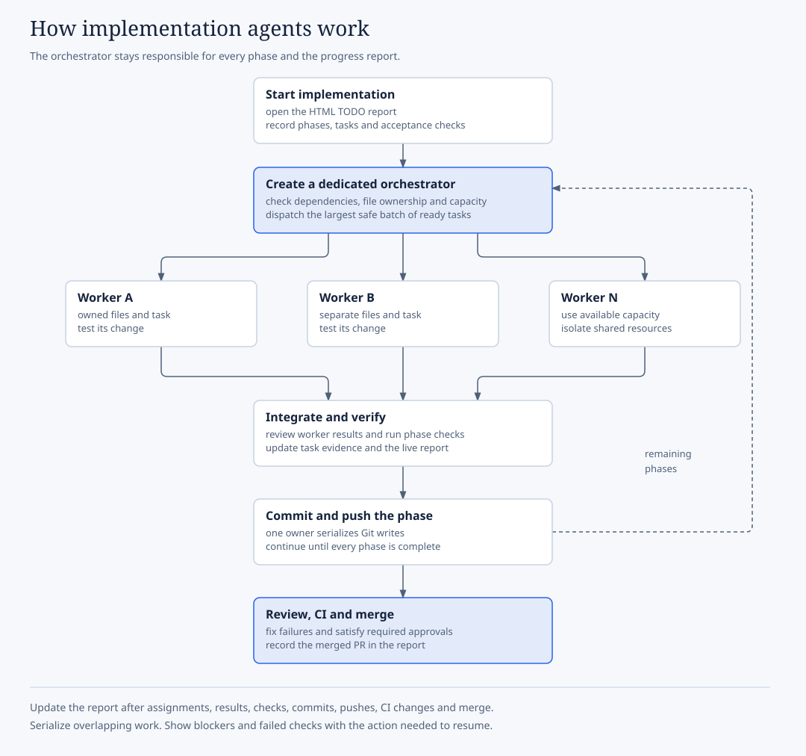
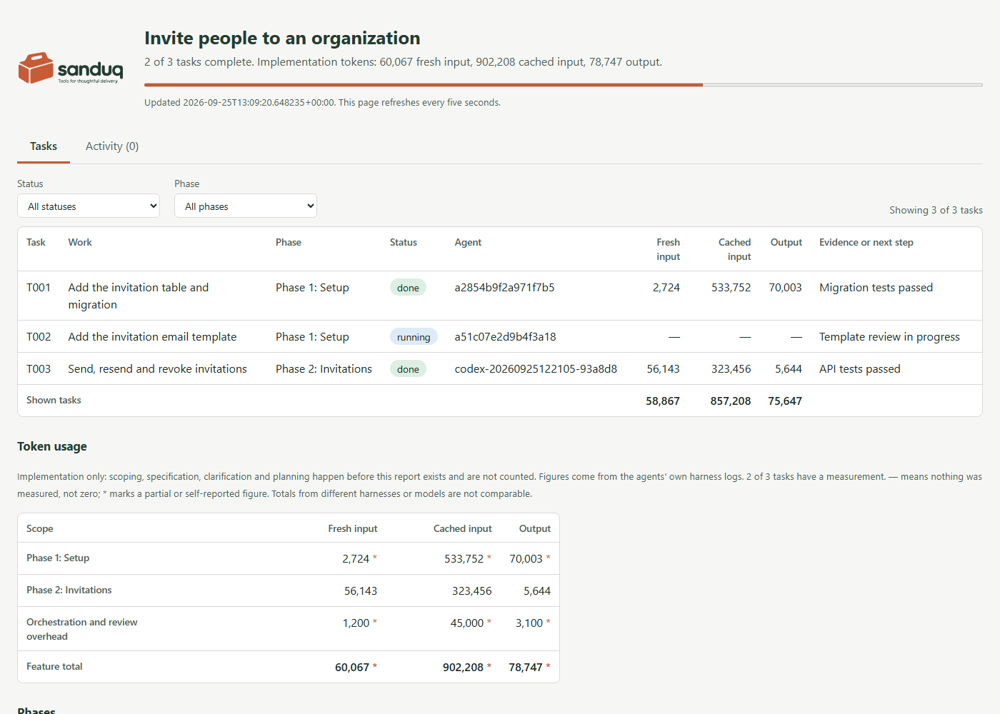
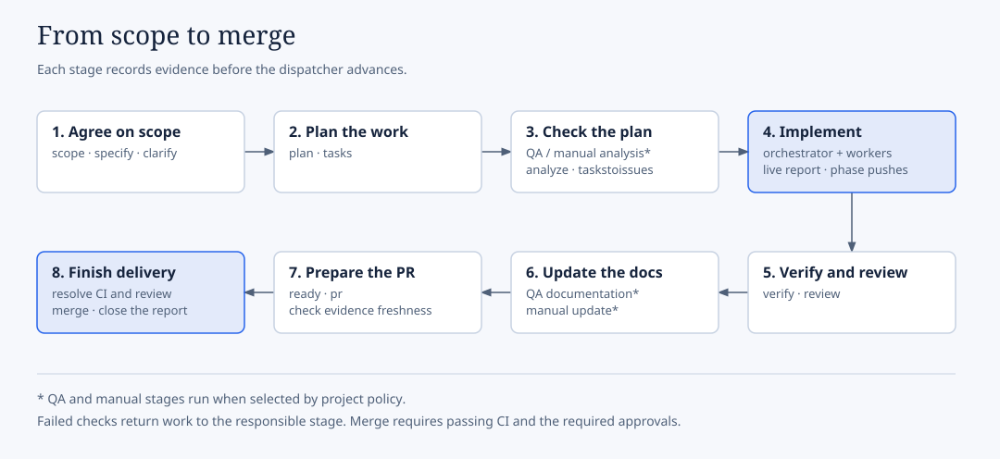
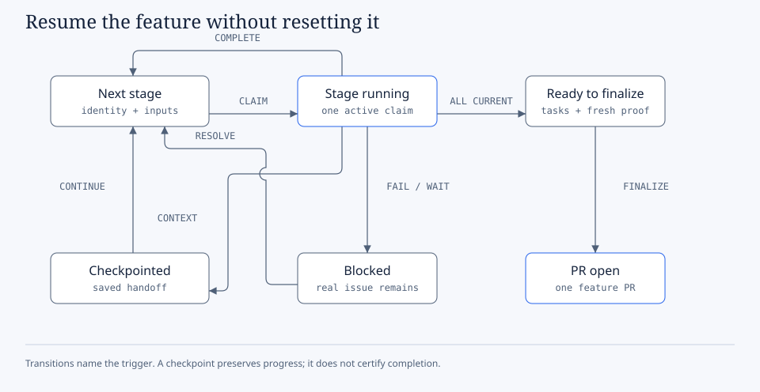

# Workflow state, evidence, and runners

Use this reference when configuring runners or inspecting an interrupted feature. For daily entry points and upgrades, start with the [operating guide](operating-guide.md).

## Table of contents

- [Orchestrated implementation and live progress](#orchestrated-implementation-and-live-progress)
- [The lifetime of one feature](#the-lifetime-of-one-feature)
- [Where the state lives](#where-the-state-lives)
- [What the CI gate actually checks](#what-the-ci-gate-actually-checks)
- [Where your CI actually runs](#where-your-ci-actually-runs)
- [Continuing in a fresh session](#continuing-in-a-fresh-session)

## Orchestrated implementation and live progress

Both `$speckit-implement` and `$speckit-superspec-execute` create a dedicated orchestration agent.
It delegates every implementation task to workers, fills available slots with ready work, and
keeps conflicting file writes or shared resources out of the same batch. Tasks with dependencies
run when their prerequisites pass. The coordinator alone integrates results and commits and pushes
each verified phase before continuing.



At implementation start, the workflow creates and opens
`specs/<feature>/workflow/progress/index.html`. The report records the task queue, worker ownership,
checks, phase commits and pushes, and PR status. Keep it updated after material events and through
CI repairs and the verified merge when that work is authorized. Pending checks and failed checks
remain visible; they never count as completion.

The report also shows token usage. Each task has fresh input, cached input and output columns, and
the footer adds up whichever tasks the Status and Phase filters show. A Token usage section totals
each phase, the orchestration and review overhead, and the whole feature.



The orchestrator records a task's usage when the task finishes, by reading the worker's own harness
log. Nobody types the numbers in:

```text
python .specify/extensions/workflow/scripts/progress.py usage --output specs/<feature>/workflow/progress --id T001 --agent <worker-id> --collect claude
python .specify/extensions/workflow/scripts/progress.py usage --output specs/<feature>/workflow/progress --id T002 --agent <thread-id> --collect codex
python .specify/extensions/workflow/scripts/progress.py usage --output specs/<feature>/workflow/progress --id T003 --agent <run-id> --collect delegate --log .delegate/runs/<run-id>/result.json
```

`claude` reads the Claude Code subagent transcript, `codex` reads the Codex rollout, and `delegate`
reads a [`delegate-task`](../scenarios/skills-only.md#delegate-task) result. Only token counters are read, never message
content. A few rules keep the figures honest:

- Collecting the same worker again replaces its figure rather than adding to it.
- A worker reused for several tasks is split by each task's running and done times, so mark a task
  `running` when you assign it.
- A log that cannot be found shows as a dash and an Activity entry, never as zero. Self-reported
  figures (`--fresh-input`, `--cached-input`, `--output-tokens`) are marked with an asterisk.
- The feature total covers implementation only. Scoping, specification and planning happen before
  the report exists. Figures from different harnesses or models are not comparable, and no cost is
  shown.

```text
$speckit-implement Keep implementing all approved phases. Delegate implementation to workers and
run the maximum conflict-free ready tasks in parallel. Open and maintain the HTML progress report.
Verify, commit, and push each completed phase. Continue through Finalize, fix CI and review findings,
and merge this feature's PR when required checks and approvals pass.
```

Use `$speckit-superspec-execute` with the same prompt when SuperSpec is the selected provider. For
an interrupted run, use `$speckit-workflow-continue`; inspect recorded worker handles and remote
state before starting replacements. The [stage-by-stage guide](lifecycle.md#every-stage-of-the-managed-lifecycle)
includes prompts for setup, specification, analysis, review, and publication.



## The lifetime of one feature

A feature does not march through the stages once and stop. It holds a claim while a stage runs, and
it has three ways to leave that state and come back; none of which resets it to the beginning.



Editable [state diagram source](../diagrams/feature-state.html). Migration is an additional guarded
operation when package identity changes; the state table below describes that boundary.

| State | Reached when | Leaves when |
| --- | --- | --- |
| **Scoped** | The issue is analysed and its effort settled | Specify claims it |
| **Bound** | Specify verified `scope-source.json` and bound a branch | The first stage takes a claim |
| **Stage running** | A stage holds the claim | The stage finishes, or one of the three detours below |
| **Checkpointed** | A fresh, reliable measurement crosses the checkpoint fraction; `checkpoint.json`, `handoff.md`, and `resume-prompt.md` are written | `continue` validates identity, inputs, and package versions |
| **Blocked** | Stale scope, unresolved answers, a wrong binding, or a closed issue | The real state is settled; never by marking it done to get past the guard |
| **Migration required** | An upgrade changed the packages under an in-flight feature | `workflow.py migrate --feature ... --reason ...`, after review |
| **Ready to finalize** | Required tasks are complete and evidence is current | Finalize |
| **Pull request open** | One PR per feature, visuals verified as loading | Required CI/review passes and an authorized merge is verified |

A claim gives one stage ownership of a feature at a time, so a second agent
cannot start a competing executor. If a claim is interrupted, `recover` takes the recorded token,
but inspect possible remote writes first. A missing HTTP response is not proof that an issue or PR
was never created.

Migration preserves still-current evidence with its original package
digest and invalidates only the stages whose command selection actually changed. Use
`--invalidate-from <stage>` when an upgrade changed a stage's contract. Historical receipts are never
edited to claim that a new package executed old work.

## Where the state lives

| Path | Holds |
| --- | --- |
| `.specify/workflow.yml` | Project policy; selected processes, provider and model routes, context budget |
| `.specify/scope/github/` | Managed Scope artifacts |
| `specs/<feature>/workflow/` | Per-feature checkpoint, handoff, resume prompt, receipts, evidence |
| `specs/<feature>/workflow/progress/index.html` | Live implementation report through authorized PR merge |
| `specs/<feature>/workflow/delegations.json` | Tracked delegation attempts, route decisions and usage |
| `.specify/workflow/backups/installs/` | Backup ZIP and operation log for every install and upgrade |
| `docs/workflow/implementation-plan.html` | The Illustrate dependency plan, regenerated after every decomposition |

Reusable source lives in this repository. Policy, issue bindings, feature progress, manual content,
and evidence stay in **your** project. Never edit an installed upstream command; an upgrade replaces it.

## What the CI gate actually checks

The project selects Disabled, Advisory, or Required evidence gating and the
individual checks it needs. Enabled managed-only gating checks changed feature
evidence; an ordinary PR without a Spec Kit feature succeeds as
`not_applicable`. Selected rules can cover receipts, issue decisions, task
completion and mapping, documentation, portability, the PR merge candidate,
and live GitHub answers. Full history is fetched; a shallow checkout fails
with `BASE_HISTORY_UNAVAILABLE` rather than guessing. Application tests and
normal PR review remain project-owned.

For source changes that belong to a managed feature but do not touch `specs/`,
name the feature explicitly: commit a `.specify/workflow/pr-features.json`
containing `{"features": ["specs/412-refund-approval"]}`, or pass `--feature` to the gate CLI.
An unrelated bug fix needs no mapping under the default managed-only scope.

The evidence checks have separate responsibilities:

- QA Assure supplies tester readiness and
  walkthrough evidence; User Manual supplies audience-facing documentation. Neither is a test result.
- Verification inventories source additions and
  deletions, so leaving a changed code file out of an agent receipt is caught, not tolerated.
- Finalize inventories every relevant diagram and
  screenshot, embeds each inline, and then verifies that it actually loads in an authenticated
  private-repository view. Never publish private assets to a public host, and never put credentials
  in an image URL.

The two processes stay independent. Neither QA nor User Manual is enabled merely because its
extension is installed. Where this gate runs is a separate, project-level decision; see
[Where your CI actually runs](#where-your-ci-actually-runs).

## Where your CI actually runs

Sanduq ships the workflow files a project needs, but it does not decide where they run. The
runner is a project decision, captured once during `init` and kept in `.specify/workflow.yml`:

```yaml
ci:
  provider: github-actions        # or `none`, to install no managed evidence gate job
  gate:
    mode: advisory                # disabled, advisory, or required
    scope: managed-only           # or all-prs
    rules:
      receipts: true
      decisions: true
      tasks: false
      task_links: false
      documentation: true
      portability: true
      candidate_merge: false
      live_answers: true
  policy: hosted-allowed          # or `self-hosted-required`
  runners:
    linux: [ubuntu-latest]
    windows: [windows-latest]
  capabilities:
    system_packages: sudo-apt     # or `preinstalled`
    python: setup-action          # or `preinstalled`
    python_version: "3.13"
  exceptions: []
```

Record it once, without editing any YAML by hand:

```bash
python .specify/extensions/workflow/scripts/workflow.py ci --show
python .specify/extensions/workflow/scripts/workflow.py ci   --policy self-hosted-required   --linux self-hosted,homek8-general --windows self-hosted,windows   --system-packages preinstalled --python preinstalled
```

Every shipped workflow file is then **rendered** from that selection rather than copied, so
changing a runner stays a supported upgrade instead of a fork. The files rendered this way are
`sanduq-workflow-gates.yml`, `documentation-gates.yml`, `user-manual-preview.yml` and
`user-manual-release.yml`.

`capabilities` matters as much as the labels. A runner without `sudo` cannot `apt-get install`
the `age` and Pango packages the User Manual jobs use, and a container image that already carries
Python does not want `actions/setup-python`. Setting either to `preinstalled` removes those steps
and makes the runner image responsible for providing them — so a self-hosted selection produces
jobs that actually run, not jobs that merely carry the right label.

### Requiring self-hosted runners

`policy: self-hosted-required` refuses to let a GitHub-hosted runner pass unnoticed. Every
workflow still on a hosted runner needs its own dated entry:

```yaml
  exceptions:
    - workflow: user-manual-release.yml
      platform: linux
      reason: "The self-hosted image has no WeasyPrint system libraries and the job cannot install them."
      removed_by: "Add libpango/libharfbuzz to the runner image."
      decided: 2026-09-22
```

`doctor` reports `CI_HOSTED_RUNNER_UNDOCUMENTED` until each one is recorded, and
`CI_WORKFLOW_STALE` when a selection was changed but never re-installed. Under the default
`hosted-allowed` nothing is required and nothing changes.

## Continuing in a fresh session

Context policy lives in `.specify/workflow.yml` under `context.mode` and defaults to
**`measured-only`**; checkpoint at 50% occupancy, a 60% ceiling, 10% reserved for the handoff. A
pause also fires early if the projected next call plus that reserve would cross the ceiling.

Only a **fresh, reliable measurement** can pause a run: the host's own reading, no more than 120
seconds old. Telemetry that is missing, estimated, stale, or malformed is **non-blocking**; the
stage continues, the gate records `unavailable`, and nothing claims a guarantee it did not have.
An estimate never forces a pause or a new session, and the legacy `measured-with-estimated-fallback`
mode now behaves the same way. Only explicit `strict` mode refuses to proceed without a host that
enforces per-call bounds.

Use the saved resume prompt after an actual interruption or a measured limit. Missing context
telemetry does not require a new session.

The handoff names the issue, feature,
branch, completed stages, pending task IDs, evidence, and the active claim. Add your real test
results, background process handles, and unresolved approvals, then start the next session with the
saved prompt.

Full operating detail: the [Delivery policy guide](delivery-policy.md),
the [operating guide](operating-guide.md), and the
[compatibility contract](../reference/compatibility.md).
