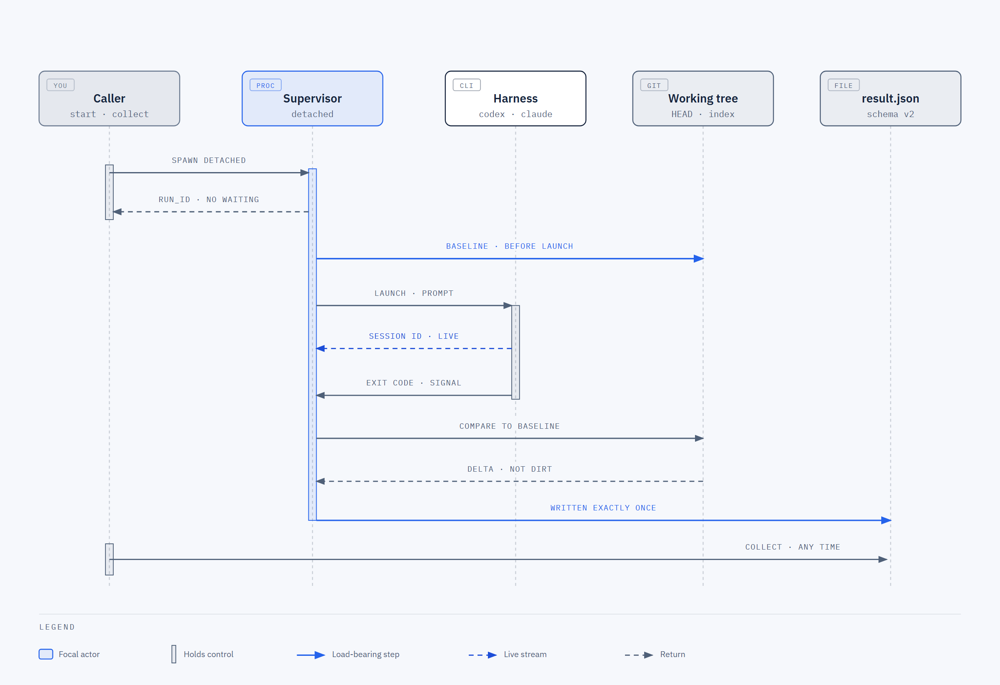
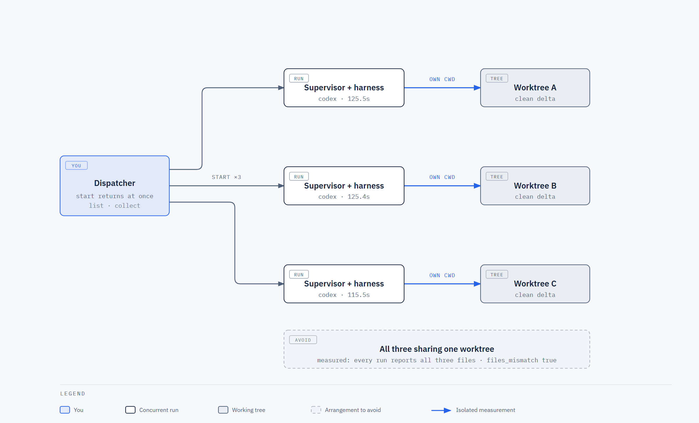

# delegate-task

> English version: [README.md](README.md)

تُسلّم مهمة واحدة إلى أداة وكيل أخرى — Claude Code أو OpenAI Codex أو OpenCode أو GitHub Copilot أو
Pi — تعمل في الخلفية، وتعود إليك بنتيجة يمكن الوثوق بها فعلاً.

هذه [مهارة لـ Claude Code](https://docs.claude.com/en/docs/claude-code/skills)، فيلتقطها Claude
تلقائياً حين تقول «استخدم codex لإعادة هيكلة هذا». وهي في الوقت نفسه مجرد سكربت Node، فتستطيع
تشغيلها من أي طرفية.

## التثبيت

تأتي `delegate-task` ضمن حزمة إضافة `agent-tools` في مستودع
[sanduq](https://github.com/samykabu/sanduq).

```text
/plugin marketplace add samykabu/sanduq
/plugin install agent-tools@sanduq
```

أو ثبّت هذه المهارة وحدها في المشروع الحالي:

```bash
npx skills add samykabu/sanduq --skill delegate-task
```

موضع التثبيت يحدّد مكان المحرّك، 
فحدّده مرة واحدة واستخدمه في كل الأوامر:

```bash
# تثبيت كإضافة
DELEGATE="$CLAUDE_PLUGIN_ROOT/skills/delegate-task/delegate.mjs"
# تثبيت بـ npx skills أو نسخة محفوظة داخل المستودع
DELEGATE=".claude/skills/delegate-task/delegate.mjs"

# ابقِ مخرجات التشغيل داخل المشروع، لا بجانب المحرّك
export DELEGATE_RUNS_DIR="$PWD/.delegate/runs"
```

اضبط `DELEGATE_RUNS_DIR` عند التثبيت كإضافة، وأضف `.delegate/` إلى `.gitignore` للمشروع.
مخرجات التشغيل تحوي نص مهمتك ومخرجات الأداة الخامة.

## لماذا وُجدت أصلاً

استدعاء أداة أخرى هو الجزء السهل. المشكلة أن تعرف بعدها ماذا حدث بالضبط.

كل أداة تخبرك أنها انتهت. ولا واحدة منها تخبرك إن كان العمل قد أُنجز. والإشارات الثلاث التي قد
تعتمد عليها بشكل بديهي، كلٌّ منها مُضلِّلة بمفردها:

**رمز الخروج 0 لا يعني شيئاً.** تشغيل داخل صندوق رملي مُنع من الكتابة سينتهي بنظافة تامة، دون أن
ينجز أي شيء. هذه الحالة موجودة عندنا ضمن اختبارات المشروع.

**ملخّص الوكيل مجرد ادّعاء.** سيخبرك بالملفات التي لمسها، وقد يكون مخطئاً، وليس لديه طريقة ليعرف.

**أرقام الـ tokens لا تعني ما تظنه.** أداة تحسب `input_tokens` دون الكاش، وأخرى تحسبه شاملاً له،
وثالثة تُصدره لكل خطوة فيلزم جمعه. إن قرأتها كما هي فقد تخطئ بأربع مراتب عشرية. قسنا مرة تشغيلاً
أبلغ عن `input_tokens: 2` لطلب أرسل فعلياً 58,065.

لذلك هذه المهارة **تقيس** التشغيل بدل أن تنقله. كل نتيجة تحمل حالة **والقاعدة التي أنتجتها**، وما
رصده git فعلياً على القرص مقابل ما ادّعى الوكيل أنه غيّره، وحساب tokens موحّد مع إشارة تقول لك إلى
أي مدى تثق به، وسجلّ تشغيلات يبقى بعد انتهاء الجلسة التي بدأته.

خمس أدوات في جدول واحد. إضافة السادسة سطر في الجدول، لا برنامج جديد.

## كيف يسير التشغيل



*المصدر: [`assets/delegate-run-lifecycle.html`](assets/delegate-run-lifecycle.html)*

خط الأساس هو بيت القصيد. أخذ بصمة الشجرة **قبل** أن تبدأ الأداة هو ما يسمح للنتيجة أن تقول «هذه
الملفات الثلاثة تغيّرت خلال هذا التشغيل» بدل «هذا كل ما هو متسخ في مستودعك، وبالتوفيق».

## المتطلبات

- **Node 18 أو أحدث.** بلا اعتماديات، وبلا خطوة تثبيت.
- أداة وكيل واحدة على الأقل في `PATH`، مسجَّل دخولها.
- `git`، من أجل طبقة القياس. بدونه تعود كل حقول git بـ `null`، وليس `false` أبداً.

```bash
node "$DELEGATE" doctor
```

الأمر `doctor` يفحص إصدار كل أداة، فيفرّق بين *غير مثبَّتة* و*مثبَّتة لكنها معطوبة*، ويطبع ما
يطلبه `--sandbox` فعلياً من كل واحدة.

## أمثلة عملية

تستطيع أن تطلب من Claude بالعربية أو الإنجليزية، أو تشغّل السكربت بنفسك. الاثنان أدناه.

### تسليم مهمة محدَّدة إلى Codex

> استخدم codex ليضيف تحقّقاً من المدخلات في `parse_config()` داخل `src/config.py`، مع اختبار
> لمسار المدخل الخاطئ. شغّل `pytest -q` حتى ينجح، ولا تلمس شيئاً آخر.

```bash
node "$DELEGATE" start \
  --harness codex --cwd ~/work/myrepo --timeout 1800 \
  --constraint "Touch only src/config.py and tests/test_config.py." \
  --task 'The job: parse_config() accepts malformed TOML and fails later with a confusing
KeyError. Validate up front and raise ConfigError naming the offending key.

Gates: run `pytest -q` and `ruff check src/`, make both green.

Report: what changed, files touched, the pytest count, and anything you decided that
this brief did not settle.'
```

اكتب نصّ المهمة بلغة الأداة نفسها؛ الإنجليزية عادةً أدقّ مع هذه الأدوات.

### رأي ثانٍ دون السماح بالكتابة

> اطلب من codex مراجعة وسيط المصادقة بحثاً عن ثغرات أمنية، للقراءة فقط

```bash
node "$DELEGATE" start \
  --harness codex --cwd ~/work/myrepo --sandbox --timeout 900 \
  --deliverable "A findings list. Do not modify anything." \
  --task 'Review src/middleware/auth.py for authentication and session-handling flaws.
Ground every claim in a line reference. Label inferences as inferences.'
```

الخيار `--sandbox` يطلب من الأداة وضع القراءة فقط الخاص بها، ويُفعّل كاشف التغيير. فإن تحرّك شيء
رغم ذلك، تخبرك النتيجة.

### تحديد نموذج بعينه

> شغّل هذه على opus بدلاً من ذلك

```bash
# Claude Code
delegate.mjs start --harness claude --model opus --cwd ~/work/myrepo \
  --task 'Explain why the retry loop in worker.py can spin forever, then fix it.'

# Codex
delegate.mjs start --harness codex --model gpt-5.5 --cwd ~/work/myrepo --task '...'

# OpenCode يحتاج اسماً مسبوقاً بالمزوّد
delegate.mjs start --harness opencode --model anthropic/claude-sonnet-4-5 \
  --cwd ~/work/myrepo --task '...'
```

تسمية النماذج تخصّ كل أداة، ونحن نمرّرها كما هي دون تعديل.

### متابعة الجلسة نفسها بدل البدء من الصفر

هذه هي التي توفّر مالاً حقيقياً. التشغيل الأول يدفع ثمن تحميل سياق مستودعك، والمتابعة تعيد
استخدامه.

```bash
# التشغيل الأول
delegate.mjs start --harness codex --cwd ~/work/myrepo \
  --task 'Add a --dry-run flag to the migrate command.'
# ← codex-20260825164159-5f4cd3

delegate.mjs collect codex-20260825164159-5f4cd3 --wait 600

# نجح، لكن الاختبار يستخدم mock في غير محلّه. أرسل التصحيح وحده:
delegate.mjs start --harness codex --cwd ~/work/myrepo \
  --resume codex-20260825164159-5f4cd3 \
  --task 'The flag is right, but the test mocks the DB session. Use the real migrated
fixture and drop the now-unused import.'
``` 

الوكيل ما زال يحتفظ بسياقه، ولهذا يكفي هذا القدر من الاختصار. في اختبارنا، رسالة متابعة قالت فقط
*«الملف الذي أنشأته للتو»* — دون تسميته — عدّلت الملف الصحيح تماماً.

المتابعة تحصل على `run_id` **جديد** يحمل `parent_run_id`، وترفض العمل إن اختلفت الأداة أو النموذج
أو إصدار الأداة أو مجلد العمل أو هوية المستودع.

### مقارنة أداتين على المهمة ذاتها

> أعطِ نفس إعادة الهيكلة إلى codex و opencode وأرني تكلفة كل منهما

```bash
T='Extract the retry logic from worker.py into a reusable decorator. Keep behaviour identical.'

delegate.mjs start --harness codex    --cwd ~/work/copy-a --task "$T"
delegate.mjs start --harness opencode --cwd ~/work/copy-b --task "$T"

delegate.mjs list      # الاثنان جنباً إلى جنب: الحالة والسبب والـ tokens
```

أعطِ كل واحدة نسختها الخاصة من الشجرة. أداتان تكتبان في مجلد واحد ستُبلغ كلٌّ منهما عن تغييرات
الأخرى، والسبب مشروح في القسم التالي.

### السماح بالـ commit (مُعطَّل افتراضياً)

```bash
delegate.mjs start --harness codex --cwd ~/work/myrepo --allow-commit \
  --task 'Bump the version to 2.4.0, update CHANGELOG.md, commit both.'
```

بدون `--allow-commit`، أي تحرّك في `HEAD` يجعل النتيجة «تحتاج مراجعة». الأداة لا تتراجع عن الـ
commit أبداً؛ فقد يكون منك أنت.

### إبقاء بيئتك بعيدة عن ثنائي طرف ثالث

```bash
delegate.mjs start --harness codex --cwd ~/work/myrepo \
  --clean-env --keep-env CODEX_API_KEY \
  --task 'Summarise what this service does, from the code.'
```

افتراضياً ترث الأداة كل ما صدّرته في بيئتك، بما في ذلك مفاتيح خدمات لا علاقة لها بالمهمة.

## تشغيل عدة وكلاء بالتوازي

الأمر `start` يعود فوراً، لذا التوازي هو ببساطة عدة استدعاءات لـ `start`. لا شيء إضافي تضبطه.



*المصدر: [`assets/delegate-parallel-fanout.html`](assets/delegate-parallel-fanout.html)*

قياس فعلي على هذا الجهاز، ثلاثة تشغيلات Codex على مستودع واحد:

| | |
|---|---|
| الإطلاق | ثلاثتها خلال ثانية واحدة |
| الزمن الكلي | 130 ثانية للثلاثة |
| مدة كل تشغيل | 125.5 · 125.4 · 115.5 ثانية |
| النتيجة | ثلاثتها `successful`، والملفات الثلاثة أُنشئت |

بالتتابع كان المجموع تقريباً هو الزمن الكلي. التوفير حقيقي لأن زمن إقلاع الأداة يهيمن على المهام
الصغيرة.

```bash
for n in alpha beta gamma; do
  delegate.mjs start --harness codex --cwd ~/work/$n --timeout 600 \
    --task "...مهمة $n..."
done

delegate.mjs list                            # تابعها
delegate.mjs collect <run_id> --wait 600     # مرة لكل تشغيل
```

⚠️ **أعطِ كل تشغيل متوازٍ مجلد عمل خاصاً به.** في التجربة أعلاه تشارك الثلاثة مستودعاً واحداً،
فأبلغت كل نتيجة عن الملفات الثلاثة جميعها مع `files_mismatch: true`. هذه ليست أخطاء في الأداة بل
أمانة منها: هي تراقب الشجرة، لا صاحب التغيير. والعقد ينصّ على ذلك صراحة —
`read_only_violation: true` تعني *حدث تغيير في هذه النافذة الزمنية*، لا *هذا الوكيل هو من غيّر*.

أما **المراجعة** المتوازية فحالة يصحّ فيها تشارك المجلد، لأن أحداً لا يكتب:

```bash
for h in codex claude opencode; do
  delegate.mjs start --harness $h --cwd ~/work/myrepo --sandbox \
    --task 'Review the diff on this branch for correctness bugs. Cite line numbers.'
done
```

## قراءة النتيجة

```text
Delegation codex-20260825164159-5f4cd3
Harness      OpenAI Codex codex-cli 0.147.0  model=not reported by this harness
Status       SUCCESSFUL
Because      harness_telemetry
Duration     56.7s   exit=0

Summary
  I created greeting.txt with exactly one line containing HELLO. I verified its
  byte content and did not modify any other file.

Changes
  measured   greeting.txt
  claimed    greeting.txt

Permission   requested=bypass  applied=codex: --dangerously-bypass-approvals-and-sandbox

Tokens (exact)
  input   total 66167  (fresh 12663, cache read 53504, cache write 0)
  output  total 409  (reasoning 68)
  TOTAL   66576
  cost    not reported by this harness

Session      01a039cc-d62a-7260-9afa-61ee7c8e03e4   resume with: --resume codex-20260825164159-5f4cd3

Logs         .delegate/runs/codex-20260825164159-5f4cd3
```

أربعة أشياء تقرأها، بهذا الترتيب:

**`Because`** — القاعدة التي حدّدت الحالة. `self_report` يعني أن كلمة الوكيل نفسه هي التي حسمتها.
أما `exit_code` و`timeout` و`head_moved` وغيرها فلكلٍّ معنى مختلف تماماً، وحقل `evidence` في الـ
JSON يسرد كل ما كان صحيحاً غير ذلك.

**`measured` مقابل `claimed`** — git في مواجهة الوكيل. إن اختلفا يظهر تحذير، وإن تعذّر التحقق من
الادّعاء تُخبَر بذلك بدل أن يُعرض عليك نجاح صامت.

**سطر الجلسة** — المعرّف كاملاً، والأمر الجاهز لمتابعتها. لا يُختصر أبداً، لا في النتيجة ولا في
`--json`.

**دقة الـ tokens** — `exact` أو `partial` أو `unavailable`. في الحالة الأخيرة الأصفار تعني *غير
معروف*، لا *مجاني*.

ليست كل أداة تُبلغ عن كل شيء. Codex لا يُصدر تكلفة ولا اسم نموذج في أي مكان من بثّه، فيظهر الحقلان
بعبارة *not reported by this harness* بدل `null` صامت يبدو كأنه خلل. Claude يُبلغ عن الاثنين،
وOpenCode يُبلغ عن التكلفة.

## الأوامر

| الأمر | ماذا يفعل |
|---|---|
| `start --harness <id> --task <text>` | يجدول تشغيلاً، يطبع `run_id`، ويعود فوراً |
| `collect <run_id> [--wait SEC] [--json]` | يجلب النتيجة؛ يخرج بالرمز `3` إن كان ما يزال يعمل |
| `status <run_id>` | `starting` · `running` · `stalled` · `adrift` · `lost` · `done` |
| `list` | كل التشغيلات، الأقدم أولاً، مع الحالة والسبب والـ tokens |
| `doctor` | أي الأدوات متوفرة، وإصداراتها، وما يطلبه `--sandbox` من كل منها |
| `prune [--keep N] [--older-than DAYS] [--yes]` | حذف الملفات القديمة؛ تجربة فقط بدون `--yes` |

## الخيارات

| الخيار | الاستخدام |
|---|---|
| `--cwd DIR` | مجلد العمل. **حدّده دائماً.** |
| `--model M` | تثبيت نموذج بعينه، بتسمية الأداة نفسها |
| `--timeout SEC` | 1800 افتراضياً، يُتحقق منه مسبقاً؛ عند انتهائه تُقتل الشجرة → `abandoned` |
| `--deliverable TEXT` | ما المطلوب تسليمه («diff موحّد، دون commit») |
| `--constraint TEXT` | قيد إضافي، يمكن تكراره |
| `--sandbox` | طلب وضع القراءة فقط، وتفعيل كاشف التغيير |
| `--allow-commit` | السماح بالـ commit، وإيقاف اعتبار تحرّك `HEAD` سبباً للمراجعة |
| `--resume <run_id>` | متابعة جلسة تشغيل منتهٍ برسالة فرق |
| `--clean-env` / `--keep-env NAME` | تسليم الأساسيات فقط؛ سمِّ ما تحتاجه الأداة |
| `--raw` | إرسال النص كما هو؛ يفقد كتلة الحالة، ولا يقبل المتابعة |

## طبقة القياس

قبل أن تبدأ الأداة وبعد أن تخرج، داخل `--cwd`:

- `HEAD`، والمنطقة المُجهَّزة، و`git status --porcelain=v1 -z` (آمن مع NUL، ويستهلك مسارات إعادة
  التسمية)
- **بصمات محتوى للمسارات المتسخة أصلاً**، لأن تعديل ملف مُعدَّل سلفاً لا يغيّر سطره في porcelain

`dirty_paths_changed` هو الفرق. `git_visible_after` هو كامل الشجرة المتسخة بما فيها خط الأساس.
`files_claimed` هو كلام الوكيل. و`files_mismatch` يقارن الادّعاء **بالفرق وحده**؛ فمقارنته بالشجرة
كاملة كانت ستحوّل ملفاً تركته متسخاً بالأمس إلى تهمة.

### `read_only_violation` بثلاث قيم

`true` و`false` و**`null`**. تحصل على `null` كلما عجز git عن الإجابة أو كانت تغطية البصمات ناقصة.
ولا تُحوَّل بصمت إلى `false` أبداً، لأنها الإجابة الوحيدة التي يجب ألا يعطيها كاشف حين لا يعرف.

- **`false` ليست «لم يُكتب شيء».** بل «لم يُرصد تغيير نهائي مشمول بالقياس». لا ترى الكتابة ثم
  التراجع، ولا ما يتجاهله gitignore، ولا الكتابة خارج المستودع.
- **`true` ليست «الوكيل هو الفاعل».** حفظك أنت لملف في تلك اللحظة يبدو مطابقاً تماماً.

### حدّ الـ commit

الغلاف يطلب من الوكيل ألا يعمل commit. هذه سياسة لا فرض — أداة تعمل بصلاحيات كاملة تستطيع تجاهلها.
ما يسندها هو القياس: إن تحرّك `HEAD` تُجبَر الحالة على `failed` بالسبب `head_moved`، ما لم تمرّر
`--allow-commit`. والأداة لا تُعيد ضبط شيء ولا تنظّف شيئاً؛ تحفظ الدليل وتقول ما رأت.

## ترتيب تحديد الحالة

أول قاعدة تنطبق تفوز، وكل ملاحظة تُحفظ في `evidence` مهما كانت الفائزة.

| # | الشرط | الحالة | السبب |
|---|---|---|---|
| 1 | انتهاء المهلة | `abandoned` | `timeout` |
| 2 | فشل تشغيل العملية | `failed` | `spawn_error` |
| 3 | القتل بإشارة | `failed` | `signal` |
| 4 | **خروج بغير صفر** | `failed` | `exit_code` |
| 5 | استثناء في التحليل | `failed` | `parse_error` |
| 6 | لا حدث نهائي | `abandoned` | `telemetry_incomplete` |
| 7 | حالة خارج المفردات المعروفة | `failed` | `parse_error` |
| 8 | الأداة أبلغت بالفشل | كما أُبلغ | `harness_telemetry` |
| 9 | الوكيل أبلغ عن فشله | كما أُبلغ | `self_report` |
| 10 | تحرّك `HEAD` بلا `--allow-commit` | `failed` | `head_moved` |
| 11 | تغيّرت المنطقة المُجهَّزة بلا `--allow-commit` | `failed` | `index_moved` |
| 12 | لا شيء مما سبق | `successful` | `harness_telemetry` |

القاعدة الرابعة إصلاح لخلل قديم: كان رمز الخروج يُمرَّر إلى كل مُحوِّل ولا يقرأه أحد، فكان حدث
نجاح مع خروج بالرمز 1 يُنشر على أنه `successful` — أي عكس ما يوثّقه هذا الملف تماماً.

## التعافي

`start` ينتظر أن يسجّل المشرف المنفصل `supervisor_started` في السجل قبل أن يقول `running`. ومشرف لا
يؤكد بدايته يُنتج نتيجة فشل بدء نهائية، بدل تشغيل يبقى يقول `running` إلى الأبد.

وأثناء العمل ينبض المشرف في السجل. الحالات متحفظة عن قصد:

| الحالة | المشرف | الأداة | `collect` |
|---|---|---|---|
| `running` | حي، والنبض حديث | — | ينتظر |
| `stalled` | **حي**، والنبض قديم | — | **يرفض** — قد ينهي عمله |
| `adrift` | مفقود | **حية** | **يرفض** — نتيجة الآن تُجمّد تشغيلاً ما زال يتحرك |
| `lost` | مفقود | مفقودة | يكتب نتيجة نهائية |

التشغيل المفقود يُعاد بناؤه من السجل والسجلات ولقطة git. **وفرق git فيه `null`**، لأن خط الأساس لم
ينجُ، و`false` ستكون ادّعاءً لم يقسه أحد.

على أنظمة POSIX تُنهي معالِجات SIGTERM/SIGINT/SIGHUP العمل قبل الموت. أما Windows فلا يستقبل
SIGTERM قابلاً للالتقاط، ولا شيء ينجو من SIGKILL، ولهذا وُجد مسار النبض.

## فهم أرقام الـ tokens

الأدوات مختلفة على معنى `input_tokens`:

| الأداة | العُرف | ما نفعله |
|---|---|---|
| Claude | `input` و`cache_creation` و`cache_read` **منفصلة** | نجمعها في `input_total` |
| Codex | `input_tokens` **يشمل** المخزّن مؤقتاً | نطرح المخزّن لنحصل على `input_fresh` |
| OpenCode | `step_finish` **لكل خطوة** | نجمع كل الخطوات |

استخدم `input_total` لكل ما أُرسل، و`input_fresh` للجزء غير المخزّن وهو ما يحرّك التكلفة. ونحتفظ
بـ `usage_raw` كما أصدرته الأداة، حتى يمكن إعادة حساب تشغيل قديم إن تبيّن لاحقاً خطأ في محلّل ما.
ولا يُعرض هذا الحقل الخام كإجمالي أبداً.

**الإجماليات غير قابلة للمقارنة بين الأدوات.** المهمة التافهة نفسها كلّفت 66,341 (codex) و117,014
(claude) و426,523 (opencode). OpenCode يعيد إرسال السياق كل خطوة ونحن نحسب كل مرة. هذا ليس ترتيباً
للكفاءة.

## الأمان

**الوضع الافتراضي هو التجاوز الكامل للصلاحيات.** الوكيل ينفّذ أوامر عشوائية دون إشراف. هذا مقصود،
وهو واقعي: في أول اختبار بهذا الوضع كتب وكيل OpenCode ملفاً **خارج** `--cwd` ثم نظّف أثره بنفسه.

الخيار `--sandbox` يطلب من كل أداة وضع القراءة فقط الموثّق لديها:

| الأداة | ما يُطلب |
|---|---|
| `codex` | `-s read-only`، مفروض من الأداة نفسها |
| `claude` | `--permission-mode plan` |
| `opencode` | `--agent plan`، ولا `--auto` إطلاقاً |
| `copilot` | `--mode plan` |
| `pi` | `--no-approve --tools read,grep,find,ls` |

⚠️ **ملفات التشغيل حسّاسة.** `prompt.txt` يحوي مهمتك كاملة، و`stdout.log` يحوي كل ما طبعته الأداة
وقد يشمل أسراراً. على POSIX يُضبط مجلد التشغيلات على `chmod 0700`؛ وعلى Windows الصلاحيات موروثة
ولا نستطيع تقييدها. نظّفها بـ `prune`.

معرّفات التشغيل تخضع للتحقق (`<harness>-<14 رقماً>-<6 hex>`) ويجب أن تقع مباشرة داخل مجلد
التشغيلات، فلا يستطيع معرّف مُمرَّر أن يخرج منه.

## إضافة أداة جديدة

سطر واحد في جدول `HARNESSES`. لا شيء غيره يتغيّر.

```js
myagent: {
  bin: 'myagent', label: 'My Agent', tier: 'experimental',
  readOnly: 'plan', resume: 'none', session_capture: 'terminal',
  reports: { cost: false, model: false },
  versionArgs: ['--version'],
  args: ({ task, model, perm, resume }) => [ /* بناء argv */ ],
  mode: (perm) => (perm === 'bypass' ? '--yolo' : '--plan'),
  session: (event) => event.sessionId ?? null,
  parse: (stdout, stderr, exitCode) => ({
    status: 'successful',        // successful | failed | abandoned
    reason: '', complete: true,  // complete:false ← telemetry_incomplete
    text: '<آخر رسالة من الوكيل>',
    usage_raw: null,
    tokens: tokens({ /* أرقام موحّدة */ fidelity: 'exact' }),
  }),
}
```

ثلاث قواعد تعلّمناها بالطريقة الصعبة:

- ضع `fidelity: 'unavailable'` حين لا تجد بيانات استخدام. الإبلاغ عن أصفار بوصفها `exact` ادّعاء
  بأن التشغيل كان مجانياً، والحقيقة أن أحداً لا يعلم.
- ضع `complete: false` حين لا يصل حدث نهائي. البثّ المبتور `abandoned` لا `successful`.
- لا تستنتج الفشل من وجود أحداث خطأ. Codex يُصدر `item.type: "error"` في تشغيلات ناجحة.

## الملفات

```text
delegate-task/
  SKILL.md          تعليمات موجّهة للوكيل، تُحمَّل تلقائياً
  README.md         النسخة الإنجليزية
  README.ar.md      هذا الملف
  delegate.mjs      المحرّك
  contracts/        مواصفات السلوك المُلزِمة
  references/       كيف تكتب مهمة، وكيف تراجع ما يعود منها
  assets/           رسوم هذا الملف ومصادرها بصيغة HTML
  test/run.mjs      172 حالة اختبار

$DELEGATE_RUNS_DIR/<run_id>/
  prompt.txt · meta.json · journal.jsonl · stdout.log · stderr.log · result.json
```

تستطيع تغيير مكان التشغيلات بـ `DELEGATE_RUNS_DIR`، وحدّ السجل لكل مجرى بـ
`DELEGATE_MAX_LOG_BYTES`، ونافذة الاحتفاظ بعد الحد بـ `DELEGATE_LOG_TAIL_BYTES`، ومكان الثنائي بـ
`DELEGATE_BIN_<HARNESS>`.

## التحقق

| الفحص | النتيجة |
|---|---|
| `test/run.mjs` | **172 نجحت، 0 فشلت** |
| هل للاختبارات أنياب | اختبار طَفَري: تُزرع عيوب متعمّدة ويجب أن تلتقطها الاختبارات |
| مراجعة خصومية | 9 جولات ضد وكيل خارجي، عبر هذه المهارة نفسها |
| كتابة حقيقية | قاس `greeting.txt`؛ وملف كان متسخاً **قبل** التشغيل بقي خارج الفرق |
| متابعة حقيقية | رسالة قالت فقط «الملف الذي أنشأته للتو» عدّلت الملف الصحيح |
| `--sandbox` حقيقي | مُنعت الكتابة، والملف غير موجود، والخروج **0**، والتقطه تقرير الوكيل الذاتي |
| توازٍ حقيقي | ثلاثة تشغيلات خلال ثانية، 130 ثانية إجمالاً، ثلاثتها ناجحة |
| التعافي | مشرف ميت يُنتج `abandoned` / `supervisor_lost` مع استرجاع الجلسة من السجل |

## حدود معروفة

- Copilot لا يستطيع الإبلاغ عن الـ tokens. لا حلّ لدينا؛ الأرقام ليست في مخرجاته أصلاً.
- مسار النجاح في Pi وشكل أرقامه غير مُتحقَّق منهما — لا مزوّد مُهيّأ على هذا الجهاز.
- متابعة الجلسة في Copilot وPi موصولة لكنها لم تُجرَّب من الطرف إلى الطرف.
- تحديد الثنائيات على Linux وmacOS مُنفَّذ لكنه غير مُختبَر.
- `prune` ينظّف ملفات هذه الأداة، لا مخزن جلسات Pi الخاص.
- **هوية العملية غير محفوظة.** التشغيلات تُعرَّف بالـ pid، فإعادة استخدام النظام لرقم pid قد تُبقي
  تشغيلاً عالقاً في `stalled` أو `adrift` بدل إنهائه. وهذا هو الفشل المتحفّظ: لا يَنشر نتيجة
  منافسة أبداً. احذف مجلد التشغيل لتصفيته.
- **مستودعان فارغان في المسار نفسه لا يمكن تمييزهما.** الهوية تعتمد على مجلد git وأول commit،
  والمستودع الفارغ لا يملك أياً منهما.
- **التشغيلات المتوازية في مجلد واحد تتلوّث قياساتها**، كما بيّنّا أعلاه. أعطِ كل تشغيل يكتب شجرته
  الخاصة.
