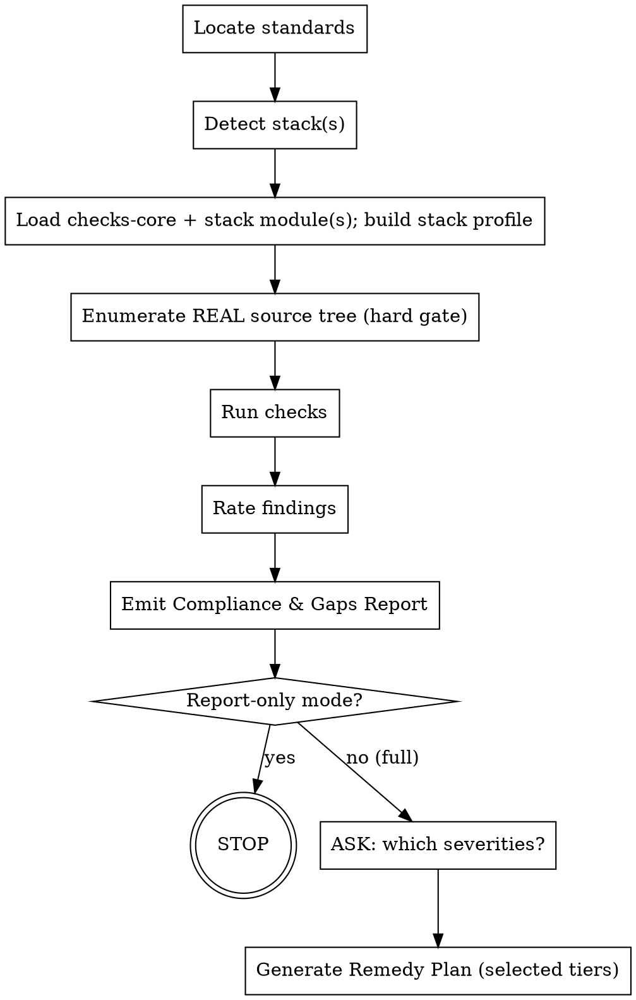

# Resal Standards Review

## Overview

Audits a project against the **Resal Engineering Standards** and produces:

1. A **Compliance & Gaps Report** (always).
2. A severity-rated **findings list** (critical / high / medium / nice-to-have).
3. A **Remedy Plan** that fixes the findings — but **only after asking the user which severity tiers to include** (skipped entirely in report-only mode).

The standard is **multi-stack**: a shared `core.md` (cross-cutting) plus one file per stack (`python.md`, `dotnet.md`, `react-web.md`, `react-native.md`). This skill **auto-detects the stack** and loads only `checks-core.md` + the matching per-stack checks module — so a .NET project is reviewed against .NET rules, a React Native app against RN rules, etc.

> **Two non-negotiables, up front:** (1) **Evidence before findings** — only cite files you have enumerated (Step 3.5) and opened; never assume a file exists from the stack's typical layout. (2) **The severity-tier question gates the remedy plan** — in full mode, ask which tiers (via `AskUserQuestion`, or in plain text if that tool is unavailable in a headless run) and wait; never write a remedy plan before the user chooses.

**Core principle:** Report first, then ask, then remediate. Never write a remedy plan before the user has chosen the severity tiers. Never modify the target code during a review — the remedy plan is a written plan, not edits, unless the user later asks you to execute it.

## Two modes

| Mode | Trigger | Behavior |
|---|---|---|
| **Full** (default) | "review against Resal standards", "audit + remediation", "compliance and fix plan" | Report → **ask which severities** → remedy plan |
| **Report-only** | "report only", "just the report", "audit only", "no remedy", "no fix plan", "report-only mode" | Report → **STOP**. No questions. No remedy plan. |

If the mode is ambiguous, default to **Full**. Any report-only phrasing present always wins.

## Workflow

### Step 1 — Locate the standards
Prefer the folder **`./standards/`** (`core.md` + per-stack files). Fallbacks: `<repo>\Resal-Standards\`, `./standards/` (legacy pointer). If none found, proceed using the bundled `checks-*.md` (self-sufficient; derived from the standard) and say so.
Confirm the target: a path to the project to review. If not given, ask for it.

### Step 2 — Detect the stack(s) (deterministic, marker-based)
Inspect the target for marker files and pick the module(s). Record the evidence.

| Marker found | Stack | Modules to load |
|---|---|---|
| `*.csproj` / `*.sln` / `*.fsproj` | **dotnet** | `checks-core.md` + `checks-dotnet.md` (standard: `dotnet.md`) |
| `package.json` containing `react-native` or `expo` | **react-native** | `checks-core.md` + `checks-react-native.md` (`react-native.md`) |
| `package.json` containing `react`/`next`/`@nx/react` (and NOT react-native) | **react-web** | `checks-core.md` + `checks-react-web.md` (`react-web.md`) |
| `pyproject.toml` / `poetry.lock`, or `app/` + FastAPI | **python** | `checks-core.md` + `checks-python.md` (`python.md`) |
| **more than one marker** (e.g. a .NET API + a React app in one repo, or an Nx monorepo with web + RN apps) | **multi** | `checks-core.md` + **each** detected stack module; review each sub-project and report in **per-stack sections** |
| no marker | **unknown** | tell the user; ask which stack, or stop |

Precedence within one project dir: a `package.json` with `react-native`/`expo` is **react-native** even if `react` is also present. In a monorepo, detect per app/package, not just at the root.

### Step 3 — Load modules & build the stack profile
Read `checks-core.md` and the detected stack module(s). Then detect what the project **actually uses** (DB, queue/Kafka, Redis, auth posture, observability, feature flags, etc.) from its manifest + imports. Record this **stack profile** at the top of the report so every "N/A" is justified. **Gate every check on the profile** — never flag a capability the project legitimately omits.

### Step 3.5 — Enumerate the REAL source tree (hard gate)
**Before running any check, list the actual files** — `Glob **/*` (or `git ls-files`) on the target — and skim the real directory structure. Do **not** assume file names from the stack's typical layout (a service may be a mature 300-file app, not a skeleton). This step exists because the single most common failure mode is authoring findings against *imagined* files (e.g. `LoginScreen.tsx`, `Class1.cs`, `template-processor.ts`) that don't exist. You may only cite a path that appears in this enumeration **and** that you have opened.

### Secret redaction rule (hard gate)
You may inspect files to determine whether a secret is hardcoded, but you must never copy secret
values into the chat, report, remedy plan, issue text, commit messages, or logs. This includes
passwords, API keys, bearer tokens, JWTs, cookies, private keys, connection strings, database URLs,
OAuth secrets, webhook secrets, signing keys, and realistic-looking test credentials.

For a secret finding, cite the file and line number, name the variable/key when safe, and replace the
value with `<REDACTED>`. If the exact line contains only a secret value, describe the surrounding key
or setting without quoting the value. Recommend rotation when the value may have been exposed. Do not
write a sample "fixed" value.

### Step 4 — Run the checks
Work through the applicable `CORE-*` checks **and** the stack module's checks. For each finding capture: check ID, what's wrong, **evidence (`file:line`)**, expected convention. Use `Grep`/`Glob`/`Read`; cite real locations.

> **HARD GATE — evidence before findings.** Do **not** write a finding until you have (a) confirmed the cited file exists in the Step-3.5 enumeration and (b) **opened it and seen the offending lines**. No assumed file names, no assumed code, no invented comments. If you can't open it and quote it, the finding doesn't exist. (When a re-read contradicts an earlier draft finding, delete the draft finding.)

> **No double-counting.** A concern is recorded **once**, under the most specific matching id. Where a stack check says "record under CORE-…" or "also CORE-…", that means *file it under the CORE id and cross-reference the stack id in the same row* — never emit two separate findings for one issue.

### Step 5 — Rate each finding
Apply the rubric in `core.md` §14 (mirrored below). The default severity in each check is the starting point; adjust for blast radius (data-integrity/security/PII → up; isolated/cosmetic → down) and note the adjustment. Tie-break: a finding matching multiple checks takes the higher severity; cite all ids.

### Step 6 — Emit the Compliance & Gaps Report
Use `report-template.md`. Always produced, in both modes. **Default: write the file** to the target repo as `RESAL-STANDARDS-REPORT.md` (print inline only if the user asked). Include the detected stack(s), stack profile, per-section scorecard, findings table, and severity counts. For **multi**, give each sub-project/stack its own section.

### Step 7 — Branch on mode
- **Report-only** → **STOP here.** No questions, no remedy plan. The report is the entire deliverable.
- **Full** → continue.

### Step 8 — (Full only) Ask which severities the remedy plan should cover
Use `AskUserQuestion` (multi-select) **before** writing any remedy plan: Critical / High / Medium / Nice-to-have, with Critical+High pre-recommended as a *suggestion only* (never auto-proceed on the pre-fill). Wait for the answer. If `AskUserQuestion` is unavailable (headless run), surface the same multi-select question in plain text and **still stop** — do not guess.

### Step 9 — Generate the Remedy Plan
Use `remedy-plan-template.md`. Write a **separate file** `RESAL-STANDARDS-REMEDY-PLAN.md`, including **only** the chosen tiers (list excluded tiers' finding ids under "out of scope"). Order Critical → High → Medium → Nice-to-have. Each item: finding id, root cause, concrete fix steps, files to touch, standard section reference, effort (S/M/L), and a verification step (the command/test that proves it's fixed). Do **not** edit target code unless the user explicitly asks you to execute the plan.

## Severity rubric (from core.md §14)

| Severity | Meaning |
|---|---|
| 🔴 **Critical** | Security, data-integrity, or correctness defect that can cause an incident/breach (hardcoded secret; injection; unsafe eval/deserialization; auth missing where required; event published before DB commit; missing rollback leaking a partial write; secrets in the client bundle / tokens in insecure mobile storage). |
| 🟠 **High** | Significant deviation hurting reliability/observability/maintainability of the whole unit (unstructured/stdlib logging; no correlation id; swallowed/downcast errors; no `/ready` dependency checks; no global error boundary; validation thrown as HTTP from inside contracts; no tests / no coverage gate; no outbound timeouts). |
| 🟡 **Medium** | Locally contained convention deviation (missing response model/status/summary; missing API versioning; mixed docstring styles; naming/casing drift; lint config drift; missing log/action taxonomy; non-idempotent retryable handler). |
| 🟢 **Nice-to-have** | Polish (monolithic utils; raise coverage floor; remove unused deps; consolidate duplicate enums; fix README drift; remove stray files; add DLQ policy). |

## Quick reference

- **Always** produce the report; **only** produce the remedy plan in full mode, **after** the AskUserQuestion severity selection.
- **Detect first, gate on the profile** — never flag an optional capability the project legitimately omits (mark N/A with justification).
- **Never** edit target code during a review.
- Evidence is mandatory: every finding cites `file:line` (open the file first) or a missing-file fact.
- Severity counts + per-section scorecard go at the top of the report; multi-stack → per-stack sections.

## Common mistakes

| Mistake | Fix |
|---|---|
| Writing the remedy plan without asking severities | STOP after the report in full mode; call `AskUserQuestion` first (text fallback if unavailable). |
| Asking severities in report-only mode | Report-only = no questions, no plan. Stop at the report. |
| Reviewing a .NET project against Python rules (or vice-versa) | Run Step-2 detection; load the matching stack module. |
| Flagging "no Redis/Kafka/JWT/RTL" on a project that doesn't use them | Gate on the Step-3 profile; mark N/A with evidence. |
| Double-counting (CORE + stack check for one issue) | Record under one id (prefer the more specific); see the no-overlap rule. |
| Findings with no file:line evidence | Open the file and cite it, or drop the finding. |
| Citing files you assumed exist (skeleton assumption) | Step 3.5: enumerate the real tree first; only cite enumerated, opened files. |
| Counting one issue twice (CORE + stack) | Record once under the most specific id; cross-ref the other in the same row. |
| Editing code instead of planning | A review produces documents; only execute fixes if the user explicitly asks. |

## Files in this skill

- `checks-core.md` — cross-cutting checks (run for every project). **Load in Step 3.**
- `checks-python.md` · `checks-dotnet.md` · `checks-react-web.md` · `checks-react-native.md` — per-stack checks; load the detected one(s).
- `report-template.md` — Compliance & Gaps Report structure (supports per-stack sections).
- `remedy-plan-template.md` — Remedy Plan structure.

The full prose standards live in `./standards/` (`core.md` + per-stack files); the `checks-*.md` here are the auditable distillation and are self-sufficient if the standards folder is absent.
